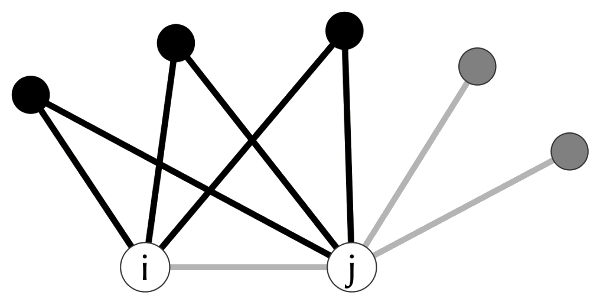

# Centrality {#sec-centrality}

Centrality is one of the most fundamental concepts in network analysis. It provides a way to quantify the importance or prominence of individual nodes within a network. In social networks, centrality helps answer questions like: Who is the most influential person? Who controls the flow of information? Who can reach others most efficiently? There is no single answer to "who is most central" because importance depends on the structural feature we consider relevant. This chapter introduces the most commonly used centrality indices, discusses their interpretation, and demonstrates how to compute them in R.


## Packages Needed for this Chapter

```{r}
#| label: libraries
#| message: false
library(igraph)
library(netrankr)
library(networkdata)
```

```{r}
#| label: libraries-silent
#| include: false
library(ggraph)
library(patchwork)
```

## What Is Centrality?

At its core, a centrality index assigns a numeric value to each node in a network. Higher values indicate greater centrality, but what "central" means depends on the index. Different indices capture fundamentally different notions of importance, each tied to a different structural property of the network. The four most widely used families of centrality, formalized in the conceptual clarification of @freeman1979centrality, can be mapped to distinct social intuitions:

- **Degree** measures *activity*: How many direct connections does a node have? A node with many ties is active, popular, or well-connected.
- **Closeness** measures *efficiency*: How quickly can a node reach all others? A node that is close to everyone can spread information or access resources with minimal steps.
- **Betweenness** measures *brokerage*: How often does a node sit on the shortest path between others? A node with high betweenness controls or mediates the flow between other parts of the network.
- **Eigenvector centrality** measures *prestige*: Is a node connected to other well-connected nodes? A node may have few ties, but if those ties are to important nodes, it is central by association.

These four intuitions are not interchangeable. A broker (high betweenness) need not be popular (high degree), and a prestigious node (high eigenvector) need not be efficient at reaching everyone (high closeness). This is precisely why multiple indices exist and why the choice of index should be guided by the research question at hand. Dozens of further indices have been proposed, most of which refine or combine these four ideas. We include one such example below, namely *subgraph centrality*, which captures local embeddedness via closed walks of all lengths, to give a flavor of what lies beyond the four main families.

::: {.callout-note}
For a more formal treatment of what constitutes a centrality index and the structural properties that underlie different indices, see @sec-advanced-centrality-concepts.
:::

## Centrality Indices in `igraph`

The `igraph` package implements a broad range of centrality indices. To illustrate them, we use the `dbces11` graph from the `netrankr` package, shown in @fig-dbces11-basic-plot. This small network is useful because different indices disagree on which node is most central, making the distinctions between indices visible.

```{r}
#| label: load-dbces
data("dbces11")
```

```{r}
#| label: fig-dbces11-basic-plot
#| echo: false
#| fig-cap: "The dbces11 example network used to illustrate centrality indices."
ggraph(dbces11, "stress") +
  geom_edge_link0() +
  geom_node_point(shape = 21, size = 10, fill = "grey66") +
  geom_node_text(aes(label = name)) +
  theme_void() +
  coord_equal(clip = "off")
```

### Degree

The most straightforward centrality index is *degree*, which counts the number of neighbors a node has. A node with high degree is directly connected to many others, making it active or popular in a social sense. Formally, letting $A = (a_{vu})$ denote the adjacency matrix,

$$
C_D(v) = \sum_{u \neq v} a_{vu}.
$$

```{r}
#| label: degree-dbces11
degree(dbces11)
```

For weighted networks, *strength* (also called weighted degree) sums the edge weights instead of simply counting ties. This is useful when ties carry different intensities, such as frequency of communication or volume of trade. As an illustration we use the `miserables` network, which records co-occurrences of characters in Victor Hugo's *Les Misérables*, with edge weights counting how often two characters appear in the same chapter.

```{r}
#| label: strength-example
data("miserables")
head(sort(strength(miserables, weights = E(miserables)$weight), decreasing = TRUE))
```

### Closeness

*Closeness centrality* is based on the shortest path distances between nodes. The idea is that a central node can reach all other nodes quickly. Letting $d(v, u)$ denote the length of the shortest path from $v$ to $u$,

$$
C_C(v) = \frac{1}{\sum_{u \neq v} d(v, u)},
$$

so that nodes with shorter total distances receive higher scores.

```{r}
#| label: closeness-dbces11
closeness(dbces11)
```

::: {.callout-tip}
Closeness centrality is only well-defined for connected networks, since distances between disconnected components are infinite. `igraph::closeness()` computes the score over the reachable nodes only and returns `NaN` for isolates, so the result can still be interpreted but ranks across components are not strictly comparable. A cleaner alternative is `igraph::harmonic_centrality()`, which defines centrality as the sum of inverse distances (treating unreachable pairs as zero contribution) and handles disconnected networks without special casing.
:::

### Betweenness

*Betweenness centrality* counts how often a node lies on the shortest path between pairs of other nodes. A node with high betweenness acts as a bridge or broker: removing it would increase distances or disconnect parts of the network. Letting $\sigma_{st}$ denote the number of shortest paths from $s$ to $t$ and $\sigma_{st}(v)$ the number of those passing through $v$,

$$
C_B(v) = \sum_{s \neq v \neq t} \frac{\sigma_{st}(v)}{\sigma_{st}}.
$$

```{r}
#| label: betweenness-dbces11
betweenness(dbces11)
```

### Eigenvector Centrality

*Eigenvector centrality* [@bonacich1987power] extends the idea of degree by weighting each connection by the centrality of the neighbor. A node is central if it is connected to other central nodes, which leads to the recursive definition

$$
C_E(v) = \frac{1}{\lambda} \sum_{u \in N(v)} C_E(u),
$$

where $\lambda$ is the leading eigenvalue of the adjacency matrix. The vector of scores is the corresponding leading eigenvector.

```{r}
#| label: eigen-dbces11
eigen_centrality(dbces11)$vector
```

::: {.callout-tip}
On disconnected networks, the leading eigenvector of the adjacency matrix concentrates on a single connected component (the one with the largest leading eigenvalue), and nodes in other components receive scores close to zero. The resulting ranking is therefore only meaningful within a single component; for cross-component comparisons, restrict the analysis to the largest component first.
:::

### Subgraph Centrality

*Subgraph centrality* [@estrada2005subgraph] quantifies the participation of each node in all subgraphs of the network, weighted by the inverse factorial of their size. It captures how embedded a node is in the local structure of the network, counting closed walks of all lengths.

```{r}
#| label: sub-dbces11
subgraph_centrality(dbces11)
```

### Comparing Indices

@fig-dbces11-centrality shows the most central node according to each of the indices computed above. Each index picks a different node as most central, highlighting how the choice of index determines what we consider "important."

```{r}
#| label: fig-dbces11-centrality
#| echo: false
#| fig-cap: "Most central node for different centrality indices in the dbces11 graph. DC = degree, BC = betweenness, CC = closeness, EC = eigenvector, SC = subgraph centrality."
V(dbces11)$cent <- NA
V(dbces11)$cent[which.max(degree(dbces11))] <- "DC"
V(dbces11)$cent[which.max(betweenness(dbces11))] <- "BC"
V(dbces11)$cent[which.max(closeness(dbces11))] <- "CC"
V(dbces11)$cent[which.max(eigen_centrality(dbces11)$vector)] <- "EC"
V(dbces11)$cent[which.max(subgraph_centrality(dbces11))] <- "SC"

ggraph(dbces11, "stress") +
  geom_edge_link0() +
  geom_node_point(
    shape = 21,
    size = 10,
    aes(fill = cent),
    show.legend = FALSE
  ) +
  geom_node_text(aes(filter = !is.na(cent), label = cent)) +
  theme_void() +
  coord_equal(clip = "off")
```

While this is a toy example, it illustrates an important point: centrality indices can produce substantially different rankings. In empirical settings, this means the choice of index is consequential and should be driven by the research question rather than convenience.

The dbces11 comparison above tells us *which* node each index picks as most central, but not how the indices track each other across the full ranking. To see that, we move from the toy example to a realistic network and examine the pairwise correlations of the scores.

### Correlation Between Indices

On some networks, all indices will largely agree; on others, they will diverge considerably. We examine this using Zachary's karate club network, a classic social network of 34 members of a university karate club observed over three years in the 1970s.

```{r}
#| label: load-karate
data("karate")
```

```{r}
#| label: centrality-correlation
cent_df <- data.frame(
  degree = degree(karate),
  closeness = closeness(karate),
  betweenness = betweenness(karate),
  eigen = eigen_centrality(karate)$vector
)
round(cor(cent_df), 2)
```

```{r}
#| label: fig-centrality-pairs
#| echo: false
#| fig-cap: "Pairwise scatter plots of four centrality indices computed on the karate club network."
#| fig-width: 8
#| fig-height: 8
pairs(cent_df, pch = 19, col = "steelblue",
      labels = c("Degree", "Closeness", "Betweenness", "Eigenvector"))
```

The correlation matrix and the pairwise scatter plots in @fig-centrality-pairs reveal which indices capture similar information and where they diverge. High correlations (e.g., between degree and eigenvector centrality) suggest that the structural features they measure overlap in this network, while low correlations indicate genuinely different dimensions of centrality.

## Directed Networks

The indices introduced so far treat every tie symmetrically. In many social networks, however, the direction of a tie carries meaning: who asks whom for advice, who endorses whom, who follows whom. A handful of centrality indices are designed specifically for directed networks and distinguish between a node's incoming and outgoing ties.

To illustrate them, we use the `ht_advice` network, a classic study of advice-seeking relations in a small high-tech company. A directed edge from `i` to `j` indicates that employee `i` sought advice from `j`.

```{r}
#| label: load-ht-advice
data("ht_advice")
```

### PageRank

*PageRank* [@brin1998anatomy] is perhaps the best-known index for directed networks, originally developed to rank web pages. It assigns each node a score that grows with the number and the PageRank of its incoming neighbors. In a social setting, a high PageRank identifies individuals who receive attention or endorsement from other well-regarded individuals.

```{r}
#| label: pagerank-ht
round(page_rank(ht_advice)$vector, 3)
```

### Hubs and Authorities

The *HITS* algorithm [@kleinberg1999authoritative] assigns each node two scores that reinforce each other: a good *hub* points to many good *authorities*, and a good *authority* is pointed to by many good *hubs*. In the advice network, authorities are employees who are frequently consulted, while hubs are employees who consult many others.

```{r}
#| label: hits-ht
hits <- hits_scores(ht_advice)
round(hits$hub, 3)
round(hits$authority, 3)
```

## Normalization

Many centrality indices can be *normalized* to produce values that are comparable across networks of different sizes. For instance, raw degree depends on the number of nodes in the network, making it difficult to compare across networks. Normalized degree divides by the maximum possible degree ($n - 1$), yielding a proportion.

```{r}
#| label: normalization
degree(dbces11)
degree(dbces11, normalized = TRUE)
```

::: {.callout-tip}
Normalization is essential when comparing centrality across networks of different sizes. Within a single network, the ranking of nodes is unaffected by normalization, so it only matters when you need scores on a comparable scale.
:::

Most `igraph` centrality functions accept a `normalized` argument. For betweenness and closeness, normalization adjusts for both network size and directedness.

## Centralization

While centrality is a node-level property, *centralization* is a network-level summary that captures how unequal the distribution of centrality is across all nodes. Freeman's centralization compares the observed network to the theoretical maximum inequality, which occurs in a *star graph* (one node connected to all others, no other edges).

A centralization score of 1 means the network is maximally centralized (like a star), while a score near 0 means centrality is evenly distributed (like a ring or complete graph). @fig-centralization-contrast shows these two extremes side by side.

```{r}
#| label: fig-centralization-contrast
#| echo: false
#| fig-cap: "A star graph (left) has maximum centralization while a ring graph (right) has minimum centralization."
#| fig-width: 10
#| fig-height: 5
p1 <- ggraph(make_star(10, mode = "undirected"), "stress") +
  geom_edge_link0(edge_color = "grey66") +
  geom_node_point(shape = 21, size = 6, fill = "grey25") +
  theme_void() +
  ggtitle("Star graph")

p2 <- ggraph(make_ring(10), "stress") +
  geom_edge_link0(edge_color = "grey66") +
  geom_node_point(shape = 21, size = 6, fill = "grey25") +
  theme_void() +
  ggtitle("Ring graph")

p1 + p2
```

```{r}
#| label: centralization-scores
centr_degree(make_star(10, mode = "undirected"))$centralization
centr_degree(make_ring(10))$centralization
```

`igraph` provides centralization functions for degree (`centr_degree()`), betweenness (`centr_betw()`), closeness (`centr_clo()`), and eigenvector centrality (`centr_eigen()`).

```{r}
#| label: centralization-karate
c(
  degree = centr_degree(karate)$centralization,
  betweenness = centr_betw(karate)$centralization,
  closeness = centr_clo(karate)$centralization,
  eigen = centr_eigen(karate)$centralization
)
```

These scores tell us not just *who* is central, but *how centralized* the network is as a whole. A highly centralized network depends heavily on a few key nodes, making it potentially vulnerable if those nodes are removed. For the karate club, eigenvector centralization is the highest of the four values, reflecting that prestige concentrates around the instructor and the administrator whose conflict later split the club. Betweenness and degree are moderately centralized, while closeness is the most evenly distributed: in a small, densely connected network, every member is within a few steps of everyone else, so no one dominates on reachability.

## Other Centrality Packages

Beyond `igraph`, several R packages offer additional centrality indices. The `sna` package implements indices such as *flow betweenness* (based on maximum flow rather than shortest paths), *information centrality* (based on information-theoretic measures), and *stress centrality* (counting all shortest paths through a node, without normalization). `sna` functions operate on adjacency matrices rather than `igraph` objects, so we first convert the graph.

```{r}
#| label: sna-example
#| message: false
A <- as_adjacency_matrix(dbces11, sparse = FALSE)
sna::flowbet(A, gmode = "graph")
round(sna::infocent(A, gmode = "graph"), 3)
```

::: {.callout-note}
We call `sna` functions via `sna::` rather than attaching the package, because `sna` defines functions with the same names as `igraph` (`degree()`, `betweenness()`, `closeness()`) and attaching it would mask the `igraph` versions we have been using.
:::

The `centiserve` package provides the largest collection, with over 30 additional indices. Packages like `CINNA`, `influenceR`, and `keyplayer` offer smaller, more specialized selections.

::: {.callout-note}
The sheer number of available centrality indices can be overwhelming. More indices does not mean better analysis. It is generally more productive to choose one or two indices that align with your research question than to compute all available options and pick the most favorable result.
:::

## Choosing a Centrality Index

With so many indices available, how should one choose? @borgatti2006graph argue that the choice should be guided by the type of network flow one implicitly has in mind: Does influence travel along shortest paths, along any walk, by parallel duplication, or only by direct transfer? More pragmatically, the key is to let the research question guide the choice rather than the other way around:

- If you are interested in **activity** or **popularity**, degree (or strength for weighted networks) is the natural choice.
- If you care about **efficiency of communication** or **independence**, closeness captures how quickly a node can reach others.
- If **brokerage** or **control** is your focus, betweenness identifies nodes that bridge different parts of the network.
- If you are interested in **influence through connections**, eigenvector centrality or PageRank captures prestige by association.

The worst practice is to compute several indices and then selectively report whichever supports the desired narrative. In the best case, you have a substantive argument for why a specific structural property matters, apply the corresponding index, and let the result speak to your hypothesis.

When multiple indices seem equally defensible and you are uncertain which to choose, the approach introduced in @sec-advanced-centrality-concepts offers a principled alternative: rather than committing to a single index, you can analyse the partial ordering that most indices agree on.

## Use Case: Florentine Families

We return to the *Florentine Families* marriage network introduced in @sec-basic-network-statistics, popularized in network analysis by @padgett1993robust, which records marriage ties among prominent Renaissance families in Florence. This network is included in the `networkdata` package.

```{r}
#| label: load-flo
data("flo_marriage")
```

The dataset contains one isolated family (the Pucci), who form no marriage ties to the other families. Because closeness is not well-defined for disconnected networks (see the earlier callout), we restrict the analysis to the connected subgraph of the remaining 15 families.

```{r}
#| label: flo-connected
flo_marriage <- subgraph(
  flo_marriage,
  components(flo_marriage)$membership == which.max(components(flo_marriage)$csize)
)
```

```{r}
#| label: fig-flo-marriage
#| echo: false
#| fig-cap: "Marriage network among Florentine families. Node size is proportional to the wealth of each family."
ggraph(flo_marriage, "stress") +
  geom_edge_link0(edge_color = "grey66") +
  geom_node_point(
    shape = 21,
    aes(size = wealth),
    fill = "grey66",
    show.legend = FALSE
  ) +
  geom_node_text(aes(size = wealth, label = name), show.legend = FALSE) +
  theme_void()
```

Marriages in Renaissance Florence were strategic alliances designed to improve a family's political standing and access to resources. The network in @fig-flo-marriage shows these marriage ties, with node sizes proportional to each family's wealth. Although the Strozzi were the wealthiest family, it was ultimately the Medici who rose to become the most powerful. A centrality analysis helps explain why.

The table below shows the centrality ranking of each family across the four most commonly used indices (1 = highest rank).

```{r}
#| label: centralities-flo
#| echo: false
data.frame(
  name = V(flo_marriage)$name,
  degree = rank(-degree(flo_marriage)),
  betweenness = rank(-betweenness(flo_marriage)),
  closeness = rank(-closeness(flo_marriage)),
  eigen = rank(-eigen_centrality(flo_marriage)$vector)
) |>
  knitr::kable(
    row.names = FALSE,
    col.names = c("Family", "Degree", "Betweenness", "Closeness", "Eigenvector")
  )
```

The Medici rank first (or nearly first) on every index. Their high *degree* means they had the most marriage ties, making them the most active family in forming alliances. Their top *betweenness* ranking reveals that they occupied a critical brokerage position: many of the shortest paths between other families passed through them, giving the Medici control over the flow of information and political favors. Their high *closeness* means they could reach any other family through fewer intermediaries than anyone else. And their *eigenvector centrality* shows that they were not just well-connected, but connected to other well-connected families.

The Strozzi, despite their wealth, were structurally peripheral. Their marriage ties connected them to less central families, limiting their ability to broker relationships or influence the network as a whole. This case illustrates a key insight of network analysis: structural position can matter more than individual attributes like wealth.

We can also examine centralization to characterize the network as a whole:

```{r}
#| label: centralization-flo
c(
  degree = centr_degree(flo_marriage)$centralization,
  betweenness = centr_betw(flo_marriage)$centralization,
  closeness = centr_clo(flo_marriage)$centralization,
  eigen = centr_eigen(flo_marriage)$centralization
)
```

Eigenvector centralization is the largest, reflecting that prestige in this network is concentrated in a tightly connected core around the Medici. Betweenness centralization is also high and confirms that brokerage was in the hands of a few families. Degree and closeness are more evenly spread, which fits the intuition that several families were reasonably active and well-positioned even if none were as dominant as the Medici on a structural measure.

## Beyond a Single Index {#sec-advanced-centrality-concepts}

We have now seen that different centrality indices can pick different "most central" nodes on the same network, and that their correlations depend on the network itself. A natural question follows: is there any structural property that *all* common indices respect, and if so, can we use it to reason about rankings without committing to a single index? The `netrankr` package is built around exactly this idea, which is developed formally in @schoch2016positional.

### Neighborhood Inclusion

The structural property at the heart of `netrankr` is *neighborhood inclusion*, illustrated in @fig-neighborhood-inclusion. If every neighbor of a node $u$ is also a neighbor of another node $v$ (plus possibly $v$ itself), then $u$ sits in a structurally weaker position than $v$: whatever $u$ can reach, $v$ can reach too, and more. Every commonly used centrality index respects this: if $u$ is neighborhood-dominated by $v$, no index will rank $u$ above $v$.

{#fig-neighborhood-inclusion width=60%}

The function `neighborhood_inclusion()` returns a matrix `P` where `P[u, v] = 1` whenever $u$ is dominated by $v$. The helper `comparable_pairs()` reports what fraction of node pairs the partial order actually orders.

```{r}
#| label: neighborhood-inclusion-dbces
P <- neighborhood_inclusion(dbces11)
comparable_pairs(P)
```

Only about 16% of pairs are comparable in `dbces11`. The other 84% are structurally ambiguous, and that ambiguity is exactly the room in which different indices can disagree. In a network where every pair is comparable, all indices would produce the same ranking.

### Rank Intervals

For a partially ordered set of nodes, every centrality index is one particular *linear extension*, a total ordering that respects the partial order. `rank_intervals()` reports, for each node, the smallest and largest rank it can take across all such extensions. Wide intervals mean the structure leaves the node's position open; narrow intervals mean the structure pins it down.

```{r}
#| label: rank-intervals-dbces
rk_int <- rank_intervals(P)
rk_int
```

We can overlay the ranks that specific indices assign to each node on top of these intervals. The three continuous-valued indices are rounded to four decimals so that floating-point near-ties collapse into a single rank rather than plotting as two barely-distinguishable points.

```{r}
#| label: fig-rank-intervals-dbces
#| fig-cap: "Rank intervals for dbces11 with the ranks produced by four centrality indices overlaid. Points scattered widely within an interval indicate indices disagree about that node's position."
cent_scores <- data.frame(
  degree = degree(dbces11),
  betweenness = round(betweenness(dbces11), 4),
  closeness = round(closeness(dbces11), 4),
  eigenvector = round(eigen_centrality(dbces11)$vector, 4)
)
plot(rk_int, cent_scores = cent_scores)
```

In @fig-rank-intervals-dbces the four indices land at different rank positions within each node's interval, which is the partial-ordering view of the disagreement we saw earlier in @fig-dbces11-centrality.

::: {.callout-note}
Occasionally a betweenness point falls outside a node's interval. Betweenness is the one common index that does not strictly preserve neighborhood inclusion. Two nodes can satisfy $N(u) \subseteq N[v]$ yet receive equal betweenness scores. All other standard indices are strictly order-preserving.
:::

### Exact Rank Probabilities

Rather than picking one index, we can enumerate *every* linear extension of the partial order and ask, for each node, how often it lands at each rank. For small graphs, `exact_rank_prob()` does this exhaustively.

```{r}
#| label: exact-rank-prob-dbces
res <- exact_rank_prob(P)
```

The probability of being the most central node (top rank) is the last column of `res$rank.prob`:

```{r}
#| label: rank-prob-top
round(res$rank.prob[, ncol(res$rank.prob)], 2)
```

Nodes E and K share the highest probability (0.16) of occupying the top rank across all valid rankings, closely followed by D and H. The expected rank, the weighted average of a node's rank over all extensions, gives a single summary:

```{r}
#| label: expected-rank
round(res$expected.rank, 2)
```

This is a more nuanced picture than any single index provides. Earlier we saw that degree, betweenness, closeness, eigenvector, and subgraph centrality each crowned a different node. The probabilistic view says some of those nodes (like E) are plausibly central across many valid rankings, while the picks of individual indices reflect one extension among many.

These tools are most useful when the choice of index is contested or arbitrary, and when the graph is small enough for the exhaustive enumeration to run. On larger networks, `exact_rank_prob()` becomes infeasible, but `neighborhood_inclusion()` and `rank_intervals()` remain cheap and still reveal which rankings the structure forces and which it leaves open.
