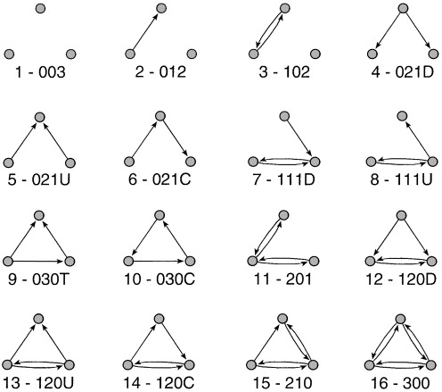

# Basic Network Statistics {#sec-basic-network-statistics}

Before tackling more advanced questions about a network, like who is most
central, which groups hold it together, how it compares to a random baseline, it
pays to know a handful of simple numbers that summarize its overall shape. How
many nodes and edges does the network contain? Are all nodes reachable from one
another? How far apart are they on average? Do neighbors of a node tend to be
neighbors of each other as well? This chapter introduces these foundational
descriptors: network size, density, degree, distance, components, diameter, and
transitivity for undirected networks, and reciprocity and the dyad and triad
census for directed networks. Each descriptor captures a different structural
property, and together they form the standard first-pass description of an
empirical network. More specialized notions, in particular centrality, are
deferred to @sec-centrality.

## Packages Needed for this Chapter

```{r}
#| label: libraries
#| message: false

library(igraph)
library(networkdata)
```

```{r}
#| label: libraries-silent
#| include: false

library(ggraph)
```

## An Example Network

To illustrate the descriptors in this chapter we use the marriage network of
Florentine families compiled by @padgett1993robust, available as `flo_marriage`
in the `networkdata` package. Nodes are the 16 leading families of 15th-century
Florence, and an undirected edge connects two families if they were joined by at
least one marriage. The network is a classic example in social network analysis:
small enough to be inspected at a glance, yet rich enough to exhibit the full
range of basic structural features, including an isolated node (the Pucci
family) that will be useful when we discuss connected components.

```{r}
#| label: load-flo

data("flo_marriage")
flo_marriage
```

@fig-flo-overview shows the network. The Medici sit at the structural centre,
while the Pucci are disconnected from the rest.

```{r}
#| label: fig-flo-overview
#| echo: false
#| fig-width: 9
#| fig-height: 6
#| fig-cap: "Marriage ties among 16 leading Florentine families (Padgett). The Pucci family has no marriage ties to the others and is therefore an isolated node."

ggraph(flo_marriage, "stress") +
    geom_edge_link0(edge_color = "grey66") +
    geom_node_point(shape = 21, size = 8, fill = "#E8813A") +
    geom_node_text(aes(label = name), repel = TRUE) +
    theme_void() +
    coord_equal(clip = "off")
```

## Network Size

The two most basic descriptors of a network are its **order**, the number of
nodes, and its **size**, the number of edges. In `igraph` they are obtained with
`vcount()` and `ecount()`.

```{r}
#| label: size

vcount(flo_marriage)
ecount(flo_marriage)
```

`summary()` prints the same information together with the graph type
(undirected/directed, named/unnamed, weighted/unweighted) and the list of vertex
and edge attributes.

```{r}
#| label: summary

summary(flo_marriage)
```

## Adjacency Matrix and Neighbors

Every simple network can be represented as a square **adjacency matrix** $A$,
where $a_{uv} = 1$ if nodes $u$ and $v$ are connected by an edge and $0$
otherwise. For an undirected network, this matrix is symmetric.

```{r}
#| label: adjacency

as_adjacency_matrix(flo_marriage, sparse = FALSE)[1:6, 1:6]
```

The **neighbors** of a node are the nodes directly connected to it, i.e. the
non-zero entries in its row of the adjacency matrix.

```{r}
#| label: neighbors

neighbors(flo_marriage, "Medici")
```

## Degree and Degree Distribution

The **degree** of a node is the number of its neighbors. It is the most
elementary measure of a node's involvement in a network and will reappear in
@sec-centrality as the simplest centrality index.

```{r}
#| label: degree

degree(flo_marriage)
```

A useful summary is the **average degree**
$\bar{d} = \tfrac{1}{n} \sum_{v} d(v) = \tfrac{2m}{n}$, where $n$ and $m$ denote
the number of nodes and edges.

```{r}
#| label: mean-degree

mean(degree(flo_marriage))
```

Zooming out from individual nodes, the **degree distribution** tabulates how
many nodes have each possible degree. It is a simple fingerprint of the
network's structure: many empirical networks have highly skewed degree
distributions, with most nodes of low degree and a few hubs of very high degree.

```{r}
#| label: degree-table

table(degree(flo_marriage))
```

@fig-flo-degree-dist shows the degree distribution of the Florentine marriage
network. Most families have only one to three marriage ties, while the Medici
stand out with six.

```{r}
#| label: fig-flo-degree-dist
#| echo: false
#| fig-width: 7
#| fig-height: 4
#| fig-cap: "Degree distribution of the Florentine marriage network. Most families have few marriage ties; the Medici are the only family with six."

deg_tab <- as.data.frame(table(degree = degree(flo_marriage)))
deg_tab$degree <- as.integer(as.character(deg_tab$degree))
ggplot(deg_tab, aes(x = degree, y = Freq)) +
    geom_col(fill = "#E8813A", width = 0.7) +
    scale_x_continuous(breaks = 0:max(deg_tab$degree)) +
    labs(x = "degree", y = "number of families") +
    theme_minimal(base_size = 13)
```

## Density

The **density** of a network is the fraction of possible edges that are actually
present. For an undirected network on $n$ nodes, the maximum number of edges is
$\binom{n}{2}$, so the density is $2m / (n(n-1))$. It lies between $0$ (empty
graph) and $1$ (complete graph).

```{r}
#| label: density

c(
    empty = edge_density(make_empty_graph(10)),
    florentine = edge_density(flo_marriage),
    full = edge_density(make_full_graph(10))
)
```

Empirical networks almost always fall towards the lower end of this range, and
as the number of nodes grows most real-world networks become increasingly
sparse.

## Shortest Paths and Distances

A **path** is a sequence of edges connecting two nodes without revisiting any
node. A **shortest path** is a path with the minimum number of edges, and its
length is the **distance** between the two nodes. There may be several shortest
paths of the same length between a given pair of nodes.

```{r}
#| label: shortest-path

shortest_paths(flo_marriage, from = "Ginori", to = "Strozzi", output = "vpath")$vpath
```

One such shortest path between the Ginori and the Strozzi is highlighted in
@fig-flo-shortest-path.

```{r}
#| label: fig-flo-shortest-path
#| echo: false
#| fig-width: 9
#| fig-height: 6
#| fig-cap: "A shortest path of length 4 between the Ginori and the Strozzi families, highlighted in red."

g <- flo_marriage
E(g)$on_path <- FALSE
epath <- as.integer(shortest_paths(g, from = "Ginori", to = "Strozzi", output = "epath")$epath[[1]])
E(g)$on_path[epath] <- TRUE

ggraph(g, "stress") +
    geom_edge_link0(aes(color = on_path, width = on_path), show.legend = FALSE) +
    geom_node_point(shape = 21, size = 8, fill = "#E8813A") +
    geom_node_text(aes(label = name), repel = TRUE) +
    scale_edge_color_manual(values = c("grey66", "firebrick3")) +
    scale_edge_width_manual(values = c(0.5, 1.5)) +
    theme_void() +
    coord_equal(clip = "off")
```

Computing `distances()` without specifying source and target returns the full
pairwise distance matrix.

```{r}
#| label: distances

distances(flo_marriage)[1:6, 1:6]
```

## Connected Components

A network is **connected** if every pair of nodes is joined by at least one
path. If it is not, it splits into **connected components**: maximal subsets of
nodes within which every pair is connected. Isolated nodes, i.e. nodes with
degree zero, form components of size one.

```{r}
#| label: components

is_connected(flo_marriage)
components(flo_marriage)
```

The Florentine marriage network has two components: one containing the 15
families that are joined by marriage ties, and the singleton component
consisting of the Pucci. Because no path connects Pucci to any other family, the
corresponding entries in the distance matrix are not numbers but `Inf`.

```{r}
#| label: distance-pucci

distances(flo_marriage, v = "Pucci")
```

## Diameter and Mean Distance

The **diameter** of a connected network is the length of the longest shortest
path, and the **mean distance** is the average shortest-path length over all
reachable pairs of nodes. Both quantify how "spread out" a network is: small
values indicate that every node is a few steps from every other, a property
often associated with **small-world** networks. By default `igraph` ignores
unreachable pairs when computing both statistics.

```{r}
#| label: diameter-mean

diameter(flo_marriage)
mean_distance(flo_marriage)
```

A diameter path is shown in @fig-flo-diameter. Reaching the Pazzi from the
Bischeri requires traversing five marriage ties.

```{r}
#| label: fig-flo-diameter
#| echo: false
#| fig-width: 9
#| fig-height: 6
#| fig-cap: "A diameter path of length 5 between the Bischeri and the Pazzi families, highlighted in red."

g <- flo_marriage
E(g)$on_path <- FALSE
epath <- as.integer(shortest_paths(g, from = "Bischeri", to = "Pazzi", output = "epath")$epath[[1]])
E(g)$on_path[epath] <- TRUE

ggraph(g, "stress") +
    geom_edge_link0(aes(color = on_path, width = on_path), show.legend = FALSE) +
    geom_node_point(shape = 21, size = 8, fill = "#E8813A") +
    geom_node_text(aes(label = name), repel = TRUE) +
    scale_edge_color_manual(values = c("grey66", "firebrick3")) +
    scale_edge_width_manual(values = c(0.5, 1.5)) +
    theme_void() +
    coord_equal(clip = "off")
```

## Transitivity

**Transitivity** in networks captures the idea that if node *A* is connected to
*B*, and *B* is connected to *C*, then *A* is also likely to be connected to
*C*, often summarized as "a friend of a friend is also a friend." This concept
is closely related to the **clustering coefficient**, which measures the
tendency of a node's neighbors to be connected to each other. A high clustering
coefficient indicates that many such triadic closures occur, meaning that
neighbors of a node are also connected to each other. Thus, transitivity
provides an intuitive interpretation of clustering: it reflects the tendency of
networks to form cohesive, locally dense structures where indirect relationships
become direct ties. Later, we will return to this idea below using the **triad
census**, which provides a more detailed account of how different three-node
configurations capture patterns such as transitivity.

The **global** transitivity is the ratio of the number of closed triples
(triangles, counted three times) to the number of connected triples. The
**local** transitivity of a node is the fraction of pairs of its neighbors that
are themselves connected.

```{r}
#| label: transitivity

transitivity(flo_marriage, type = "global")
head(transitivity(flo_marriage, type = "local", isolates = "zero"))
```

In social networks we generally expect transitivity to be sizeable: if two
families are both allied with the Medici, there is a reasonable chance that they
are allied with each other as well ("the friend of my friend is also my
friend"). The Florentine marriage network has a global transitivity of about
$0.19$, confirming this tendency, albeit at a modest level.

## Assortativity

**Assortativity** measures the tendency of nodes in a network to connect to
other nodes that are similar to them according to some attribute. It provides
insight into whether a network is structured around similarity (**homophily**)
or difference (**heterophily**), which has important implications for processes
such as information flow, contagion, and group formation.

### Assortativity based on numerical attribute

One common form is **degree assortativity**, which evaluates whether nodes with
similar degrees tend to be connected. This can be computed as:

```{r}
#| label: assortativity-num

assortativity(flo_marriage, degree(flo_marriage))
```

A negative value indicates disassortative mixing, meaning that highly connected
nodes tend to connect to nodes with fewer connections, while a positive value
indicates that nodes tend to connect to others with similar degree.

### Assortativity based on nominal attribute

Assortativity can also be computed based on categorical (nominal) attributes.
For example, in the Florentine marriage network, one might examine whether
families tend to form ties with others sharing the same attribute. Here, we use
the attribute wealth which we dichotomize based on the median into two groups:

- Low = below or equal to the median (lower wealth)
- High = above the median (higher wealth)

```{r}
#| label: assortativity-cat

# get wealth attribute
wealth <- V(flo_marriage)$wealth
# compute median
med_wealth <- median(wealth, na.rm = TRUE)
# create categorical variable
wealth_cat <- ifelse(wealth <= med_wealth, "low", "high")
# compute assortativity
assortativity_nominal(flo_marriage, as.factor(wealth_cat))
```
A value of -0.3299233 indicates moderate disassortative mixing or heterophily.
In other words, families are more likely to form marriage ties with others from
a different wealth category (i.e., high-wealth families marrying into
lower-wealth families and vice versa), rather than with families of similar
wealth.

## Directed Networks: Reciprocity

The descriptors above apply to undirected networks. For directed networks,
additional measures capture the asymmetry of ties. The simplest is
**reciprocity**, defined as the proportion of directed edges for which the
reverse edge is also present.\

Reciprocity is a central concept in social exchange theory, where it reflects
mutual exchange relationships between actors. Social interactions are often
shaped by considerations of costs and benefits, and reciprocated ties indicate
balanced or mutually beneficial relationships.

To illustrate this, we use `rhesus`, a network of grooming relations among a
group of rhesus monkeys.

```{r}
#| label: reciprocity-example

data("rhesus")
reciprocity(rhesus)
```

About `r round(reciprocity(rhesus)*100)`% of edges are reciprocated in the
network. @fig-rhesus-reciprocity highlights the reciprocated edges in black and
the asymmetric edges in grey.

```{r}
#| label: fig-rhesus-reciprocity
#| echo: false
#| fig-cap: "Grooming relations among a group of rhesus monkeys. Reciprocated edges are drawn in black, asymmetric edges in grey. Node color encodes the gender of the monkey."

E(rhesus)$mutual <- which_mutual(rhesus)
ggraph(rhesus, "stress") +
    geom_edge_parallel(aes(filter = !mutual), edge_color = "grey66", edge_width = 0.5,
        arrow = arrow(angle = 15, length = unit(0.15, "inches"),
            ends = "last", type = "closed"), n = 2, end_cap = circle(8, "pt")
    ) +
    geom_edge_parallel(aes(filter = mutual), edge_color = "black", edge_width = 0.5,
        arrow = arrow(angle = 15, length = unit(0.15, "inches"),
            ends = "last", type = "closed"), n = 2, end_cap = circle(8, "pt")
    ) +
    geom_node_point(shape = 21, size = 8, aes(fill = gender)) +
    scale_fill_manual(values = c("#E8813A", "#4D189D"), name = "") +
    theme_void() +
    theme(legend.position = "bottom")
```

Reciprocity varies across types of networks. In friendship networks, ties are
often reciprocated because they reflect trust, mutual recognition, and emotional
support. In contrast, in hierarchical networks (such as organizational or
leadership structures), reciprocity is less common because relationships are
inherently asymmetric.

Overall, reciprocity provides insight into the balance, trust, and structure of
relationships in directed networks, helping distinguish between mutual exchanges
and asymmetric dependencies.

## Dyad and Triad Census

The **dyad census** categorizes all possible pairs of nodes in a directed
network by their mutual-connection status. A dyad is **mutual** if both nodes
have a directed edge to the other, **asymmetric** if only one of the two edges
is present, and **null** if neither is. The census gives an overview of the
prevalence of reciprocity and one-sided relations in the network.

```{r}
#| label: dyad-census

dyad_census(rhesus)
```
Note that for undirected networks, there are only two types of dyads: either a
tie is present or it is absent.

More informative than the dyad cencus is the **triad census**, which counts the
occurrence of each of the $16$ possible configurations of edges among three
nodes in a directed network (see @fig-triad-types). Triads are labelled using
the **MAN notation**, often written as `xyzL`, where `x` is the number of
reciprocated (mutual) ties, `y` is the number of asymmetric ties, and `z` is the
number of null ties; the optional letter `L` (`U`, `C`, `D`, or `T`)
distinguishes triads that share the same `xyz` counts but differ in structure.

```{r}
#| label: fig-triad-types
#| echo: false
#| fig-cap: "The 16 possible triads in a directed network, labelled using the MAN (mutual/asymmetric/null) notation."


```

```{r}
#| label: triad-census

triad_census(rhesus)
```

Note that for undirected networks, the triad census is simpler, as there are
only four possible triad types based on the number of edges present (0, 1, 2, or
3).

Different triad types are useful because they reveal local structural patterns
that are not visible at the dyad level. For example, certain triads capture
**reciprocity**, **hierarchy**, or **transitivity** (e.g., "a friend of a friend
is also a friend"), which are key building blocks of larger network
organization. By comparing the frequency of specific triad configurations to
what would be expected at random, researchers can identify underlying social
processes such as clustering, balance, or dominance structures within the
network. We return to this in the inferential part of this book.

### Use case: Triad Census

One of the many applications of the triad census is to compare a set of
networks. In this example, we are tackling the question of "how transitive is
football?" and assess structural differences among a set of football leagues.

```{r}
#| label: football-triad

data("football_triad")
```

`football_triad` is a list which contains networks of 112 football leagues as
igraph objects. A directed link between team A and B indicates that A won a
match against B. Note that there can also be an edge from B to A, since most
leagues play a double round robin. For the sake of simplicity, all draws were
deleted so that there could also be null ties between two teams if both games
ended in a draw.

Below, we calculate the triad census for all networks at once using `lapply()`.
The function returns the triad census for each network as a list, which we turn
into a matrix in the second step. Afterwards, we manually add the row and column
names of the matrix.

```{r}
#| label: football-census

footy_census <- lapply(football_triad, triad_census)
footy_census <- matrix(unlist(footy_census), ncol = 16, byrow = TRUE)
rownames(footy_census) <- sapply(football_triad, function(x) x$name)
colnames(footy_census) <- c(
    "003", "012", "102", "021D", "021U", "021C", "111D", "111U",
    "030T", "030C", "201", "120D", "120U", "120C", "210", "300"
)

# normalize to make proportions comparable across leagues
footy_census_norm <- footy_census / rowSums(footy_census)

# check the Top 5 leagues
idx <- which(rownames(footy_census) %in% c(
    "england", "spain", "germany",
    "italy", "france"
))
footy_census[idx, ]
```

Notice how the transitive triad (`030T`) has the largest count in the top
leagues, hinting toward the childhood wisdom: "If A wins against B and B wins
against C, then A must win against C".

In empirical studies, we are not necessarily only interested in transitive
triads, but rather in how the triad census profiles compare across networks. We
follow [Katherine Faust's](https://doi.org/10.1111%2Fj.1467-9531.2007.00179.x)
suggestion and perform a singular value decomposition (SVD) on the normalized
triad census matrix.

```{r}
#| label: svd-footy

footy_svd <- svd(footy_census_norm)
```

SVDs reduce the dimensionality of the data while retaining most of the
information. The triad census is 16-dimensional, which is impossible to
visualize directly. With an SVD, we can project it to two dimensions and compare
the leagues visually in @fig-footy-svd.

```{r}
#| label: fig-footy-svd
#| echo: false
#| fig-width: 12
#| fig-height: 6
#| fig-cap: "First two singular vectors of the normalized triad-census profiles for 112 football leagues, scaled by the corresponding singular values. Leagues close to each other have similar triad profiles."

data.frame(
    u1 = footy_svd$d[1] * footy_svd$u[, 1],
    u2 = footy_svd$d[2] * footy_svd$u[, 2],
    league = rownames(footy_census)
) |>
    ggplot(aes(x = u1, y = u2)) +
    geom_point() +
    ggrepel::geom_text_repel(aes(label = league)) +
    theme_minimal() +
    theme(axis.title = element_text(size = 16)) +
    labs(x = "First singular vector, multiplied by singular value",
         y = "Second singular vector, multiplied by singular value")
```

How should we interpret the two dimensions? To investigate, we compare them to
two simple network statistics: density and the proportion of `030T` triads. In
general, any node-, dyad-, or triad-level statistic could be used.

@fig-footy-svd-density shows that density is not strongly related to the first
singular vector in this particular example, although it often is for other
collections of networks.

```{r}
#| label: fig-footy-svd-density
#| echo: false
#| fig-width: 12
#| fig-height: 6
#| fig-cap: "First singular vector (scaled by its singular value) plotted against network density for each football league."

data.frame(
    y = footy_svd$d[1] * footy_svd$u[, 1],
    x = sapply(football_triad, edge_density)
) |>
    ggplot(aes(x, y)) +
    geom_point() +
    theme_minimal() +
    theme(axis.title = element_text(size = 16)) +
    labs(x = "density", y = "First singular vector, multiplied by singular value")
```

@fig-footy-svd-030t shows a much clearer relationship between the second
singular vector and the proportion of `030T` triads, suggesting that the
fraction of transitive triads is a good indicator of structural differences
among the leagues.

```{r}
#| label: fig-footy-svd-030t
#| echo: false
#| fig-width: 12
#| fig-height: 6
#| fig-cap: "Second singular vector (scaled by its singular value) plotted against the proportion of transitive 030T triads for each football league."

data.frame(
    y = footy_svd$d[2] * footy_svd$u[, 2],
    x = footy_census_norm[, 9]
) |>
    ggplot(aes(x, y)) +
    geom_point() +
    theme_minimal() +
    theme(axis.title = element_text(size = 16)) +
    labs(x = "fraction of 030T", y = "Second singular vector, multiplied by singular value")
```

### Dyad/Triad Census with Attributes

The R package `netUtils` implements a version of the dyad and triad census that
can account for node attributes.

```{r}
#| label: load-netUtils

library(netUtils)
```

The node attribute should be coded as integers from `1` to `max(attr)`. The
output of `dyad_census_attr()` is a `data.frame` in which each row corresponds
to a pair of attribute values, together with the count of asymmetric, symmetric,
and null dyads of that combination.

The output of `triad_census_attr()` is a named vector whose names have the form
`Txxx-abc`, where `xxx` is the standard triad census code and `abc` are the
attributes of the three nodes involved.

```{r}
#| label: rand-attr

set.seed(1108)
g <- sample_gnp(20, p = 0.3, directed = TRUE)
# add a vertex attribute
V(g)$type <- rep(1:2, each = 10)

dyad_census_attr(g, "type")
triad_census_attr(g, "type")
```
