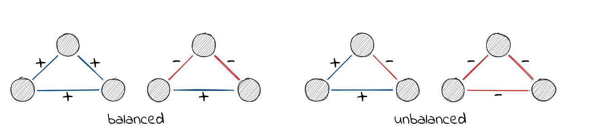

# Signed Networks {#sec-signed-networks}

Most of social network analysis deals with relations that are inherently positive: friendship, collaboration, advice seeking, trade. The tools we use to study networks, from centrality indices to community detection, were largely developed with these positive ties in mind. But social life is not only about who we like. People form rivalries, nations go to war, and online communities upvote *and* downvote content. When we want to study networks that contain both positive and negative ties, we enter the realm of signed networks.

Signed networks require their own analytical toolkit. Standard centrality measures do not account for the difference between a node connected to five friends versus one connected to five enemies. Community detection algorithms that look for dense subgroups miss the point when the structure is defined by who is *against* whom, not just who is *with* whom. In this chapter, we introduce the key concepts and methods for analysing signed networks: structural balance, blockmodeling, and centrality.

## Packages Needed for this Chapter

```{r}
#| label: libraries
#| message: false
library(igraph)
library(signnet)
library(networkdata)
```

```{r}
#| label: libraries-silent
#| include: false
library(ggraph)
library(patchwork)
```

## What Are Signed Networks?

A signed network is a network where each edge carries a sign: positive (+1) or negative (-1). Positive ties typically represent friendship, alliance, trust, or agreement, while negative ties represent enmity, conflict, distrust, or disagreement. The combination of both types of ties in a single network is what makes signed networks analytically distinct from conventional networks.

In R, the `signnet` package provides tools for analysing signed networks. It builds on `igraph` and assumes that a signed network is an igraph object with an edge attribute `"sign"` containing values 1 (positive) or -1 (negative). All functions in the package check for this attribute and will throw an error if it is missing or contains other values.

```{r}
#| label: example-signed
g <- make_full_graph(5, directed = FALSE)
E(g)$sign <- 1
E(g)$sign[1:3] <- -1
g
```

We will use the `tribes` dataset throughout this chapter. It is a signed social network of sixteen tribes from the Gahuku-Gama alliance structure of the Eastern Central Highlands of New Guinea. Tribes are connected by friendship ties ("rova") and enmity ties ("hina").

```{r}
#| label: load-tribes
data("tribes")
```

The function `ggsigned()` provides a convenient way to visualise signed networks. It requires the `ggraph` package to be installed.

```{r}
#| label: plot-tribes
ggsigned(tribes)
```

Under the hood, a signed network is represented by a signed adjacency matrix, where entries are 1, -1, or 0. We can extract it with `as_adj_signed()`.

```{r}
#| label: signed-adj
as_adj_signed(tribes)[1:5, 1:5]
```

The signed Laplacian matrix, used in several spectral methods, is obtained with `laplacian_matrix_signed()`.

```{r}
#| label: signed-lap
laplacian_matrix_signed(tribes)[1:5, 1:5]
```

## Structural Balance

Structural balance theory originates in the social psychology of Fritz Heider in the 1940s and was formalised for graphs by Cartwright and Harary in the 1950s. The core idea is intuitive: consider three people. If Alice and Bob are friends, and Bob and Carol are friends, we expect Alice and Carol to also be friends -- "the friend of my friend is my friend." Similarly, if Alice and Bob are enemies and Bob and Carol are enemies, we expect Alice and Carol to be friends -- "the enemy of my enemy is my friend." These configurations are *balanced*. A triangle where all three pairs are enemies, or where two pairs are friends but one pair are enemies, feels unstable and is considered *unbalanced*.



More formally, a triangle is balanced if it has an even number of negative ties (zero or two), and unbalanced if it has an odd number (one or three). A network is *balanced* if it can be partitioned into two groups such that all ties within groups are positive and all ties between groups are negative.

We can generate a balanced network with `sample_islands_signed()`, which creates groups with positive intra-group ties and negative inter-group ties.

```{r}
#| label: balanced-example
g_bal <- sample_islands_signed(islands.n = 2, islands.size = 10,
                               islands.pin = 0.8, n.inter = 5)
```

```{r}
#| label: plot-balanced
ggsigned(g_bal)
```

We can verify that this network is balanced by counting its triangles. Balanced networks contain only "+++" and "+--" triangles, with no "++-" or "---" triangles.

```{r}
#| label: count-triangles
count_signed_triangles(g_bal)
```

To inspect individual triangles, we can list them with `signed_triangles()`. The column `P` indicates the number of positive ties in each triangle.

```{r}
#| label: list-triangles
head(signed_triangles(g_bal))
```

Increasing the `islands.n` parameter to more than two creates networks that are not balanced in the strict two-group sense but are "clusterable" as defined by Davis -- they can be partitioned into more than two groups with the same within-positive, between-negative pattern.

### Measuring Balancedness

Real-world networks are rarely perfectly balanced. The question then becomes: *how balanced* is a given network? The `signnet` package implements three methods for measuring the degree of balancedness via `balance_score()`. All return a value between zero (perfectly unbalanced) and one (perfectly balanced).

For our perfectly balanced synthetic network, all three methods agree:

```{r}
#| label: balance-perfect
balance_score(g_bal, method = "triangles")
balance_score(g_bal, method = "walk")
balance_score(g_bal, method = "frustration")
```

The **triangles** method returns the fraction of balanced triangles. It is the most intuitive but only considers local structure.

The **walk** method uses eigenvalues of the signed and unsigned adjacency matrices to capture balance at all scales, not just triangles. It is based on the work of Estrada.

The **frustration** method finds a partition of the network into two groups and counts how many edges violate the balance pattern (negative ties within groups and positive ties between groups). The fewer violations, the more balanced the network. Since finding the optimal partition is computationally hard (NP-complete), the function uses simulated annealing and returns an upper bound. For exact results, `frustration_exact()` solves the problem via integer programming.

For the `tribes` network, which is not perfectly balanced, the three methods disagree:

```{r}
#| label: balance-tribes
balance_score(tribes, method = "triangles")
balance_score(tribes, method = "walk")
balance_score(tribes, method = "frustration")
```

This disagreement is common for empirical networks and reflects the fact that each method captures different aspects of balance. When reporting balance scores, it is good practice to report multiple methods.

### Signed Triad Census

For directed signed networks, the function `triad_census_signed()` computes the signed triad census. While the unsigned triad census distinguishes 16 types of triads, the signed version distinguishes 138 non-isomorphic types. The naming scheme follows the pattern "xxx-yyyyyy", where "xxx" is the unsigned triad type and "yyyyyy" describes the signs of the ties present (P for positive, N for negative, 0 for absent).

## Blockmodeling

Structural balance theory predicts that a balanced network can be partitioned into groups with positive intra-group ties and negative inter-group ties. Blockmodeling is the computational approach to finding such partitions.

### Traditional Blockmodeling

The function `signed_blockmodel()` partitions a network into `k` blocks, optimising for positive ties within blocks and negative ties between blocks. The objective function is $P(C) = \alpha N + (1-\alpha)P$, where $N$ is the total number of negative ties within blocks and $P$ is the total number of positive ties between blocks. The parameter `alpha` controls the trade-off between these two goals.

Let us apply blockmodeling to the `tribes` network with three blocks:

```{r}
#| label: blockmodel-tribes
set.seed(44)
clu <- signed_blockmodel(tribes, k = 3, alpha = 0.5, annealing = TRUE)
clu$membership
clu$criterion
```

The function returns a list with two entries: the block membership of each node and the value of $P(C)$, where lower values indicate a better fit. Setting `annealing = TRUE` uses simulated annealing in the optimisation, which generally produces better results at the cost of longer computation.

We can visualise the block structure with `ggblock()`:

```{r}
#| label: plot-blockmodel-tribes
ggblock(tribes, clu$membership, show_blocks = TRUE)
```

The matrix plot shows positive ties (within-block) and negative ties (between-block), giving a visual assessment of how well the blockmodel captures the signed structure of the network.

### Generalized Blockmodeling

Traditional blockmodeling assumes a single pattern: positive blocks on the diagonal and negative blocks off the diagonal. But some networks have more complex structures. For instance, two groups might be allies (positive ties between them) while both are enemies of a third group.

The function `signed_blockmodel_general()` allows us to specify arbitrary block structures via the `blockmat` parameter. Each entry in the matrix indicates whether we expect the corresponding block to be positive (1) or negative (-1).

```{r}
#| label: general-setup
## construct a network with a non-standard block structure
g1 <- g2 <- g3 <- make_full_graph(5)
V(g1)$name <- as.character(1:5)
V(g2)$name <- as.character(6:10)
V(g3)$name <- as.character(11:15)

g <- Reduce("%u%", list(g1, g2, g3))
E(g)$sign <- 1
E(g)$sign[1:10] <- -1
g <- add_edges(g, c(rbind(1:5, 6:10)), attr = list(sign = -1))
g <- add_edges(g, c(rbind(1:5, 11:15)), attr = list(sign = -1))
g <- add_edges(g, c(rbind(11:15, 6:10)), attr = list(sign = 1))
```

Here, groups two and three have positive ties between them, while both have negative ties with group one. The block structure matrix reflects this:

```{r}
#| label: general-blockmat
set.seed(424)
blockmat <- matrix(c(1, -1, -1,
                     -1, 1, 1,
                     -1, 1, -1), 3, 3, byrow = TRUE)
blockmat

general <- signed_blockmodel_general(g, blockmat, alpha = 0.5)
general$criterion
```

```{r}
#| label: plot-general-blockmodel
ggblock(g, general$membership, show_blocks = TRUE)
```

Comparing the general model with the traditional model on this network shows the benefit of specifying the correct block structure:

```{r}
#| label: compare-blockmodels
traditional <- signed_blockmodel(g, k = 3, alpha = 0.5, annealing = TRUE)
c(general = general$criterion, traditional = traditional$criterion)
```

A lower criterion value indicates a better fit. The general model should perform better here because it matches the actual structure of the network.

## Centrality

In unsigned networks, having many connections is straightforwardly advantageous. But in signed networks, the picture is more nuanced. A tribe with five alliances and no enemies is in a very different position from one with five alliances and five enemies, even though both have the same number of ties. Centrality indices for signed networks must account for this distinction.

### Signed Degree

The function `degree_signed()` offers four variants, controlled by the `type` parameter:

- `type = "pos"`: count only positive neighbors
- `type = "neg"`: count only negative neighbors
- `type = "ratio"`: positive neighbors / (positive + negative neighbors)
- `type = "net"`: positive neighbors minus negative neighbors

For directed networks, the `mode` parameter distinguishes "in" and "out" versions.

```{r}
#| label: degree-tribes
data.frame(
  tribe = V(tribes)$name,
  pos = degree_signed(tribes, type = "pos"),
  neg = degree_signed(tribes, type = "neg"),
  ratio = round(degree_signed(tribes, type = "ratio"), 2),
  net = degree_signed(tribes, type = "net")
)
```

### PN Centrality and Eigenvector Centrality

Beyond degree, the `signnet` package implements two more centrality indices. The **PN index** by Everett and Borgatti is conceptually similar to Katz status for unsigned networks. It takes into account not just direct ties but also the signs of indirect paths through the network.

**Eigenvector centrality** (`eigen_centrality_signed()`) extends the idea that a node is central if it is connected to other central nodes, adapted for signed networks.

```{r}
#| label: centrality-comparison
cent_df <- data.frame(
  tribe = V(tribes)$name,
  degree_net = degree_signed(tribes, type = "net"),
  eigen = round(eigen_centrality_signed(tribes), 3),
  pn = round(pn_index(tribes), 3)
)
cent_df
```

The correlation between eigenvector centrality and the PN index tells us how much these two measures agree:

```{r}
#| label: centrality-cor
cor(eigen_centrality_signed(tribes), pn_index(tribes), method = "kendall")
```

Note that the adjacency matrix of a signed network may not have a dominant eigenvalue. When this occurs, eigenvector centrality is not well-defined and `eigen_centrality_signed()` will return an error. In such cases, the PN index provides a more robust alternative.

## Signed Two-Mode Networks

The `signnet` package also provides tools for working with signed two-mode (bipartite) networks. Projecting a signed two-mode network onto one of its modes is less straightforward than in the unsigned case, because paths through negative ties can change the sign of the resulting projection. The package implements a duplication approach that resolves this issue and also accounts for ambivalent ties, where both positive and negative paths exist between two nodes. For details, see the `signnet` package vignette on signed two-mode networks.

## Use Case: International Relations

The `cowList` dataset (included in the `signnet` package) contains 51 signed networks of inter-state relations in overlapping four-year windows from 1946 to 1999, derived from the [Correlates of War](https://correlatesofwar.org/) project. Two countries are connected by a positive tie if they formed an alliance or signed a peace treaty, and by a negative tie if they were at war or involved in other conflicts.

```{r}
#| label: load-cow
data("cowList")
names(cowList)[c(1, 20, 51)]
```

Each network covers a four-year window (e.g., "65-68" covers 1965--1968). Let us examine two snapshots: one from the height of the Cold War and one from the post-Cold War period.

```{r}
#| label: cow-years
cow_cold <- cowList[["65-68"]]
cow_post <- cowList[["93-96"]]
```

```{r}
#| label: cow-sizes
c(nodes_cold = vcount(cow_cold), edges_cold = ecount(cow_cold),
  nodes_post = vcount(cow_post), edges_post = ecount(cow_post))
```

We can assess how balanced the international system was in each period:

```{r}
#| label: cow-balance
data.frame(
  method = c("triangles", "walk", "frustration"),
  cold_war = c(
    balance_score(cow_cold, method = "triangles"),
    balance_score(cow_cold, method = "walk"),
    balance_score(cow_cold, method = "frustration")
  ),
  post_cold_war = c(
    balance_score(cow_post, method = "triangles"),
    balance_score(cow_post, method = "walk"),
    balance_score(cow_post, method = "frustration")
  )
)
```

Applying blockmodeling reveals the alliance structure. During the Cold War, we would expect to find blocs corresponding to the Western and Eastern alliances:

```{r}
#| label: cow-blockmodel
set.seed(42)
clu_cold <- signed_blockmodel(cow_cold, k = 2, alpha = 0.5, annealing = TRUE)
```

```{r}
#| label: plot-cow-blockmodel
ggblock(cow_cold, clu_cold$membership, show_blocks = TRUE)
```

The block membership can be inspected alongside the country names to see which states cluster together:

```{r}
#| label: cow-membership
split(V(cow_cold)$name, clu_cold$membership)
```

## Scientific Reading

Heider, Fritz. 1946. "Attitudes and Cognitive Organization." *The Journal of Psychology* 21 (1): 107--12.

Cartwright, Dorwin, and Frank Harary. 1956. "Structural Balance: A Generalization of Heider's Theory." *Psychological Review* 63 (5): 277.

Davis, James A. 1967. "Clustering and Structural Balance in Graphs." *Human Relations* 20 (2): 181--87.

Doreian, Patrick, and Andrej Mrvar. 1996. "A Partitioning Approach to Structural Balance." *Social Networks* 18 (2): 149--68.

Doreian, Patrick, and Andrej Mrvar. 2009. "Partitioning Signed Social Networks." *Social Networks* 31 (1): 1--11.

Doreian, Patrick, and Andrej Mrvar. 2015. "Structural Balance and Signed International Relations." *Journal of Social Structure* 16: 1.

Aref, Samin, and Mark C. Wilson. 2018. "Measuring Partial Balance in Signed Networks." *Journal of Complex Networks* 6 (4): 566--95.

Estrada, Ernesto. 2019. "Rethinking Structural Balance in Signed Social Networks." *Discrete Applied Mathematics*.

Everett, Martin G., and Stephen P. Borgatti. 2014. "Networks Containing Negative Ties." *Social Networks* 38: 111--20.

Bonacich, Phillip, and Paulette Lloyd. 2004. "Calculating Status with Negative Relations." *Social Networks* 26 (4): 331--38.
