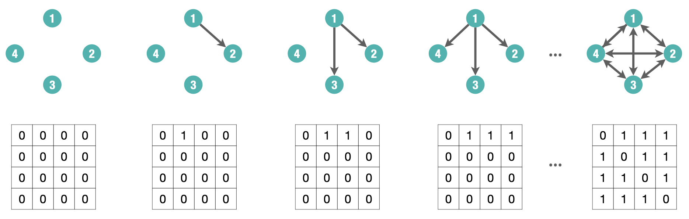

# Stochastic Actor Oriented Models (SAOMs) {#sec-saom}

Up to this point, we have focused on modeling social networks as
**cross-sectional data**, that is, as static snapshots of tie patterns observed
at a single point in time. Models such as Erdős--Rényi, preferential attachment,
and Exponential Random Graph Models (ERGMs) allow us to account for structural
dependencies, attribute effects, and network complexity within such static
networks.

However, social networks are inherently dynamic. Ties are not fixed; they
emerge, dissolve, and evolve through time as a result of decisions made by
individual actors. Treating network data as static ignores this core aspect of
social life. A more realistic modeling approach must account for the sequential,
actor-driven nature of network evolution.

This brings us to **Stochastic Actor-Oriented Models (SAOMs)**, a class of
models explicitly designed for **longitudinal network data**. Unlike
cross-sectional models that treat the network as a single outcome, SAOMs treat
the network as a continuous-time stochastic process driven by individual actor
decisions. In this framework, changes to the network occur one tie at a time,
reflecting micro-level decisions made by actors based on preferences,
opportunities, and constraints.

SAOMs are particularly well-suited for panel data, i.e., multiple observations
of the same network over time where both tie structures and actor attributes may
co-evolve. This allows researchers to address questions such as:

- How often do actors initiate or terminate ties?
- Do actors prefer to form ties based on similarity (selection) or become more
  similar after forming ties (influence)?
- How do structural tendencies like reciprocity or transitivity manifest through
  sequential decision-making?
- Can we simulate or predict how the network may evolve in future time points?

SAOMs are one of two main frameworks for dynamic network modeling. The other is
the **Temporal Exponential Random Graph Model (TERGM)**. While TERGMs extend
ERGMs to panel data by conditioning on past networks, SAOMs take a process-based
view that explicitly models *how* ties change over time due to actor decisions.

@tbl-ergmsaom shows the core differences between ERGMs. While ERGMs model the
global structure of a network at a single point in time, SAOMs treat network
evolution as a dynamic process driven by actors making sequential decisions. In
other words, SAOMs extend the logic of ERGMs into the temporal domain, capturing
the mechanisms of change rather than just the final structure.

::: {#tbl-ergmsaom}
  |                       | ERGMs                                       | SAOMs                                                 |
  | :-------------------- | ------------------------------------------- | ----------------------------------------------------- |
  | **Data type**         | Cross-sectional (static snapshot)           | Longitudinal (panel data, repeated observations)      |
  | **Unit of analysis**  | The entire network                          | Individual actor decisions                            |
  | **Modeling approach** | Statistical dependence among ties           | Actor-based tie change process                        |
  | **Time modeling**     | No time dimension                           | Continuous-time change process                        |
  | **Common mechanisms** | Reciprocity, transitivity, nodal covariates | Same, but expressed as actor preferences over changes |
  | **Estimation method** | MCMC Maximum Likelihood (MCMCMLE)           | Simulation-based Method of Moments (MoM)              |
  | **Outcome**           | Probability of the observed network         | Simulated network trajectories over time              |
  | **In R**              | `ergm` (or `statnet`)                       | `RSiena`                                              |

Comparison between Exponential Random Graph Models (ERGMs) and Stochastic
Actor-Oriented Models (SAOMs). The two approaches differ in their treatment of
time, unit of analysis, estimation, and interpretation.
:::

In what follows, we focus on the SAOM framework, its components, estimation
process, and how it can be used to explain and simulate network evolution.

## Packages Needed for this Chapter

```{r}
#| message: false

library(igraph)
library(ggraph)
library(graphlayouts)
library(networkdata)
library(intergraph)
library(RSiena)
```

### Example: Teenage Friends and Lifestyle Study

We use a running example with data from the "Teenage Friends and Lifestyle
Study" [@west1996s50], which was also used in the previous chapter on ERGMs. In
contrast to the earlier example that focused on a single time point and only the
subset of 50 pupils, we here model the dynamics of friendship ties across all
three observed waves and with the 129 pupils over all three time points, and
including relevant actor-level covariates such as gender and smoking behavior.
The dataset is called `glasgow129` in the `networkdata` package, which includes
the following:

- Networks: Binary, directed friendship ties measured at three time points.
- Actors: 129 pupils measured at three time points.
- Many covariates, but we focus on
  - Sex: 1 = Male, 2 = Female
  - Smoking: 1 = No, 2 = Occasional, 3 = Regular

We load the data from the `networkdata` package and extract a graph object for
each time period:

```{r}
#| message: false

# Load data as graph object from networkdata and extract all three wave networks
glasgow_g1 <- glasgow129[[1]]
glasgow_g2 <- glasgow129[[2]]
glasgow_g3 <- glasgow129[[3]]
```
These `igraph` objects are our network snapshots and consider various SAOMs. We
begin by converting each network snapshot into a binary adjacency matrix. These
matrices represent the presence or absence of directed ties between actors at
each time point.

```{r}
#| message: false

# Convert to adjacency matrices
net1 <- as_adjacency_matrix(glasgow_g1, sparse = FALSE)
net2 <- as_adjacency_matrix(glasgow_g2, sparse = FALSE)
net3 <- as_adjacency_matrix(glasgow_g3, sparse = FALSE)
```

We then combine them into a 3-dimensional array with dimensions
`[actor × actor × wave]`, which is the required format for longitudinal network
data in `RSiena`:

```{r}
#| message: false

# Combine into 3D array [actor x actor x wave]
net_array <- array(c(net1, net2, net3), dim = c(129, 129, 3))
```

## Modeling Network Evolution

Most real-world social networks are dynamic systems. Relationships between
individuals form, dissolve, and evolve as a result of ongoing social
interactions, personal decisions, and contextual factors. When we observe a
single snapshot of a network, we can only speculate about the processes that
produced it. By contrast, longitudinal network data, repeated observations of a
network over time, allow us to move from static description to dynamic
explanation.

Longitudinal network data consist of a set of actors $N = \{1, 2, \dots, n\}$
and a series of observed adjacency matrices:
$$
Y(t_0),\ Y(t_1),\ \dots,\ Y(t_M)
$$
where each matrix captures the presence or absence of ties between actors at a
particular time point, that is $y_{ij}(t) = 1$ if actor $i$ has a tie to actor $j$ at time $t$, and
$y_{ij}(t) = 0$ otherwise.

These repeated measures make it possible to ask and answer key questions:

- How frequently do actors change their ties?
- What drives the formation, maintenance, or dissolution of ties?
- How do individual attributes (e.g., gender, age, group membership) shape
  network dynamics?
- Can we predict how the network will evolve in the future?
- How do both endogenous (network-based) and exogenous (attribute-based) factors
  jointly shape the network?

Moreover, understanding *why* networks change requires distinguishing between
competing explanations. For instance, if we observe that two similar actors are
connected at time $t_1$, this might reflect selection (they formed a tie because
of their similarity) or influence (they became similar after forming a tie).
Only a longitudinal framework allows us to tease apart these mechanisms.

Time also matters for structural tendencies. Consider transitivity: when we
observe a triadic closure (i.e., if $i$ is tied to $j$ and $j$ to $\ell$, then $i$
may become tied to $\ell$), we cannot know whether it reflects an intentional
closure or merely a residual pattern without knowing the order in which ties
appeared.

Stochastic Actor-Oriented Models (SAOMs) offer a solution by treating network
change as a **continuous-time, actor-driven process**. In this framework:

- The network evolves through a sequence of micro-steps where individual actors
  have opportunities to change their outgoing ties.
- Each actor evaluates the current network and makes decisions based on
  preferences (e.g., for reciprocation, closure, or similarity).
- The model simulates the timing and direction of these changes between
  observation moments (waves).

This actor-oriented perspective aligns closely with how ties form in real life:
individuals decide whom to connect with (or disconnect from), guided by
structural cues and attribute-based tendencies.

In the next section, we will formalize this logic, introduce the core components
of SAOMs, and show how the `RSiena` package implements these models for
empirical analysis.

### Stochastic Processes and Continuous-Time Markov Chains

To understand the dynamics of network evolution in Stochastic Actor-Oriented
Models (SAOMs), it is helpful to first grasp the concept of a **stochastic
process**, a collection of random variables indexed by time:

$$
\{ X(t),\ t \in T \}
$$

where:

- $T$ is the index set (typically representing time),
- $S$ is the **state space**, the set of all possible values that $X(t)$ can take.

In the context of longitudinal network analysis, the stochastic process
represents the network evolving over time. That is, we can interpret the state
as the network at time $t$, so that

$$
X(t) \equiv Y(t),
$$

where $Y(t)$ is the adjacency matrix at time $t$, with entries
$y_{ij}(t) \in \{0,1\}$ indicating whether a tie from actor $i$ to actor $j$
is present at time $t$.


SAOMs are based on a particular type of stochastic process: the
**continuous-time Markov chain (CTMC)**. A CTMC is defined by:

1. A finite **state space** $S$ (e.g., all possible network configurations),
2. A **continuous time domain** $t \in [0, \infty)$,
3. The **Markov property**, which states that the future state depends only on
   the present state, not on the past:

$$
P\bigl(X(t_j) = s_j \mid \{X(t): t \le t_i\}\bigr)
=
P\bigl(X(t_j) = s_j \mid X(t_i) = s_i\bigr)
$$

This **memoryless** property implies that future network evolution depends only
on the current configuration. In the context of SAOMs, actors make tie changes
based solely on the present network structure (e.g., existing ties, shared
partners, or attributes), without direct dependence on earlier configurations.

The CTMC evolves through a sequence of randomly timed transitions. Each state is
held for a random duration, and transitions to the next state are governed by
probability. More formally, a CTMC is characterized by:

- When a change occurs: governed by the holding time, typically modeled with an
  exponential distribution.
- What the next state is: determined by the jump matrix, which specifies the
  transition probabilities between states.

Together, **holding time** and **jump probabilities** define the full behavior
of the CTMC.

#### Example: A Cat’s Daily Activities {.unnumbered}

To bring the concept of a continuous-time Markov chain (CTMC) to life (or to all
nine lives of our cat), consider a model of a house cat's daily activities. At
any given moment, the cat is in one of the following behavioral states:

- $0$: Sleeping
- $1$: Eating
- $2$: Playing
- $3$: Plotting chaos (e.g., knocking things off shelves)

We define $X(t)$ as the cat's current activity at time $t$. The process
$\{X(t), t \in [0, \infty)\}$ satisfies:

- A finite state space $S = \{0, 1, 2, 3\}$\
- Continuous transitions over time\
- The Markov property: next state depends only on the current state\

The cat transitions between states at random times. Each stay in a state lasts
for a random holding time, and transitions to the next state occur
probabilistically based on a transition (jump) matrix.

The holding time $T_r$ in state $r$ is modeled using an exponential
distribution:
$$
f_{T_r}(t) = \lambda_r e^{-\lambda_r t}, \quad t > 0
$$

- $\lambda_r$ is the rate of leaving state $r$.
- $\mathbb{E}[T_r] = \frac{1}{\lambda_r}$ is the expected duration in state $r$.

The exponential distribution's **memoryless property** means that the
probability of remaining in a state is independent of how long the cat has
already been in it:
$$
P(T_r > s + t \mid T_r > t) = P(T_r > s)
$$
So, even after two hours of napping, the chance that the cat naps another 30
minutes is the same as if it had just started.

Once the holding time ends, the cat jumps to a new state. The **transition
(jump) matrix** $P = (p_{rs})$ governs this:
$$
p_{rs} = P(X(t^+) = s \mid X(t) = r)
$$
For each state $r$, the row of probabilities $p_{rs}$ must sum to 1:
$$
\sum_{s \in S} p_{rs} = 1
$$

@fig-catex illustrates a single realization of such a process. This visual shows
how a process starting in state 0 might stay there for some time, then jump to
state 2, then state 3, and so on, with irregular intervals between jumps.

::: {#fig-catex}
```{r}
#| fig-height: 4
#| fig-width: 7
#| message: false
#| echo: false

library(ggplot2)
jump_times <- c(0, 2, 5, 8, 14)
states <- c(0, 2, 3, 0, 1)  # Sleep → Play → Chaos → Sleep → Eat

segment_data <- data.frame(
  x = jump_times[-length(jump_times)],
  xend = jump_times[-1],
  y = states[-length(states)]
)

jump_points <- data.frame(
  x = jump_times[-1],
  y = states[-1]
)

ggplot() +
  geom_segment(data = segment_data, aes(x = x, xend = xend, y = y, yend = y),
               linewidth = 1.2, color = "black") +
  geom_point(data = jump_points, aes(x = x, y = y), shape = 21, fill = "black", size = 3) +
  annotate("segment", x = 0, xend = 2, y = -0.3, yend = -0.3,
           arrow = arrow(type = "closed", length = unit(0.2, "cm")),
           color = "#1c9099", linewidth = 1.5) +
  annotate("text", x = 1, y = -0.5, label = "Holding time", color = "#1c9099", size = 4) +
  annotate("segment", x = 8, xend = 8, y = 3, yend = 0.09,
           arrow = arrow(type = "closed", length = unit(0.2, "cm")),
           color = "darkorange", linewidth = 1.5) +
  annotate("text", x = 8.2, y = 1.5, label = "Jump", color = "darkorange", size = 4, angle = 90) +
  labs(x = "Time", y = "State") +
  scale_y_continuous(breaks = 0:3,
                     labels = c("Sleep", "Eat", "Play", "Chaos")) +
  theme_minimal(base_size = 10) +
  theme(panel.grid.minor = element_blank(),
        axis.title.y = element_text(angle = 0, vjust = 1.2))
```
A realization of a continuous-time Markov chain (CTMC) showing the cat
transitioning through behavioral states (Sleep → Play → Chaos → Sleep → Eat).
Horizontal segments show how long each activity lasts (holding time), while
vertical arrows show transitions (jumps) between states.

:::

Below is a hypothetical transition matrix $P$ for the cat's behavioral states.
Each row corresponds to the current state, and each column to the next state:

  |           | Sleep | Eat  | Play | Chaos |
  | --------- | :---: | :--: | :--: | :---: |
  | **Sleep** | 0.00  | 0.70 | 0.83 | 0.56  |
  | **Eat**   | 0.71  | 0.00 | 0.81 | 0.20  |
  | **Play**  | 0.05  | 0.82 | 0.00 | 0.45  |
  | **Chaos** | 0.91  | 0.46 | 0.61 | 0.00  |

> *Note: Diagonal entries (e.g., Sleep → Sleep) are set to zero for
> interpretability. They can be included to model the probability of no state
> change.*

Next, we can combine the states and transitions into a directed graph showing
which states can be reached from one another, and with what likelihood. This is
shown in @fig-catex2.

::: {#fig-catex2}
```{r}
#| fig-height: 4
#| fig-width: 4
#| message: false
#| echo: false

library(igraph)
library(ggraph)
library(tidygraph)
library(ggplot2)

# Define all 4 states
state_names <- c("Sleep", "Eat", "Play", "Chaos")

# Create all combinations of from → to (including self-loops)
transitions <- expand.grid(from = state_names, to = state_names, stringsAsFactors = FALSE)

# Assign random-ish transition probabilities (you can edit or normalize)
set.seed(77)
transitions$prob <- round(runif(nrow(transitions), min = 0.05, max = 0.95), 2)
# Create graph
g <- tbl_graph(nodes = data.frame(name = state_names), edges = transitions, directed = TRUE)

# Plot using geom_edge_arc to support curvature
ggraph(g, layout = "circle") +
  geom_edge_arc(aes(label = prob),
                arrow = arrow(length = unit(3, "mm"), type = "closed"),
                end_cap = circle(8, "mm"),
                start_cap = circle(8, "mm"),
                label_colour = "black",
                label_size = 3,
                alpha = 0.8,
                strength = 0.15,
                angle_calc = "along",
                label_dodge = unit(2.5, "mm"),
                show.legend = FALSE) +
  geom_node_circle(aes(r = 0.1), fill = "lightgrey", color = "black") +
  geom_node_text(aes(label = name), size = 3, fontface = "bold") +
  theme_void() 


```
Directed graph representation of the CTMC jump chain. Each node is a state
(e.g., Sleep, Eat), and arrows represent possible transitions with associated
probabilities.
:::

@fig-catex2 is a visual representation of this matrix. Each arrow in the graph
corresponds to a non-zero entry $p_{rs}$ in the matrix. The curved edges
indicate transitions between pairs of states, and the labels on the arrows match
the values in the matrix. Together, the matrix and the graph describe a **jump
chain** over the set of behavioral states. These transitions are stochastic
(i.e., random), and their dynamics unfold in continuous time, which is what
differentiates CTMCs from discrete-time Markov models.

In summary, a Continuous-Time Markov Chain (CTMC):

- Determines how long the system remains in a state using the holding time,
  typically modeled as exponentially distributed.
- Uses a transition (jump) matrix to govern which state is entered next.
- Is memoryless and evolves in continuous time, meaning the future depends only
  on the present state and not the past.

These principles underpin Stochastic Actor-Oriented Models (SAOMs), where actors
make sequential and probabilistic changes to their network ties or attributes,
driven solely by the current network state.

### Definition of SAOMs

Stochastic Actor-Oriented Models (SAOMs), introduced by @snijders1996stochastic,
provide a principled framework for analyzing how social networks evolve over
time. Formally, network evolution is represented as a continuous-time Markov
chain (CTMC) operating on a space of networks.

As previously introduced, a continuous-time Markov chain (CTMC) is characterized
by three key components:

- **A finite state space**: For SAOMs, this is the set $\mathcal{Y}$ of all
  possible directed networks on $n$ actors. Each state $Y \in \mathcal{Y}$ is an
  adjacency matrix with entries $y_{ij} \in \{0,1\}$ for $i \neq j$.
- **A continuous-time process**: Network changes (such as the creation or
  dissolution of ties $y_{ij}(t)$) occur at random points in continuous time.
- **The Markov property**: The probability of a transition depends only on the
  current network state $Y(t)$, not on the sequence of past networks that
  preceded it.

In the sections that follow, we explore how each of these components is specified
in SAOMs, including how actors are selected to make changes and how tie updates
are determined.

#### State Space of Networks

Let $\mathcal{Y}$ denote the set of all possible adjacency matrices (i.e.,
network configurations) defined on $n$ actors. Each matrix $Y \in \mathcal{Y}$
represents a possible state of the network.

For directed networks without self-ties, the size of this state space is:

$$
|\mathcal{Y}| = 2^{n(n-1)}
$$

This follows from the fact that each of the $n(n-1)$ possible directed ties
between distinct actors $(i,j)$ with $i \neq j$ can independently be either
present ($y_{ij} = 1$) or absent ($y_{ij} = 0$).

In the SAOM framework, the stochastic process $\{Y(t), t \geq 0\}$ evolves over
this state space, with each realization corresponding to a sequence of network
configurations over time.

For instance, with a 4-node directed network shown in @fig-saomex, we can
represent different adjacency matrices as the network evolves. The figure
illustrates a step-by-step sequence of tie changes, starting from an empty
network and progressing toward a more connected structure.

::: {#fig-saomex .center}
{width="100%"}

An example of network evolution as a sequence of micro-steps in continuous time.
At each step, a single directed tie $y_{ij}$ is updated, producing a new network
state and its corresponding adjacency matrix.
:::

#### Continuous-time process

Stochastic Actor-Oriented Models (SAOMs) assume that the network evolves as a
continuous-time Markov process. Formally, the stochastic process
$\{Y(t), t \geq 0\}$ changes over time through a sequence of small,
actor-driven modifications, where individual ties $y_{ij}(t)$ may be created or
dissolved.

In empirical applications, however, we do not observe the full trajectory of
this process. Instead, we observe the network only at a finite set of discrete
time points (e.g., survey waves):
$$
t_1,\ t_2,\ \ldots,\ t_M.
$$

At each observation moment, we record a network $Y(t_m)$, but the intermediate
tie changes (i.e., which actor changed which tie $(i,j)$ and at what exact time)
remain unobserved. These changes occur in a latent process between observation
moments.

This distinction is fundamental:

- **Observed process**: a sequence of network snapshots
  $Y(t_1), Y(t_2), \ldots, Y(t_M)$.
- **Latent process**: the underlying continuous-time evolution, consisting of
  a sequence of micro-steps in which actors stochastically update individual
  ties $y_{ij}(t)$ based on the current network state $Y(t)$.

SAOMs aim to model and simulate this latent evolution process, allowing us to
infer the actor-level mechanisms that most likely generated the observed changes
between $Y(t_1)$ and $Y(t_M)$.

#### The Markov Property

A central assumption of Stochastic Actor-Oriented Models (SAOMs) is that the
probability of moving to a new network state depends only on the current state,
not on the path taken to get there. This is the Markov property and is formally
defined as:
$$
P\bigl(Y(t_j) = y' \mid \{Y(t): t \leq t_i\}\bigr)
=
P\bigl(Y(t_j) = y' \mid Y(t_i) = y\bigr)
$$
where $Y(t)$ denotes the network state (i.e., adjacency matrix) at time $t$,
and $y, y' \in \mathcal{Y}$ are particular network configurations at times
$t_i$ and $t_j$, respectively.

In other words, the future evolution of the process depends solely on the
current network state $Y(t_i)$ and not on the entire sequence of previous
states. The model is memoryless: it "forgets" the past once the current state is
known.

In the context of SAOMs, this means that when an actor is given the opportunity
to make a change, such as forming or dissolving a tie $y_{ij}(t)$, they do so
based only on the current network structure and covariate information. There is
no dependence on the path the network took to reach its current configuration.

This assumption significantly simplifies the modeling of network dynamics. It
eliminates the need to track full network histories and allows for tractable
simulation-based estimation. Conceptually, it also aligns with many social
processes where actors respond to their current social environment rather than
recalling a complete relational past.

Nonetheless, the Markov assumption is a modeling abstraction. While it
facilitates analysis and interpretation, it may not capture certain behaviors
where history matters, such as long-term reciprocity, reputation building, or
delayed responses. Still, for many applications, it offers a powerful and
flexible framework for understanding how networks evolve over time.

#### Actor-Oriented Modeling Assumptions

A central challenge in modeling network dynamics is the vast number of possible
network configurations. For a directed network with $n$ actors, the state space
$\mathcal{Y}$ contains $2^{n(n-1)}$ possible networks, making exhaustive
evaluation of all potential transitions computationally infeasible.

SAOMs address this by adopting an **actor-driven approach**. Instead of modeling
global changes to the network, SAOMs assume that individual actors make
decisions about their outgoing ties through a series of small, sequential
updates. This simplifies the modeling process while remaining grounded in a
realistic representation of social behavior.

The SAOM framework relies on three core assumptions:

1. **One actor at a time**: At each micro-step, a single actor $i$ is randomly
   selected and given the opportunity to revise their outgoing ties. This
   reflects individual, sequential decision-making.

2. **One tie at a time**: The selected actor $i$ considers one outgoing tie
   $y_{ij}(t)$ for some $j \neq i$, and may choose to create it
   ($y_{ij}(t) = 1$), dissolve it ($y_{ij}(t) = 0$), or leave it unchanged.
   Only one tie variable can change per step, which keeps the space of possible
   transitions manageable.

3. **Actor-controlled change**: Each actor controls only their own outgoing
   ties. Tie changes arise solely from the actor's individual evaluation of the
   current network state $Y(t)$ and are not the result of simultaneous or
   coordinated actions.

Together, these assumptions define a process of sequential micro-steps, each
involving:

- Selecting an actor $i$ at random,
- Considering a possible change to one tie $y_{ij}(t)$,
- And waiting a randomly determined time before the next opportunity arises.

This process unfolds in continuous time and follows the structure of a
continuous-time Markov chain (CTMC). It consists of two key components: the
**holding time**, which determines how long the current network state $Y(t)$
persists, and the **jump chain**, which defines the probability of transitioning
to a new network state via a single tie update.


#### The Holding Time and the Jump Chain

The **holding time** in SAOMs refers to the waiting period before an actor is
given the opportunity to change one of their outgoing ties. In accordance with
the properties of a continuous-time Markov chain (CTMC), this waiting time is
modeled as an exponentially distributed random variable.

For actor $i$, the holding time $T_i$ has the following probability density
function:
$$
f_{T_i}(t) = \lambda_i e^{-\lambda_i t}, \quad \lambda_i > 0, \quad t > 0
$$
Here, $\lambda_i$ is the rate parameter, determining how frequently actor $i$
receives opportunities to change their ties. The choice of $\lambda_i$ defines
how the actor selection process unfolds:

- **Homogeneous specification**: All actors have the same rate $\lambda$,
  implying equal opportunity:
  $$
  \lambda_i = \lambda \quad \text{for all } i, \qquad 
  P(i \text{ is selected}) = \frac{1}{n}
  $$

- **Heterogeneous specification**: The rate varies across actors based on
  covariates or network structure:
  $$
  \lambda_i = \lambda_i(\theta, Y(t), v)
  $$
  where $\theta$ is a parameter vector, $Y(t)$ is the current network
  configuration, and $v$ are actor-specific covariates. In this case:
  $$
  P(i \text{ is selected}) = 
  \frac{\lambda_i(\theta, Y(t), v)}{\sum_{r=1}^{n} \lambda_r(\theta, Y(t), v)}
  $$
  This flexibility allows the model to reflect actor-level heterogeneity in the
  speed of network change. In many applications, however, a homogeneous rate is
  assumed for simplicity and interpretability.

This setup relies on the memoryless property of the exponential distribution:
$$
P(T_i > s + t \mid T_i > t) = P(T_i > s)
$$
That is, the probability that actor $i$ will be selected in the next instant is
unaffected by how long they have already been waiting. This property aligns
naturally with the continuous-time Markov assumption and greatly simplifies
simulation. In summary, the holding time determines *when* micro-steps occur.

Once an actor has been selected and the holding time has elapsed, the next
question becomes: *what* change (if any) will this actor make to the network?
This is governed by the **jump chain**, which determines the next network state.

At each micro-step, actor $i$ evaluates a set of feasible alternatives
$\{Y^{(a)}\}_{a=1}^{A}$, each differing from the current network $Y(t)$ by at
most a change in one outgoing tie $y_{ij}(t)$ (i.e., forming, dissolving, or
maintaining a tie).

Each alternative $Y^{(a)}$ is assigned a utility:
$$
U_{ia} = F_{ia} + \varepsilon_{ia}
$$

Here, $F_{ia}$ represents the deterministic component of the utility function,
typically defined through an objective function that incorporates structural
effects such as reciprocity, transitivity, or covariate similarity. The
$\varepsilon_{ia}$ term introduces randomness via a Gumbel-distributed
disturbance, reflecting unobserved preferences or decision noise.

This setup defines a **random utility model**, where actor $i$ selects among
alternatives probabilistically. Under the Gumbel assumption, the choice
probabilities follow a multinomial logit form:

$$
p_{ia} = \frac{\exp(F_{ia})}{\sum_{b=1}^{A} \exp(F_{ib})}
$$

where $F_{ia}$ is the deterministic utility that actor $i$ assigns to
alternative $a$, corresponding to the candidate network $Y^{(a)}$.

These probabilities define the jump chain, describing the likelihood of moving
from the current network state $Y(t)$ to a new state $Y^{(a)}$. Because only one
actor changes at most one tie at each micro-step, the set of feasible
transitions is small, making the process computationally tractable.

We now make explicit how the deterministic component $F_{ia}$ is constructed.
It is given by an **objective function**:

$$
F_{ia} = f_i(\theta, Y^{(a)}) = \sum_{k=1}^{K} \theta_k \cdot s_{ik}(Y^{(a)}, v)
$$

where:

- $Y^{(a)}$ is the candidate network after a tie change,
- $s_{ik}(Y^{(a)}, v)$ is the contribution of effect $k$ for actor $i$,
- $\theta_k$ is the parameter associated with that effect.

This formulation makes clear that the utility of an alternative depends on how
the resulting network configuration aligns with the actor's preferences, as
captured by the statistics $s_{ik}(\cdot)$. The random utility formulation
introduces stochasticity while allowing for interpretable parameter estimation.

In summary, the jump chain determines *which* network configuration the process
moves to, conditional on actor selection. Combined with the holding time, which
governs *when* actors are selected, it defines the dynamics of the SAOM as a
continuous-time Markov process.

#### Endogenous Effects in the Objective Function

The objective function introduced above is a linear combination of effects, each
capturing a specific structural pattern or social mechanism. These effects are
conceptually similar to those used in Exponential Random Graph Models (ERGMs),
although they differ in interpretation due to the dynamic and actor-oriented
nature of SAOMs. They fall into two main categories:

- **Endogenous effects**: derived from the structure of the network itself.
- **Exogenous effects**: related to external actor attributes.

The objective function for actor $i$ evaluating a candidate network $Y^{(a)}$
is given by:

$$
f_i(\theta, Y^{(a)}) = \sum_{k=1}^{K} \theta_k \cdot s_{ik}(Y^{(a)})
$$

where $\theta_k$ is the parameter for effect $k$, and s_{ik}(Y^{(a)}) is
the value of effect $k$ evaluated for actor $i$ in the candidate network
$Y^{(a)}$. Each effect enters the objective function with an associated
parameter to be estimated from data. The weighted sum of these effects (together
with a stochastic component) determines the actor's utility for each potential
tie change, guiding the probabilistic decision-making process at the heart of
the SAOM framework.

This section focuses on a set of commonly used endogenous effects, that is,
effects based solely on the structure of the network (without using external
covariates). Many other effects can be specified, depending on the theoretical
focus and complexity of the network under study.

##### 1. Outdegree Effect {.unnumbered}

Similar to the `edges` term in ERGM, this effect reflects the tendency (or cost)
of maintaining ties. It counts the number of outgoing ties from actor $i$ in the
candidate network configuration $Y^{(a)}$:

$$
s_i^{\text{out}}(Y^{(a)}) = \sum_{j} y^{(a)}_{ij}
$$

This term typically has a negative coefficient, penalizing actors for having too
many ties, and thus introducing a cost to maintaining social relationships.

##### 2. Reciprocity Effect {.unnumbered}

The reciprocity effect captures the tendency for actors to form mutual ties
(equivalent to the `mutual` term in ERGMs). It counts how many of actor $i$'s
outgoing ties are reciprocated:

$$
s_i^{\text{rec}}(Y^{(a)}) = \sum_{j} y^{(a)}_{ij} \, y^{(a)}_{ji}
$$

A positive coefficient for this effect reflects a preference for mutual
connections, e.g., *"I send a tie to those who also send one to me."*

##### 3. Transitive Triplets Effect {.unnumbered}

Closely related to the `triangles` or `GWESP` terms in ERGMs, this effect models
triadic closure. The transitive effect reflects a tendency toward forming
closed triads. If actor $i$ sends a tie to $h$, and $h$ sends a tie to $j$, then
$i$ is more likely to send a tie to $j$.

$$
s_i^{\text{trans}}(Y^{(a)}) = \sum_{j,h} y^{(a)}_{ij} \, y^{(a)}_{jh} \, y^{(a)}_{ih}
$$

This effect captures the formation of transitive triples (closed triads), where
$i \to j$, $j \to h$, and $i \to h$. It reflects processes such as social
closure, hierarchy, and the formation of cohesive subgroups.

##### 4. Three-Cycle Effect {.unnumbered}

The three-cycle effect (analogous to cyclic triads in ERGMs) captures the
tendency of actors to form circular structures in the network. Specifically,
it counts the number of directed cycles of length three involving actor $i$:

$$
s_i^{\text{cyc}}(Y^{(a)}) = \sum_{j,h} y^{(a)}_{ij} \, y^{(a)}_{jh} \, y^{(a)}_{hi}
$$

This effect captures patterns such as $i \to j \to h \to i$, representing
feedback loops or non-hierarchical structures in the network. It often receives
a negative coefficient, discouraging cyclic patterns and favoring more
hierarchical or transitive structures.

Next, we introduce exogenous effects, which link actor behavior to covariates
such as attributes or group memberships.

#### Exogenous Effects in the Objective Function {#sec-exeffects}
In addition to modeling endogenous network tendencies (such as reciprocity or
transitivity), SAOMs allow the inclusion of **exogenous covariates** that
influence tie formation. These covariates capture observed attributes of actors
or dyads that may shape network dynamics.

We denote covariate information by $v$. Depending on the context, $v$ may include:

- **Actor-level covariates**: $v_i$ (e.g., age, gender, smoking status),
- **Dyadic covariates**: $v_{ij}$ (e.g., geographic distance or similarity between actors $i$ and $j$).

As in ERGMs, these effects enter the **objective function**, which represents
the utility that actor $i$ associates with a candidate network configuration
$Y^{(a)}$:

$$
f_i(\theta, Y^{(a)}) = \sum_{k=1}^{K} \theta_k \cdot s_{ik}(Y^{(a)}, v)
$$

Here, the statistics $s_{ik}(Y^{(a)}, v)$ may depend not only on the network
structure $Y^{(a)}$ but also on the covariates $v$. This allows actor $i$’s
evaluation of potential tie changes to incorporate both structural features of
the network and observed attributes of actors or dyads.

Below are common types of exogenous effects.

##### 1. Individual-Level Covariate Effects {.unnumbered} 

These effects are based on **actor-level covariates** and can enter the
objective function in two ways:

1. **Covariate-Ego Effect**\
   This effect captures whether actors with a particular covariate value are
   more (or less) likely to form outgoing ties.
   $$
   s_i^{\text{ego}}(Y^{(a)}, v) = v_i \sum_j y^{(a)}_{ij}
   $$
   Here, $v_i$ is the covariate value for actor $i$ (the *ego*), and the
   statistic counts how many ties they initiate. If the covariate is binary,
   this can test whether having a trait (e.g., belonging to a particular group)
   is associated with being more active in sending ties.

2. **Covariate-Alter Effect**\
   This effect reflects a preference for forming ties to others (*alters*) with
   certain attribute values.
   $$
   s_i^{\text{alter}}(Y^{(a)}, v) = \sum_j y^{(a)}_{ij} \, v_j
   $$
   Here, $v_j$ is the covariate value of the potential receiver. A positive
   parameter indicates that actors are more likely to send ties to alters with
   higher covariate values (and vice versa).

##### 2. Dyadic Covariate Effects {.unnumbered}

SAOMs also allow modeling based on **dyadic similarity**, capturing whether
actors prefer to connect with others who are similar in some attribute.

A common specification is the similarity-based effect:
$$
s_i^{\text{sim}}(Y^{(a)}, v) 
= \sum_j y^{(a)}_{ij} 
\left( 1 - \frac{|v_i - v_j|}{\max(v) - \min(v)} \right)
$$

This statistic increases when actor $i$ sends ties to actors $j$ who are similar
in their covariate values. The similarity term is normalized to the interval
$[0,1]$, where 1 indicates perfect similarity and 0 indicates maximal
difference.

For binary covariates, this simplifies to an indicator function:
$$
s_i^{\text{sim}}(Y^{(a)}, v) = \sum_j y^{(a)}_{ij} \cdot \mathbf{1}(v_i = v_j)
$$

This effect captures **homophily**, the tendency of actors to form ties with
others who share the same attribute (e.g., same gender or group membership).

#### Choosing Effects for the Objective Function

When specifying a Stochastic Actor-Oriented Model (SAOM), the first step is to
select which effects to include in the actor's objective function
$f_i(\theta, Y^{(a)})$. At a minimum, models typically include an outdegree
effect (capturing a baseline tendency to form ties) and a reciprocity effect
(capturing the preference for mutual ties). 

Beyond these baseline effects, additional terms should be guided by substantive
theory or research hypotheses. For example, if theory suggests that individuals
tend to befriend friends of their friends, a transitive triplet effect may be
appropriate. If social similarity (homophily) based on covariates such as gender
is expected, similarity-based covariate effects can be included.

These choices tailor the model to reflect specific structural patterns and
attribute-driven mechanisms. While only a few examples are presented here,
SAOMs provide a wide range of endogenous and exogenous effects that can be
combined to test theoretically meaningful processes of network evolution.

### Parameter Estimation and Interpretation

In Stochastic Actor-Oriented Models (SAOMs), each parameter $\theta_k$
quantifies the importance of a specific effect $s_{ik}(Y^{(a)}, v)$ in the
actor's decision-making process during network evolution. These parameters help
us understand how structural features or covariates influence the likelihood of
different tie changes.

The interpretation of $\theta_k$ is as follows:

- If $\theta_k = 0$, the statistic $s_{ik}(Y^{(a)}, v)$ has no effect on the
  transition probabilities and does not influence network dynamics.
- If $\theta_k > 0$, actor $i$ is more likely to move toward network states
  $Y^{(a)}$ that increase the value of $s_{ik}(Y^{(a)}, v)$.
- If $\theta_k < 0$, actor $i$ prefers changes that decrease the value of
  $s_{ik}(Y^{(a)}, v)$.

Importantly, these preferences are assumed to be stable over time. That is, the
parameter vector $\theta = (\theta_1, \dots, \theta_K)$ is assumed to be constant
throughout the observation period:
$$
\theta_1, \dots, \theta_K \text{ are constant over time.}
$$

Parameter estimation in SAOMs is performed using simulation-based methods, as
implemented in the `RSiena` R package (SIENA: Simulation Investigation for
Empirical Network Analysis).

The core idea is to simulate the network evolution process under the assumed
model, compare the simulated outcomes with observed data, and iteratively adjust
the parameters to improve the fit. This approach is based on the **method of
moments**, where simulated network statistics are aligned with their empirical
counterparts.

The estimation process typically involves:

- Defining the observed networks at multiple time points,
- Specifying the effects (endogenous and exogenous) to include in the model,
- Running simulations and updating parameters iteratively until convergence.

To assess whether a particular effect significantly contributes to the network
dynamics, we test each parameter $\theta_k$:

- **Null Hypothesis ($H_0$):** The effect has no influence on tie changes,
  $$
  H_0 : \theta_k = 0
  $$
- **Alternative Hypothesis ($H_1$):** The effect has a systematic influence,
  $$
  H_1 : \theta_k \ne 0
  $$

Under standard conditions, inference is based on the **t-ratio**, defined as the
ratio of the parameter estimate to its standard error:
$$
\left| \frac{\theta_k}{\text{s.e.}(\theta_k)} \right| \ge 2 
\;\Rightarrow\; \text{Reject } H_0
$$

If the absolute t-ratio exceeds 2, the parameter is considered significantly
different from zero at approximately the 5% significance level.

### RSiena
RSiena is an R package for estimating and simulating Stochastic Actor-Oriented
Models (SAOMs) for network and behavioral dynamics. It is specifically designed
to analyze longitudinal network data, where social ties and actor attributes
evolve over time.

In RSiena, the distinction between modeling **network evolution** and the
**co-evolution of networks and behavior** begins with how the dependent
variables are specified.

If only the network is included as a dependent variable (i.e., a
`sienaDependent` network object), the model focuses on network evolution. This
framework captures how actors form, maintain, or dissolve ties over time. It
can include covariates (such as gender or smoking status) to explain **social
selection**, meaning that actor attributes influence the likelihood of tie
formation or dissolution. In this case, individual attributes are treated as
exogenous and remain fixed over time.

Alternatively, RSiena allows for **co-evolution models** by including both a
network and a behavioral variable as dependent variables. This setup enables the
simultaneous modeling of two processes: how networks evolve and how actors'
behaviors change over time. This makes it possible to study **social influence**,
where individuals may adopt behaviors similar to those of their network peers.
The model thus captures both the selection of network ties based on covariates
and the influence of peers on individual behavior.

Below, we outline the typical steps involved in estimating SAOMs using RSiena:

1. **Preparing the data**\
   Import and format the network and covariate data into the appropriate
   structure. This includes creating adjacency matrices for networks observed
   over time and vectors or matrices for actor-level covariates. These are then
   converted into RSiena objects such as `sienaDependent`, `coCovar`, or
   `varCovar`.

2. **Specifying the model**\
   Define the model by selecting the effects to include. Use `getEffects()` to
   retrieve the default effects object and `includeEffects()` to add endogenous
   and covariate-related effects.

3. **Estimating the model**\
   Set up the estimation procedure using `sienaAlgorithmCreate()` and estimate
   the model with `siena07()`. Evaluate convergence and diagnostic statistics to
   ensure reliable results.

4. **Interpreting the results**\
   Analyze the estimated parameters to understand the underlying social
   processes. This involves examining the direction, magnitude, and statistical
   significance of effects to interpret mechanisms of network change or
   co-evolution.


#### Model 1: Structural Effects
We begin by estimating a simple model specification that includes only two
effects: an outdegree (density) effect and a reciprocity effect. These capture
baseline tie propensity and the tendency toward mutual ties, without
incorporating more complex structural or covariate-based influences. In other
words, no covariates are included, and the model is specified purely in terms of
endogenous network dynamics.

We first convert the 3D network array `net_array` into a `sienaDependent`
object using the `sienaDependent()` function. This step tells `RSiena` that the
array represents a dependent network variable observed over multiple waves. The
resulting object is then used as input for model specification and estimation.

```{r}
#| message: false
# Convert array into RSiena dependent object
siena_net <- sienaDependent(net_array)
```

After defining the network as a `sienaDependent` object, we now wrap it into a
complete `RSiena` data object using `sienaDataCreate()`. This function prepares
the data for model specification and estimation by bundling all input variables
(here just the network) into a structure that the estimation algorithm can use.

Since we are modeling only the network (and no actor covariates yet), we simply
pass `siena_net` as the argument.

```{r}
#| message: false
# Create a Siena data object
data_mod1 <- sienaDataCreate(siena_net)
```

In RSiena, model specification is driven by the concept of "effects" which
represent the structural features, covariate influences, and behavioral
mechanisms that are hypothesized to drive network or behavioral change. By
default, `getEffects()` lists all possible effects available for the data
structure (e.g., network dynamics, covariates, behaviors). It doesn't add any
effects to the model yet though, it just initializes the structure that will
hold them.

We begin by calling `getEffects()` on our `data_mod1` object to create a
default effects object. This object holds all possible effects for the given
data structure and is used as a base for customization. You can have a look at
these effects directly by calling it:

```{r}
#| message: false
# Define the effects: start with default effect object
my_effects <- getEffects(data_mod1)
my_effects
```

These are the exact effects included by default:

- Rate parameters for each wave transition (e.g., Period 1 and Period 2)
- Outdegree (density): capturing the baseline propensity to send ties
- Reciprocity: modeling the tendency to reciprocate received ties

Since our simple model includes only these two structural effects, there is no
need to add further effects using `includeEffects()` at this stage.

Before running the estimation, we need to define the estimation algorithm that
RSiena will use. This is done with the function `sienaAlgorithmCreate()`, which
sets up the computational parameters for the simulation-based estimation
process.

In the example below, we assign the algorithm to the object `my_algorithm`. The
`projname` argument specifies a name for the project; RSiena will use this name
to organize temporary output files and logs related to the estimation.

```{r}
#| message: false
# Define the estimation algorithm
my_algorithm <- sienaAlgorithmCreate(projname = "saom_1", seed = 123)
```

::: {.callout-note}
Setting a seed as argument ensures reproducible results across runs given same R
setup. Due to the stochastic nature of the algorithm and differences in
computational environments, minor variations may still occur across:

- different versions of R or RSiena,
- different operating systems,
- or when using parallel processing.
:::

This algorithm object is later passed into the `siena07()` function to control
how the estimation is performed. You can customize various settings like number
of iterations, convergence thresholds, or use defaults (as we do here) for a
basic estimation.

Now that we've set up the data, specified the effects, and defined the
estimation algorithm, we can estimate the Stochastic Actor-Oriented Model using
the `siena07()` function. This function runs the RSiena estimation procedure. It
takes the following inputs:

- `my_algorithm`: the algorithm settings we defined earlier.
- `data = data_mod1`: the network data in RSiena format.
- `effects = my_effects`: the specified model effects (in this case, outdegree
  and reciprocity).
- `batch = TRUE`: suppresses user prompts during the estimation, making it
  suitable for scripted or automated runs.

```{r}
#| message: false
#| output: false
#| cache: true

# Estimate the SAOM
saom_1 <- siena07(
  my_algorithm,
  data = data_mod1,
  effects = my_effects,
  batch = TRUE
)
```

To print a summary of the estimation results:

```{r}
#| message: false
# View results
saom_1
```

A nicer summary of the model is obtained by running the following, which
renders the table of results inline (including significance stars for easy
interpretation):

```{r}
#| output: false
#| message: false
#| eval: !expr knitr::is_html_output()
#| echo: !expr knitr::is_html_output()

siena.table(saom_1, type = "html", sig = TRUE)
```

```{r}
#| output: false
#| message: false
#| eval: !expr knitr::is_latex_output()
#| echo: !expr knitr::is_latex_output()

siena.table(saom_1, type = "tex", sig = TRUE)
```

```{r}
#| echo: false
#| results: asis

f <- if (knitr::is_latex_output()) "saom_1.tex" else "saom_1.html"
cat(readLines(f), sep = "\n")
```

**So, how do we interpret the parameter estimates?**

Before interpreting parameter estimates, it's essential to assess whether the
estimation has converged adequately. In RSiena, convergence is assessed using
two main criteria:

1. Overall maximum convergence ratio:\  This value summarizes how far the
   simulated statistics deviate from the observed ones. A value below 0.25 is
   generally considered acceptable, with values below 0.15 indicating very good
   convergence.

2. Individual convergence t-ratios:\
   For each effect, the t-ratio compares the observed statistic to the average
   from the simulated networks. If the estimation has converged, these t-ratios
   should be close to zero. Values below 0.10 are ideal, and below 0.20 is
   generally acceptable.

##### Convergence Assessment {.unnumbered}

All convergence t-ratios in our Model 1 ouput are below 0.03, which suggests
that the simulated statistics align closely with the observed network statistics
for each parameter. This implies that the estimated model reproduces the key
structural features of the observed data with high precision. Additionally, the
overall maximum convergence ratio is 0.04, which is well below the commonly used
threshold of 0.10, and even under the more conservative cutoff of 0.05. This
means that none of the parameters are associated with poor convergence behavior.
Taken together, these diagnostics confirm that the SAOM estimation process has
stabilized, and the parameter estimates can be interpreted with confidence.

##### Rate Parameters {.unnumbered}

The rate parameters capture how frequently actors are given the opportunity to
change their outgoing ties between two consecutive observation moments. These
are modeled as intensities in a continuous-time Markov framework.

The estimates can be interpreted as follows:

- **Rate 1**: Estimate = 8.580 (SE = 0.698)  
  On average, each actor had about 9 opportunities to change a tie between
  waves 1 and 2.

- **Rate 2**: Estimate = 7.238 (SE = 0.605)  
  On average, each actor had about 7 opportunities to change a tie between
  waves 2 and 3.

These values do not indicate how many changes were actually made, but how often
actors *could have* made a change. Since actors may choose not to modify a tie
(i.e., retain the current state), the actual number of observed changes is
typically lower than the number of opportunities.


##### Network Dynamics {.unnumbered}

Once an actor is given an opportunity to change a tie, their decision is guided
by an objective function that evaluates alternative network states. Each effect
included in the model represents a social mechanism influencing this decision.

The main effects in this model are:

- **Outdegree (density)**: Estimate = –2.411 (SE = 0.041)  
  Strong negative effect: actors are generally reluctant to form many ties.

- **Reciprocity**: Estimate = 2.705 (SE = 0.086)  
  Strong positive effect: actors strongly prefer to reciprocate existing ties.

Both estimates are statistically significant, as their t-ratios exceed 2.


##### Interpretation of Parameters

**Outdegree (density):** $\theta_{\text{out}} = -2.411$  
A strong negative value indicates that actors prefer *sparser networks*. Forming
new ties carries a cost, so additional ties are less likely unless offset by
other favorable effects.

**Reciprocity:** $\theta_{\text{rec}} = 2.705$  
A strong positive value reflects a preference for reciprocating existing ties.
If another actor sends a tie to ego, ego is much more likely to return it.


##### Interpreting Utility Changes

These effects jointly determine how actors evaluate potential tie changes. The
objective function for actor $i$ can be written as:

$$
f_i(\theta, Y^{(a)}) =
\theta_{\text{out}} \sum_{j} y^{(a)}_{ij}
+
\theta_{\text{rec}} \sum_{j} y^{(a)}_{ij} \, y^{(a)}_{ji}
$$

To understand this, consider two scenarios:

1. **Adding a reciprocated tie**  
   Suppose $y_{ji}(t) = 1$ (the other actor has already sent a tie), and actor
   $i$ considers forming $y_{ij} = 1$. The change in utility is:

   $$
   -2.411 + 2.705 = 0.294
   $$

   This yields a **positive utility change**, making the move likely.

2. **Adding a non-reciprocated tie**  
   If $y_{ji}(t) = 0$, the tie is not reciprocated. The utility change is:

   $$
   -2.411
   $$

   This is **negative**, making the change unlikely.


Overall, the results indicate that actors strongly prefer reciprocated ties and
are cautious about forming many new ties. Reciprocated ties generate positive
utility, while unreciprocated ties are penalized. These patterns reflect
well-known social mechanisms: a preference for mutual relationships and an
aversion to the costs of maintaining many ties.

#### Model 2: Structural + Covariate Effects

Sociological theory suggests that, beyond general tendencies such as reciprocity
and transitivity, actors are influenced by individual characteristics when
forming or maintaining ties. In adolescent friendship networks, one of the most
important predictors of tie formation is behavioral similarity, such as shared
lifestyle choices or habits.

Having established a baseline SAOM using only endogenous structural effects
(e.g., outdegree and reciprocity), we now extend the model to incorporate
actor-level covariates. By including exogenous attributes such as sex and
smoking behavior, we can investigate how individual characteristics shape tie
formation in addition to structural patterns. This richer specification allows
us to test more nuanced hypotheses about social selection and influence
mechanisms within the network.

As discussed in @sec-exeffects, incorporating covariates into the objective
function requires distinguishing between different types of effects:

- **Ego effects**: How an actor's own covariate value influences their tendency
  to form or maintain ties (e.g., do smokers send more ties?).
- **Alter effects**: How the recipient's covariate value affects the likelihood
  of receiving a tie (e.g., are smokers more likely to be chosen as friends?).
- **Similarity effects**: Whether actors prefer to form ties with others who are
  similar to themselves (e.g., are adolescents more likely to befriend others
  with similar smoking behavior?).

This extended specification remains actor-oriented and stochastic but adds an
important layer of covariate-based preference. It allows us to distinguish
between purely structural mechanisms and individual-level traits influencing
network evolution, aligning more closely with theoretical insights from social
psychology and adolescent health research.

Building on Model 1, which included only outdegree (density) and reciprocity, we
now incorporate exogenous covariate information to obtain a more nuanced model
of friendship dynamics.

In Model 2, we treat sex as a fixed covariate and smoking behavior as a changing
covariate observed at each wave. We include the following additional effects:

- **Ego effect of smoking**: Does an adolescent's smoking status influence how
  many ties they send?
- **Alter effect of smoking**: Are smokers more likely to receive ties?
- **Similarity in smoking**: Are adolescents more likely to form ties with
  others who have similar smoking behavior?
- **Sex effects**: Do patterns of tie formation differ by sex?

In sum, Model 2 captures not only structural tendencies in friendship formation
but also how individual traits shape social dynamics, resulting in a more
realistic and theoretically grounded model of network evolution.

We begin by converting the 3D network array into a `sienaDependent` object:

```{r}
#| message: false

# Convert array into RSiena dependent object
siena_net <- sienaDependent(net_array)
```

Like before, this object represents the longitudinal network that serves as the
dependent variable in the SAOM. Different from before, we extract covariate
values from the network's node attributes. Sex (`sex.F`) is treated as a
time-invariant covariate, while smoking behavior (`familysmoking`) is treated as
time-varying across the three network waves.

```{r}
#| message: false

# Extract sex (constant over all waves) and recode to numeric: 1 = Female, 0 = Male
sex_char <- V(glasgow_g2)$sex.F
sex_num <- ifelse(sex_char == "F", 1,
                  ifelse(sex_char == "M", 0, NA))
# convert to fixed covariate object                  
sex_cov <- coCovar(sex_num)

# Extract smoking behavior (assumed changing)
smoke1 <- as.numeric(V(glasgow_g1)$tobacco)
smoke2 <- as.numeric(V(glasgow_g2)$tobacco)
smoke3 <- as.numeric(V(glasgow_g3)$tobacco)
smoking_array <- cbind(smoke1, smoke2, smoke3)
# convert to changing covariate object
smoking_cov <- varCovar(smoking_array)
```

Next we combine the network and covariates into a single Siena data object that
will be used for estimation.

```{r}
#| message: false

data_mod2 <- sienaDataCreate(siena_net, sex_cov, smoking_cov)
```

We define the effects to be included in the model. This includes structural
effects (like outdegree, reciprocity, and transitive triplets) as well as ego,
alter, and similarity effects for both sex and smoking covariates.

```{r}
#| message: false

# Start with the default effect set
my_effects <- getEffects(data_mod2)

# Add structural effects
my_effects <- includeEffects(my_effects, outdegree, recip, transTrip)

# Add effects for sex
my_effects <- includeEffects(my_effects, egoX, altX, simX, interaction1 = "sex_cov")

# Add effects for smoking
my_effects <- includeEffects(my_effects, egoX, altX, simX, interaction1 = "smoking_cov")
```

We define the estimation settings using `sienaAlgorithmCreate()`. A seed is
included to support reproducibility of the results.

```{r}
#| message: false

my_algorithm <-  sienaAlgorithmCreate(projname = "saom_2", seed = 123)
```

We now estimate the model using the `siena07()` function, which runs the
simulation-based estimation procedure.

```{r}
#| message: false
#| output: false
#| cache: true

saom_2 <- siena07(
  my_algorithm,
  data = data_mod2,
  effects = my_effects,
  batch = TRUE
)
```

Finally, as before, we display the model results inline:

```{r}
#| output: false
#| message: false
#| eval: !expr knitr::is_html_output()
#| echo: !expr knitr::is_html_output()

siena.table(saom_2, type = "html", sig = TRUE)
```

```{r}
#| output: false
#| message: false
#| eval: !expr knitr::is_latex_output()
#| echo: !expr knitr::is_latex_output()

siena.table(saom_2, type = "tex", sig = TRUE)
```

```{r}
#| echo: false
#| results: asis

f <- if (knitr::is_latex_output()) "saom_2.tex" else "saom_2.html"
cat(readLines(f), sep = "\n")
```

We now interpret the results from Model 2, beginning with an assessment of
convergence, followed by the interpretation of the estimated parameters.

##### Convergence Assessment {.unnumbered}

In Model 2, all convergence t-ratios are below 0.07, and the overall maximum
convergence ratio is 0.11. This indicates good convergence, and the parameter
estimates can be interpreted with confidence.

##### Rate Parameters {.unnumbered}

Rate parameters determine how frequently actors are given the opportunity to
change their outgoing ties between observation moments. The estimated rates are:

- **Period 1**: 10.761 (SE = 1.054)
- **Period 2**: 8.981 (SE = 0.850)

These values suggest that, on average, each actor had approximately 11
opportunities to change a tie between waves 1 and 2, and about 9 opportunities
between waves 2 and 3. Importantly, these values reflect the *rate of
opportunities* for change, not the number of actual tie changes.

##### Network Dynamics {.unnumbered}

- **Outdegree (density)**: $-2.859$ (SE = 0.053)\
  This strong negative effect indicates that actors are generally reluctant to
  form many ties, leading to relatively sparse networks.

- **Reciprocity**: $1.991$ (SE = 0.089)\
  This positive effect reflects a strong tendency for actors to reciprocate
  incoming ties.

- **Transitive triplets**: $0.448$ (SE = 0.026)\
  This positive effect indicates a preference for triadic closure: if actor $i$
  is tied to $j$, and $j$ is tied to $k$, then $i$ is more likely to form a tie
  to $k$.

Together, these effects capture key structural features of the network dynamics:
sparsity, reciprocity, and local clustering.

We now turn to covariate-related effects, starting with sex:

- **Sex alter**: $-0.154$ (SE = 0.097, not significant)\
  There is no evidence that actors systematically prefer or avoid alters based
  on their sex.

- **Sex ego**: $0.159$ (SE = 0.103, not significant)\
  This suggests no significant difference in tie-sending activity between male
  and female actors.

- **Sex similarity**: $0.912$ (SE = 0.093)\
  This strong and statistically significant effect indicates a clear tendency
  toward same-sex friendships, i.e., sex-based homophily.

The SAOM specification includes three effects based on the covariate `sex`,
which is coded as `0` for boys and `1` for girls and is centered around its
mean value.

```{r}
mean(sex_cov)
```
i.e., $\bar{v} = 0.434$. Thus, approximately 43.4% of actors in this dataset
are girls. In `RSiena`, covariates are mean-centered by default, ensuring that
estimated effects are interpreted relative to the average actor.

After centering, the covariate values become:
$$
v_i - \bar{v} =
\begin{cases}
-0.434 & \text{if actor } i \text{ is a boy} \\
\;\;0.566 & \text{if actor } i \text{ is a girl}
\end{cases}
$$

Because covariates are mean-centered, the contribution of a potential tie
$y_{ij}$ to the objective function depends on these centered values. The
covariate-related part of the objective function for actor $i$, when evaluating
a candidate network $Y^{(a)}$, can be written as:

$$
f_i(\theta, Y^{(a)}) =
\theta_{\text{ego}} (v_i - \bar{v}) \sum_{j} y^{(a)}_{ij}
\;+\;
\theta_{\text{alter}} \sum_{j} y^{(a)}_{ij} (v_j - \bar{v})
\;+\;
\theta_{\text{sim}} \sum_{j} y^{(a)}_{ij} \, I(v_i = v_j)
$$

where:

- $v_i$ and $v_j$ are the covariate values (sex) for actors $i$ and $j$,
  respectively (coded as 0 = boy, 1 = girl),
- $\bar{v} = 0.434$ is the sample mean of the covariate,
- $y^{(a)}_{ij}$ indicates the presence of a tie from $i$ to $j$ in the
  candidate network $Y^{(a)}$,
- $I(v_i = v_j)$ is an indicator function equal to 1 if actors $i$ and $j$
  share the same sex, and 0 otherwise.

@tbl-sexeff below lists some example contributions to the objective function

::: {#tbl-sexeff}
  | Ego    | Alter  | Ego Term                         | Alter Term                        | Similarity Term | Total Contribution |
  | ------ | ------ | -------------------------------- | --------------------------------- | --------------- | ------------------ |
  | Male   | Male   | $0.159 \times (-0.434) = -0.069$ | $-0.154 \times (-0.434) = +0.067$ | $+0.912$        | $0.910$            |
  | Male   | Female | $-0.069$                         | $-0.154 \times 0.566 = -0.087$    | $0$             | $-0.156$           |
  | Female | Male   | $0.159 \times 0.566 = +0.090$    | $+0.067$                          | $0$             | $0.157$            |
  | Female | Female | $+0.090$                         | $-0.087$                          | $+0.912$        | $0.915$            |

Sex-based contributions to the objective function under different ego-alter
combinations. {.striped}
:::

These values show that same-sex ties, especially between girls, are more likely
due to the strong similarity effect. Cross-sex ties are less likely, receiving
lower utility in the objective function.

Next, we look at the behavioral covariate smoking. From the above output we note
the following:

- **Smoking Alter**: $0.109$ (SE = 0.061, not significant)\
  Suggests no evidence that smoking status affects how attractive an actor is as
  a tie recipient.

- **Smoking Ego**: $0.077$ (SE = 0.063, not significant)\
  No effect of smoking behavior on how active an actor is in sending ties.

- **Smoking Similarity**: $0.380$ (SE = 0.117)\
  This positive and significant parameter indicates a clear tendency toward
  homophily with respect to smoking behavior: actors are more likely to form or
  maintain friendships with others who share a similar smoking status.

Based on the model output and the centered smoking covariate, we interpret the
smoking-related effects in the SAOM model. The smoking variable is ordinal with
three categories: 1 = no smoking, 2 = occasional smoking, and 3 = regular
smoking. The covariate is centered by subtracting its mean. In this case, the
mean value is computed in R as:

```{r}
mean(smoking_cov)
```

We now interpret the covariate effects related to smoking behavior. In this
model, smoking is treated as a three-level categorical covariate:
1 = Non-smoker, 2 = Occasional, 3 = Regular. The mean of the covariate,
computed via `mean(smoke_cov)`, is approximately $\bar{v} = 1.377$.

After mean-centering (as done by default in RSiena), the transformed values are:

$$
v_i - \bar{v} =
\begin{cases}
-0.377 & \text{if } v_i = 1 \quad \text{(Non-smoker)} \\
0.623  & \text{if } v_i = 2 \quad \text{(Occasional smoker)} \\
1.623  & \text{if } v_i = 3 \quad \text{(Regular smoker)}
\end{cases}
$$

The contribution of a potential tie $y_{ij}(t)$ (from actor $i$ to actor $j$)
to the objective function is given by:

$$
\theta_{\text{ego}}(v_i - \bar{v}) 
+ \theta_{\text{alter}}(v_j - \bar{v}) 
+ \theta_{\text{sim}} \left(1 - \frac{|v_i - v_j|}{R_v}\right)
$$

where $R_v$ denotes the range of the covariate $v$ (here, $R_v = 3 - 1 = 2$).
Substituting the estimated parameter values from the model:

$$
0.077(v_i - 1.377) + 0.109(v_j - 1.377) 
+ 0.380 \left(1 - \frac{|v_i - v_j|}{2} \right)
$$

This expression combines:

- an **ego effect**, capturing how smoking behavior influences how many ties
  actor $i$ tends to send,
- an **alter effect**, capturing how smoking behavior affects how attractive
  actor $j$ is as a recipient of ties,
- and a **similarity effect**, which rewards ties between actors with similar
  smoking levels.

@tbl-smokeeff illustrates how these smoking-related covariate effects contribute
to the objective function. Each cell reports the total contribution associated
with a potential tie from ego $i$ to alter $j$, given their respective smoking
levels.

::: {#tbl-smokeeff}

  | Ego        | Alter      | Ego Term                        | Alter Term                      | Similarity Term                 | Total Contribution |
  | ---------- | ---------- | ------------------------------- | ------------------------------- | ------------------------------- | ------------------ |
  | Non-smoker | Non-smoker | $0.077 \cdot (-0.377) = -0.029$ | $0.109 \cdot (-0.377) = -0.041$ | $0.380 \cdot 1 = 0.380$         | $0.310$            |
  | Non-smoker | Occasional | $-0.029$                        | $0.109 \cdot 0.623 = 0.068$     | $0.380 \cdot (1 - 0.5) = 0.190$ | $0.229$            |
  | Non-smoker | Regular    | $-0.029$                        | $0.109 \cdot 1.623 = 0.177$     | $0.380 \cdot (1 - 1) = 0$       | $0.148$            |
  | Occasional | Non-smoker | $0.077 \cdot 0.623 = 0.048$     | $-0.041$                        | $0.190$                         | $0.197$            |
  | Occasional | Occasional | $0.048$                         | $0.068$                         | $0.380$                         | $0.496$            |
  | Occasional | Regular    | $0.048$                         | $0.177$                         | $0.190$                         | $0.415$            |
  | Regular    | Non-smoker | $0.077 \cdot 1.623 = 0.125$     | $-0.041$                        | $0$                             | $0.084$            |
  | Regular    | Occasional | $0.125$                         | $0.068$                         | $0.190$                         | $0.383$            |
  | Regular    | Regular    | $0.125$                         | $0.177$                         | $0.380$                         | $0.682$            |

Smoking-related contributions to the objective function under different
ego-alter combinations. {.striped}
:::

We see from @tbl-smokeeff that actors with similar smoking behavior are more
likely to form ties, especially regular-to-regular smokers, indicating a strong
homophily pattern. The ego and alter terms slightly amplify or reduce this
tendency depending on individual smoking levels.

#### Modeling the Co-Evolution of Networks and Behaviors

##### 1. Basic Shape Effects {.unnumbered}

These effects govern the overall shape or distribution of the behavior.

- **Linear shape effect**  
  This effect encourages an increase or decrease in behavior depending on the
  sign of the parameter:

  $$
  s^\text{beh}_{i,\text{linear}}(z) = z_i
  $$

  If $\theta_{\text{lin}} > 0$, higher behavior values are favored. If
  $\theta_{\text{lin}} < 0$, lower behavior values are favored.

- **Quadratic shape effect**  
  This effect penalizes extreme behavioral values (high or low), favoring
  moderation:

  $$
  s^\text{beh}_{i,\text{quadratic}}(z) = z_i^2
  $$

  A negative estimate for this effect leads to stabilization around the middle
  values of the behavioral scale, i.e., it favors moderate behavior (e.g.,
  smoking occasionally rather than regularly).

Note that the basic shape effects are typically included in the behavioral model
specification.

##### 2. Social Influence Effects {.unnumbered}

The behavioral similarity effects in SAOMs allow us to model how actors adjust
their behavior to become more similar to their peers. These effects assume that
individuals are influenced by the behavioral attributes of those they are
connected to.

- **Average similarity**  
  This effect captures how similar an actor's behavior is to their alters'
  behaviors, averaged across all outgoing ties. It reflects per-peer influence.
  The statistic is defined as:

  $$
  s^\text{beh}_{i,\text{avsim}}(Y, z) =
  \frac{1}{y_{i+}} \sum_{j=1}^n y_{ij}
  \left( \text{sim}_z(i,j) - \overline{\text{sim}_z} \right)
  $$

  where:

  - $y_{ij}$ is 1 if actor $i$ has a tie to actor $j$, and 0 otherwise.
  - $y_{i+} = \sum_{j=1}^n y_{ij}$ is the number of outgoing ties for actor $i$.
  - $\text{sim}_z(i,j)$ is the behavioral similarity between actor $i$ and actor
    $j$, defined as:
    $$
    \text{sim}_z(i,j) = 1 - \frac{|z_i - z_j|}{R_z}
    $$
    where $R_z$ is the range of the behavior variable.
  - $\overline{\text{sim}_z}$ is the average similarity across all dyads in the
    network and acts as a centering constant. This centering ensures that the
    statistic has an interpretable baseline, distinguishing whether actors are
    more or less similar to their peers compared to the overall average.

- **Total similarity**  
  This variant captures the total amount of similarity, not normalized by the
  number of ties. It gives more weight to actors with more alters:

  $$
  s^\text{beh}_{i,\text{totsim}}(Y, z) =
  \sum_{j=1}^n y_{ij}
  \left( \text{sim}_z(i,j) - \overline{\text{sim}_z} \right)
  $$

Both versions reflect social influence. A positive parameter estimate means that
actors are more likely to adjust their behavior to become more similar to those
they are connected to. In other words, the model captures conformity or peer
influence. The higher the similarity between ego and alters, the higher the
objective function, making such changes more likely. A negative parameter
estimate would indicate that actors tend to diverge from their peers, becoming
less similar over time. This could suggest differentiation or opposition in
behavior, although negative influence parameters are rare and often
theoretically unexpected.

The difference between the two lies in how the influence is scaled: average
similarity treats influence on a per-tie basis, while total similarity
accumulates influence across all alters, potentially making actors with more
peers more susceptible to conformity.

##### 3. Network Position Effects {.unnumbered}

Network position effects model whether an actor's behavior is associated with
their position in the network. In this context, they are behavioral effects:
they ask whether actors with more incoming or outgoing ties tend to have higher
or lower behavioral values.

- **Outdegree effect**  
  This effect investigates whether actors with more outgoing ties tend to have
  different behavioral values:

  $$
  s^\text{beh}_{i,\text{out}}(Y, z) =
  z_i \sum_{j=1}^n y_{ij}
  $$

- **Indegree effect**  
  This effect models whether being popular (having many incoming ties) is
  related to behavior:

  $$
  s^\text{beh}_{i,\text{ind}}(Y, z) =
  z_i \sum_{j=1}^n y_{ji}
  $$

A positive parameter estimate for a position effect means that higher behavioral
values are associated with the corresponding network position. For instance, if
the behavior is smoking, a positive outdegree effect suggests that actors who
smoke more tend to send more ties, while a positive indegree effect suggests
that actors who smoke more tend to receive more ties.

A negative parameter estimate indicates that higher behavioral values are
associated with fewer ties in that position. For example, actors with higher
smoking values may be less active in sending ties or less popular as recipients,
depending on whether the outdegree or indegree effect is negative.

##### 4. Covariate Effects {.unnumbered}

Covariate effects capture how actor-level attributes, such as sex, age, or
socioeconomic status, directly influence behavioral change. Unlike social
influence effects, these effects do not depend on the network ties themselves;
they test whether actors with certain attributes tend to have higher or lower
behavioral values.

- **Covariate effect**  
  Actor attributes can be included in the behavioral objective function as main
  effects. This indicates whether an attribute $v_i$ is associated with higher
  or lower behavior values:

  $$
  s^\text{beh}_{i,\text{covariate}}(v) = v_i
  $$

These effects capture how an actor's covariate value influences their tendency
to increase or decrease their behavioral score. For example, we might ask: Are
boys or girls more likely to adopt a risky behavior? Do older students tend to
reduce smoking over time?


##### Model 3: Network and Behavioral Co-Evolution

We now estimate a co-evolution model in which the friendship network and smoking
behavior are both treated as dependent processes. The network evolves through
changes in ties, while smoking behavior evolves through changes in actors'
behavioral states.

> Key point: here `smoking_beh` is no longer only a covariate. It is a **behavioral dependent variable**, so the model estimates both **selection** effects and **influence** effects.


```{r}
#| message: false

# Network dependent variable
siena_net <- sienaDependent(net_array)

# Behavioral dependent variable: smoking over waves
smoking_beh <- sienaDependent(smoking_array, type = "behavior")

# Time-constant covariate: sex
sex_cov <- coCovar(sex_num)

# Create RSiena data object
data_coev <- sienaDataCreate(
  siena_net,
  smoking_beh,
  sex_cov
)
```

We now specify both network and behavioral effects.

```{r}
#| message: false

# Start with default effects
my_effects <- getEffects(data_coev)

# Network structural effects
my_effects <- includeEffects(
  my_effects,
  outdegree, recip, transTrip,
  name = "siena_net"
)

# Sex effects on network evolution
my_effects <- includeEffects(
  my_effects,
  egoX, altX, simX,
  name = "siena_net",
  interaction1 = "sex_cov"
)

# Smoking-based selection effects on network evolution
my_effects <- includeEffects(
  my_effects,
  egoX, altX, simX,
  name = "siena_net",
  interaction1 = "smoking_beh"
)

# Behavioral dynamics: shape effects are typically included by default,
# but we explicitly include peer influence via average alter behavior
my_effects <- includeEffects(
  my_effects,
  avAlt,
  name = "smoking_beh",
  interaction1 = "siena_net"
)

my_effects
```

We define the estimation settings using `sienaAlgorithmCreate()`.

```{r}
#| message: false
my_algorithm <- sienaAlgorithmCreate(
  projname = "saom_coev",
  seed = 123
)
```

We now estimate the co-evolution model.

```{r}
#| message: false
#| output: false
#| cache: true

saom_coev <- siena07(
  my_algorithm,
  data = data_coev,
  effects = my_effects,
  batch = TRUE
)
```
Finally, we display the model results inline.

```{r}
#| output: false
#| message: false
#| eval: !expr knitr::is_html_output()
#| echo: !expr knitr::is_html_output()

siena.table(saom_coev, type = "html", sig = TRUE)
```


```{r}
#| output: false
#| message: false
#| eval: !expr knitr::is_latex_output()
#| echo: !expr knitr::is_latex_output()

siena.table(saom_coev, type = "tex", sig = TRUE)
```

```{r}
#| echo: false
#| results: asis
f <- if (knitr::is_latex_output()) {
  "saom_coev.tex"
} else {
  "saom_coev.html"
}
cat(readLines(f), sep = "\n")
```


In summary, we note the following:

- **Network structure**  
  - Strong negative outdegree (density) effect $\implies$ actors are selective; the network is sparse.  
  - Strong positive reciprocity $\implies$ actors tend to return ties.  
  - Positive transitive triplets $\implies$ evidence of triadic closure and clustering.  

- **Sex effects (covariates)**  
  - Significant ego effect $\implies$ sex influences tie-sending activity.  
  - Significant alter effect $\implies$ sex affects likelihood of receiving ties.  
  - Strong positive similarity effect $\implies$ clear sex-based homophily.  

- **Smoking and network selection**  
  - No significant ego, alter, or similarity effects for smoking  
  - $\implies$ no evidence that friendships are formed based on smoking behavior.  

- **Behavioral dynamics (smoking)**  
  - High rate parameters $\implies$ many opportunities for behavior change.  
  - Linear and quadratic shape effects not significant $\implies$ no clear baseline behavioral tendency.  
  - Average alter effect not significant $\implies$ no evidence of social influence.  

- **Overall conclusion**  
  - Network evolution is strongly structured (reciprocity, closure, homophily).
  - $\implies$ no evidence for selection or influence based on smoking behavior in this model.  
  
  
::: {.callout-note}
**Convergence assessment**
In this model, although individual convergence t-ratios are all below 3.39,
the overall maximum convergence ratio is **28.47**, which is far above acceptable
thresholds. This indicates that the estimation has **not converged properly**.

As a result, the parameter estimates should be interpreted with caution.
Additional iterations, improved model specification, or adjustments to the
estimation settings are required before drawing substantive conclusions.
:::


