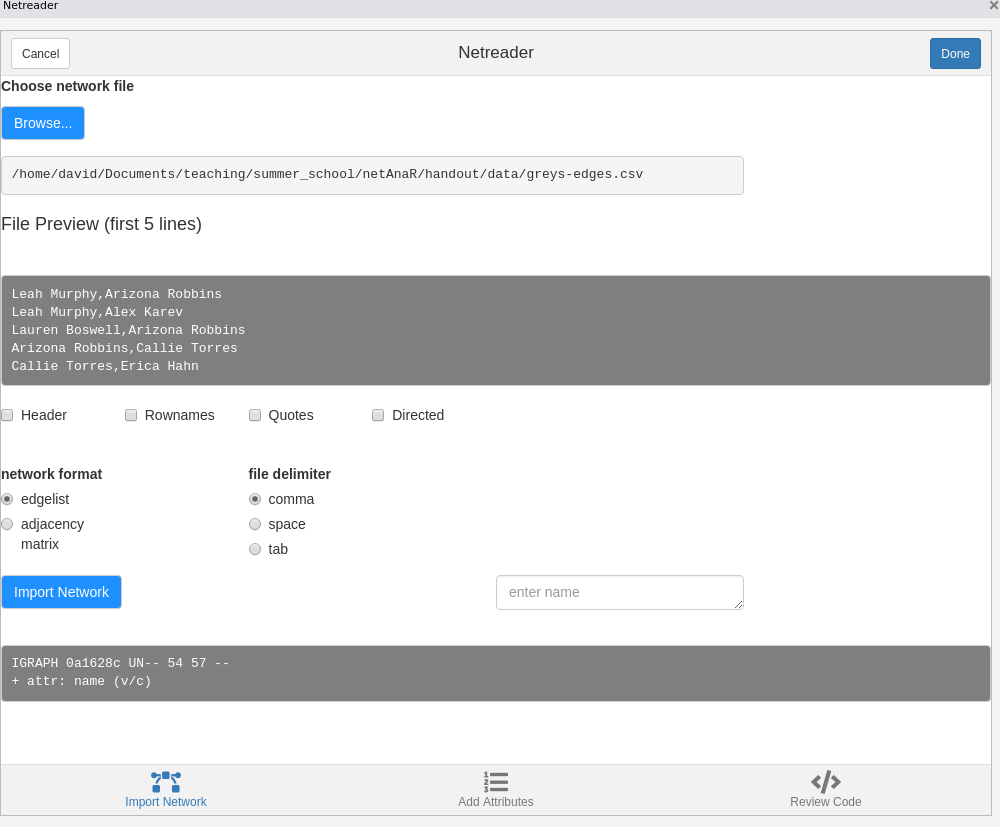
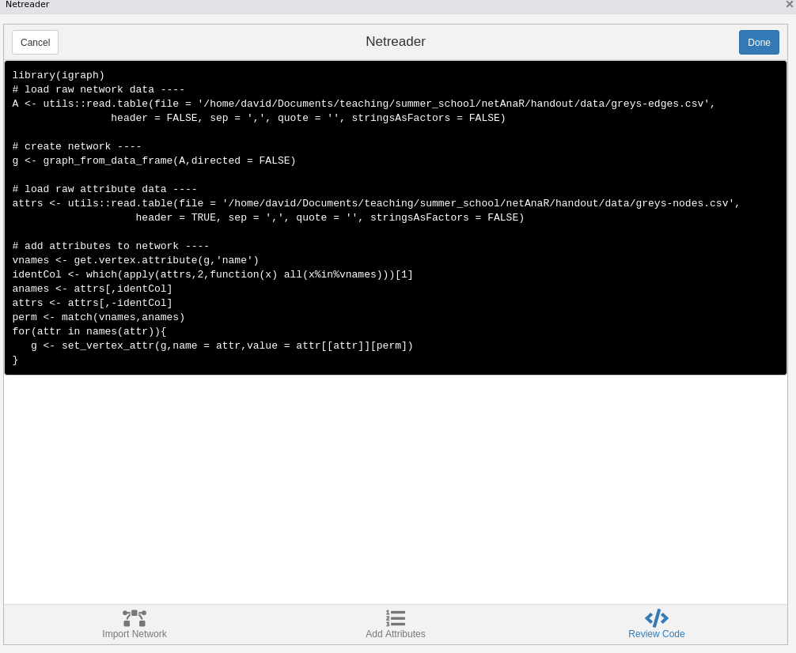

# Network Data and Analysis {.unnumbered}

This chapter introduces the foundational concepts of network analysis and
explains how relational data can be represented and analyzed. Moving beyond an
individual-centered perspective, we focus on how connections between actors are
captured, structured, and studied as networks.

We begin by defining what networks are and how they differ from conventional
data structures, before introducing key analytical perspectives such as levels
of analysis and the distinction between explaining network outcomes and
explaining network formation. Building on this conceptual foundation, the
chapter then turns to practical implementation. You will learn how to represent
network data in different formats, how to import existing network files, and how
to construct and manipulate network objects in R using the `igraph` package,
including working with nodes, edges, and their attributes.

By the end of this chapter, you will understand both how network data is
structured and how to work with it in practice.

## Packages Needed for this Chapter

```{r}
#| label: libraries
#| message: false

library(igraph)
```

## Why Study Networks?

Conventional research methods are often individual-based, and our models
typically focus on relationships between variables rather than relationships
between people. However, much of the world around us is fundamentally structured
as networks. This is true not only for society, but also for brains (neural
networks), organizations (who reports to whom), economies (who sells to whom),
and ecologies (who eats whom). In each of these domains, outcomes are shaped not
just by the attributes of individual units, but by the pattern of connections
among them.

Classical social theorists emphasized this relational foundation of social life.
Georg Simmel argued that society exists where individuals enter into interaction
[@simmel19081971]. Émile Durkheim described society as a system formed by
associated individuals and their channels of communication
[@durkheim1974individual]. Karl Marx similarly stressed that society does not
consist of isolated individuals, but expresses the sum of interrelations within
which individuals stand [@marx1993grundrisse]. These perspectives share a
central insight: social structure is relational.

Despite this, much empirical research continues to privilege individual-level
explanations. For example, if David predominantly eats vegetarian food, we might
explain this in terms of his ethical beliefs, economic situation, health
concerns, or taste preferences. A network perspective, however, would also
consider whether David has a vegetarian partner or close friends who influence
his dietary choices. Instead of focusing solely on internal attributes, we
examine the relational context in which decisions are embedded.

Network effects also shape emotions and well-being. If someone close to you is
unhappy, are you likely to remain unaffected? Feelings, behaviors, and norms
often spread through social ties. What happens to one person can influence
others in their immediate network and beyond.

Similarly, access to opportunities may depend not only on individual merit but
also on personal networks. Jobs, information, and resources are frequently
obtained through social connections. Life chances are therefore shaped not just
by who we are, but by how we are connected and where we are positioned within a
network.

Studying networks allows us to move beyond isolated individuals and to analyze
the patterns of relationships that structure behavior, outcomes, and inequality.
A network perspective makes these relational structures visible and provides
tools to systematically investigate their consequences.

## What is a Network?

In the context of social network analysis, a network is a conceptual and
analytical construct used to understand, visualize, and examine the
relationships and structures that emerge from interactions among individuals,
groups, organizations, or even entire societies. Rather than focusing solely on
the attributes of actors, a network perspective centers on the ties that connect
them and the structures that arise from these connections. This relational
perspective lies at the core of social network analysis
[@wasserman1994social; @scott2012social].

At its core, a network consists of **nodes** and **edges**. Nodes represent the
actors in the network, such as individuals, organizations, or other social
entities. Edges represent the relationships or connections between these actors.
These relationships can take many forms and capture different aspects of social
life.

Connections may be based on **similarities**, such as shared location,
participation in the same event or organization, or common attributes. They may
reflect **relational roles**, such as kinship ties or other socially defined
roles. Networks can also capture **relational cognition**, including affective
or perceptual relations (e.g., liking, trust, perceived influence).

Many network ties are based on **interactions**, such as who talked to whom, who
helped whom, or who sold goods to whom. Others represent **flows**, such as the
transmission of information, beliefs, or money. By mapping these different types
of relationships, network analysis provides a systematic way to study how social
structures are formed and maintained.

Importantly, ties can differ in their properties. Relations may be
**symmetric**, as in mutual friendship, or **asymmetric**, as in advice-seeking
or authority relations (though asymmetric ties can still be reciprocated and
thus become bi-directional). Ties may vary in **strength**, frequency of
contact, or intensity, and they can be **positive** (e.g., friendship,
cooperation) or **negative** (e.g., conflict, dislike).

By conceptualizing social life in terms of nodes and edges and by distinguishing
between different types and properties of ties, social network analysis provides
a flexible and powerful framework for examining the relational foundations of
social structure.

## From “Ordinary” to Network Data

Traditional research often treats individuals or entities as independent units
of analysis. Even when the focus is on pairs of individuals, such as couples,
these dyads are frequently treated as if they were independent from one another.
However, in many social settings, relationships are interdependent and
overlapping. A person can be part of multiple dyads simultaneously, and these
connections influence one another.

As a result, the usual statistical assumption of independence does not hold in
networked settings. Observations are not isolated: ties between actors create
dependencies. What happens in one relationship may affect others, and
individuals are embedded in broader relational structures that shape their
behavior and outcomes. Recognizing this interdependence is one of the key
motivations for adopting a network perspective.

In the social sciences, networks are tools for mapping and quantifying patterns
of social connections. They help reveal the underlying dynamics of social
cohesion, influence, and information flow within communities and societies.
Rather than focusing solely on individual characteristics, network analysis
examines how ties between actors (whether individuals, organizations, or other
entities) form structures that shape opportunities and constraints.

Social network analysis is guided by a structural intuition: social life is
organized through relationships. It is grounded in systematic empirical data,
relying on observed and measured connections between actors. At the same time,
it draws heavily on graphical representations, using network diagrams to
visualize nodes (actors) and edges (ties) and to make structural patterns such
as clusters, central positions, or bridging roles visible.

Beyond visualization, network analysis employs mathematical and computational
models to quantify structural properties, test hypotheses about relational
processes, and model how networks form and evolve. Through the lens of network
theory, researchers can explore how social structures influence behaviors,
access to resources, diffusion of information, and life chances. For this
reason, social network analysis has become an invaluable approach in sociology,
anthropology, political science, and many other disciplines concerned with
social systems and interactions.

## Levels of Analysis

A key feature of network analysis is that it can be conducted at multiple
levels, each capturing different aspects of social structure. Distinguishing
between these levels helps clarify both the type of data collected and the kinds
of research questions that can be addressed.

At the most basic level is the **dyadic level**, which focuses on pairs of
actors and the relationships between them. The dyad is the fundamental unit of
network data collection, as ties are always defined between two nodes. Research
at this level examines how relationships form and what consequences they have.
For example, one might ask whether sharing an office increases the likelihood of
friendship, or whether similarity in attributes leads to tie formation.

Moving up, the **node level** considers individual actors embedded within a
network. Here, dyadic information is aggregated to describe properties of nodes,
such as the number of connections an individual has, their centrality, or their
position within the network. Node-level analysis typically relates network
properties to individual outcomes. For instance, researchers may examine whether
individuals with more social ties enjoy better health, higher performance, or
greater access to resources.

At a broader scale, the **network level** examines the overall structure of the
network as a whole. This includes properties such as density, clustering,
centralization, or the presence of cohesive subgroups. Network-level questions
address how structural configurations shape collective outcomes. For example,
one might ask whether more densely connected networks facilitate faster
diffusion of information or innovation.

Additional intermediate levels are also possible, such as triads or larger
groups, which allow researchers to study patterns like transitivity, balance,
and subgroup cohesion. Together, these levels highlight that networks are
inherently multi-layered structures, and meaningful analysis often requires
moving between them.

## Goals of Network Analysis

Network analysis can be used for different analytical purposes depending on how
network variables are conceptualized within a study. A central distinction is
whether network properties are treated as **independent (explanatory)**
variables or as **dependent (outcome)** variables.

In the first case, researchers use network measures to explain individual or
collective outcomes. This approach draws on **network theory**, which emphasizes
how structural positions and relational patterns shape behavior and
opportunities. For example, an individual's centrality in a network may
influence their performance, access to information, or accumulation of social
capital. Likewise, brokerage positions that connect otherwise disconnected
groups may facilitate innovation, information advantages, or control over
resources. In this perspective, network properties serve as explanatory
variables that help account for observed outcomes.

In the second case, network structures themselves become the outcome of
interest. Here, the goal is to understand how and why networks form and evolve.
This approach is often described as the **theory of networks**. Researchers
investigate the mechanisms that generate observed patterns of ties, such as
homophily, reciprocity, or balance processes. For instance, one might examine
whether people with similar attributes, interests, or behaviors are more likely
to become friends. In this perspective, network ties and structures are
dependent variables to be explained.

These two analytical orientations are complementary. On the one hand, network
theory explains the consequences of network structure. On the other hand, the
theory of networks explains the antecedents of network structure. Together, they
provide a broader framework for understanding both how networks shape social
outcomes and how they themselves are shaped by social processes.

## Network Representations

There are several possible ways to express network data. All come with a set of
advantages and disadvantages.

### Adjacency Matrix

An adjacency matrix is a square matrix where the elements indicate whether pairs
of vertices in the graph are adjacent or not, meaning whether they are directly
connected by an edge. If the graph has $n$ vertices, the matrix $A$ will be an
$n \times n$ matrix where the entry $A_{ij}$ is $1$ if there is an edge from
vertex $i$ to vertex $j$, and $0$ if there is no edge. In the case of weighted
graphs, the weight of the edge is used instead of binary values.

For undirected graphs, the adjacency matrix is symmetric, meaning that
$A_{ij} = A_{ji}$ for all pairs of vertices. This reflects the fact that ties
have no direction: if vertex $i$ is connected to vertex $j$, then vertex $j$ is
also connected to vertex $i$. In contrast, for directed graphs the matrix is
generally not symmetric, because a tie from $i$ to $j$ does not necessarily
imply a tie from $j$ to $i$ (e.g., in advice-seeking or following
relationships).

#### Pros {.unnumbered}

- **Simple Representation**: It provides a straightforward and compact way to
  represent graphs, especially useful for dense graphs where many or most pairs
  of vertices are connected.

- **Efficient for Edge Lookups**: Checking whether an edge exists between two
  vertices can be done in constant time, making it efficient for operations that
  require frequent edge lookups.

- **Easy Implementation of Algorithms**: Many graph algorithms can be easily
  implemented using adjacency matrices, making it a preferred choice for certain
  computational tasks.

#### Cons {.unnumbered}

- **Space Inefficiency**: For sparse graphs, where the number of edges is much
  less than the square of the number of vertices, an adjacency matrix uses a lot
  of memory to represent a relatively small number of edges.

- **Poor Scalability**: As the number of vertices grows, the size of the matrix
  grows quadratically, which can quickly become impractical for large graphs.

### Edge List

An edge list is a matrix (or data frame) where each row represents an edge
between two vertices. In an undirected graph, an edge is given by a pair
$(i,j)$, indicating a connection between vertices $i$ and $j$. Because the
relation has no direction, the pairs $(i,j)$ and $(j,i)$ represent the same
edge. For directed graphs, the order of the vertices in each pair matters: an
entry $(i,j)$ indicates a tie from vertex $i$ to vertex $j$.

In weighted graphs, an additional column can be included to represent the
strength, frequency, or intensity of the tie. More generally, edge lists can be
extended with further columns to store edge attributes, such as timestamps,
types of interaction, or categories of relationships.

#### Pros {.unnumbered} 

- **Space Efficiency for Sparse Graphs**: Edge lists are particularly
  space-efficient for representing sparse graphs where the number of edges is
  much lower than the square of the number of vertices, as they only store the
  existing edges.

- **Simplicity**: The structure is straightforward and easy to understand,
  making it suitable for simple graph operations and for initial graph
  representation before processing.

#### Cons {.unnumbered} 

- **Inefficient for Edge Lookups**: Checking whether an edge exists between two
  specific vertices can be time-consuming, as it may require scanning through
  the entire list, leading to an operation that is linear in the number of
  edges.

- **Inefficiency in Graph Operations**: Operations like finding all vertices
  adjacent to a given vertex or checking for connectivity between vertices can
  be inefficient compared to other representations like adjacency matrices or
  adjacency lists, especially for dense graphs.

- **Less Suitable for Dense Graphs**: As the number of edges grows, the edge
  list can become large and less efficient in terms of both space and operation
  time compared to an adjacency matrix for dense graphs, where the number of
  edges is close to the maximum possible number of edges.

### Adjacency List

An adjacency list is a collection of lists, where each list corresponds to a
vertex and contains the set of vertices adjacent to it. In other words, for
every vertex $i$ in the graph, there is an associated list that includes all
vertices $j$ to which $i$ is directly connected.

For undirected graphs, if vertex $i$ is connected to vertex $j$, then $j$ will
appear in the list of $i$ and $i$ will also appear in the list of $j$. In
directed graphs, however, adjacency lists typically distinguish between outgoing
and incoming ties, so the list for vertex $i$ usually contains only those
vertices that $i$ points to.

#### Pros {.unnumbered}

- **Space Efficiency**: Adjacency lists are more space-efficient than adjacency
  matrices in sparse graphs, as they only store information about the actual
  connections.

- **Scalability**: This representation scales better with the number of edges,
  especially for graphs where the number of edges is far less than the square of
  the number of vertices.

- **Efficiency in Graph Traversal**: For operations like graph traversal or
  finding all neighbors of a vertex, adjacency lists provide more efficient
  operations compared to adjacency matrices, particularly in sparse graphs.

#### Cons {.unnumbered}

- **Edge Lookups**: Checking whether an edge exists between two specific
  vertices can be less efficient than with an adjacency matrix, as it may
  require traversing a list of neighbors.

- **Variable Edge Access Time**: The time to access a specific edge or to check
  for its existence can vary depending on the degree of the vertices involved,
  leading to potentially inefficient operations in certain scenarios.

- **Higher Complexity for Dense Graphs**: In very dense graphs, where the number
  of edges approaches the number of vertex pairs, adjacency lists can become
  less efficient in terms of space and time compared to adjacency matrices, due
  to the overhead of storing a list for each vertex.

## Importing Network Data

### Foreign Formats

`igraph` can deal with many different foreign network formats with the function
`read_graph`. (The `rgexf` package can be used to import Gephi files.)

```{r}
#| label: read_graph
#| eval: false

read_graph(
  file,
  format = c(
    "edgelist",
    "pajek",
    "ncol",
    "lgl",
    "graphml",
    "dimacs",
    "graphdb",
    "gml",
    "dl"
  ),
  ...
)
```

If your network data is in one of the above formats you will find it easy to
import your network.

### Nodes, Edges, and Attributes

If your data is not in a network file format, you will need one of the following
functions to turn raw network data into an `igraph` object:
`graph_from_edgelist()`, `graph_from_adjacency_matrix()`,
`graph_from_adj_list()`, or `graph_from_data_frame()`.

Before using these functions, however, you still need to get the raw data into
R. The concrete procedure depends on the file format. If your data is stored as
an excel spreadsheet, you need additional packages. If you are familiar with the
`tidyverse`, you can use the `readxl` package. Other options are, e.g. the
`xlsx` package.

Most network data you'll find is in a plain text format (csv or tsv), either as
an edgelist or adjacency matrix. To read in such data, you can use base R's
`read.table()`.

Make sure you check the following before trying to load a file: Does it contain
a header (e.g. row/column names of an adjacency matrix)? How are values
delimited (comma, whitespace or tab)? This is important to set the parameters
`header`, `sep` to read the data properly.

## Networks in `igraph`

Below, we represent friendship relations between Bob, Ann, and Steve as a matrix
and an edgelist.

```{r}
#| label: simple_struc

# adjacency matrix
A <- matrix(
  c(0, 1, 1, 1, 0, 1, 1, 1, 0),
  nrow = 3,
  ncol = 3,
  byrow = TRUE
)

rownames(A) <- colnames(A) <- c("Bob", "Ann", "Steve")
A
# edgelist
el <- matrix(
  c("Bob", "Ann", "Bob", "Steve", "Ann", "Steve"),
  nrow = 3,
  ncol = 2,
  byrow = TRUE
)
el
```

Once we have defined an edgelist or an adjacency matrix, we can turn them into
`igraph` objects as follows.

```{r}
#| label: simple-graph

g1 <- graph_from_adjacency_matrix(A, mode = "undirected", diag = FALSE)

g2 <- graph_from_edgelist(el, directed = FALSE)
# g1 and g2 are the same graph so only printing g1
g1
```

The printed summary shows some general descriptives of the graph. The string
"UN--" in the first line indicates that the network is *U*ndirected (*D* for
directed graphs) and has a *N*ame attribute (we named the nodes Bob, Ann, and
Steve). The third and forth character are *W*, if there is a edge weight
attribute, and *B* if the network is bipartite (there exists a node attribute
"type"). The following number indicate the number of nodes and edges. The second
line lists all graph, node and edge variables. Here, we only have a node
attribute "name".

The conversion from edgelist/adjacency matrix into an igraph object is quite
straightforward. The only difficulty is setting the parameters correctly (Is the
network directed or not?), especially for edgelists where it may not immediately
be obvious if the network is directed or not.

### Import via `snahelper`

The R package `snahelper` implements several Addins for RStudio that facilitate
working with network data by providing a GUI for various tasks. One of these is
the `Netreader` which allows to import network data.

The first two tabs allow you to import raw data (edges and attributes). Make
sure to specify file delimiters, etc. according to the shown preview.



Using the `Netreader` should comes with a learning effect (hopefully). The last
tab shows the R code to produce the network with the chosen data **without**
using the Addin.



The network will be saved in your global environment once you click "Done".
