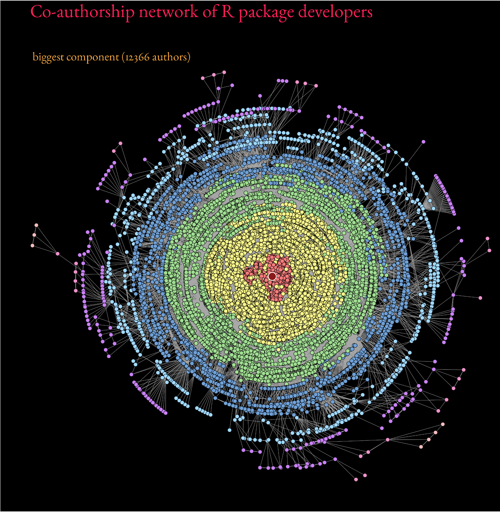
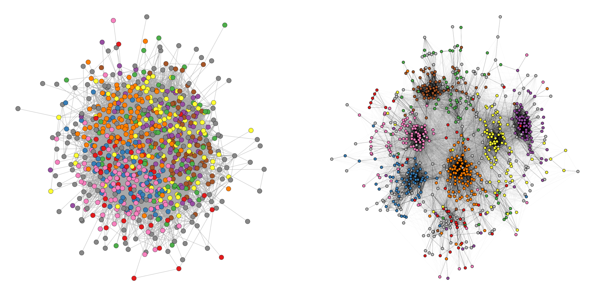

# Advanced Layouts 

Knowing the basics of `ggraph` is enough to handle most network visualization tasks well. However, there are some more advanced layouting and visualization techniques that can be used to visualize specific types of networks or to emphasize certain structural features. In this part, we will show some examples of such more advanced layouts and learn how to use them with `ggraph`.

## Packages needed for this chapter
```{r}
#| label: libraries
#| message: false
library(igraph)
library(ggraph)
library(graphlayouts)
library(networkdata)
library(ggforce)
```

## Data Preparation

We use the same network dataset as in the previous chapter, the network of characters in the first season of Game of Thrones which is available in `networkdata`. We also apply the same preprocessing steps to prepare the data for visualization.

```{r}
#| label: data
data("got")

gotS1 <- got[[1]]

got_palette <- c(
  "#1A5878",
  "#C44237",
  "#AD8941",
  "#E99093",
  "#50594B",
  "#8968CD",
  "#9ACD32"
)

## compute a clustering for node colors
V(gotS1)$clu <- as.character(membership(cluster_louvain(gotS1)))

## compute degree as node size
V(gotS1)$size <- degree(gotS1)
```

## Large Networks

The stress layout from `graphlayouts` also works well with medium to large graphs. @fig-coauthor-cran shows the biggest component of the co-authorship network of R package developers on CRAN (~12k nodes) which was created with `layout_with_stress()`.

{#fig-coauthor-cran}

Beyond ~20k nodes, however, it is advisable to switch to dedicated layout algorithms which are optimized to work with large graphs such as `layout_with_pmds()` or `layout_with_sparse_stress()`.

These are capable to deal with networks of around 100,000 nodes. At this size, though, most visualizations will not be very informative anymore.

## Concentric Layouts

Circular layouts as shown in @fig-circular-layout using `layout_in_circle()` from `igraph`, are generally not advisable. 

```{r}
#| label: fig-circular-layout
#| fig-cap: "GoT network with a circular layout."
#| fig-width: 8
#| fig-height: 8

ggraph(gotS1, layout = "circle") +
  geom_edge_link0(aes(edge_linewidth = weight), edge_colour = "grey66") +
  geom_node_point(aes(fill = clu, size = size), shape = 21) +
  geom_node_text(aes(size = size, label = name), family = "serif") +
  scale_edge_width_continuous(range = c(0.2, 1.2)) +
  scale_size_continuous(range = c(1, 5)) +
  scale_fill_manual(values = got_palette) +
  coord_fixed() +
  theme_graph() +
  theme(legend.position = "none")
```

Concentric circles, on the other hand, help to emphasize the position of certain nodes in the network. The `graphlayouts` package offers two functions to create concentric layouts, `layout_with_focus()` and `layout_with_centrality()`.

The first one allows one to focus the network on a specific node and arrange all other nodes in concentric circles (depending on the geodesic distance). In @fig-concentric-ned, we focus the layout around the character *Ned Stark*.
```{r}
#| label: fig-concentric-ned
#| fig-cap: "GoT network with concentric layout focused on Ned Stark."
#| fig-width: 8
#| fig-height: 8
ggraph(gotS1, layout = "focus", focus = 1) +
  geom_edge_link0(aes(edge_linewidth = weight), edge_colour = "grey66") +
  geom_node_point(aes(fill = clu, size = size), shape = 21) +
  geom_node_text(
    aes(filter = (name == "Ned"), size = size, label = name),
    family = "serif"
  ) +
  scale_edge_width_continuous(range = c(0.2, 1.2)) +
  scale_size_continuous(range = c(1, 5)) +
  scale_fill_manual(values = got_palette) +
  coord_fixed() +
  theme_graph() +
  theme(legend.position = "none")
```

The parameter `focus` is used to choose the node id of the focal node. The function `coord_fixed()` is used to always keep the aspect ratio at one so that the circles always appear as a circle and not an ellipse. 

The function `draw_circle()` can be used to add the concentric circles explicitly as shown in @fig-concentric-ned1.
```{r}
#| label: fig-concentric-ned1
#| fig-cap: "Concentric layout focused on Ned Stark with explicit circles drawn."
#| fig-width: 8
#| fig-height: 8
ggraph(gotS1, layout = "focus", focus = 1) +
  draw_circle(col = "#00BFFF", use = "focus", max.circle = 3) +
  geom_edge_link0(aes(edge_linewidth = weight), edge_colour = "grey66") +
  geom_node_point(aes(fill = clu, size = size), shape = 21) +
  geom_node_text(
    aes(filter = (name == "Ned"), size = size, label = name),
    family = "serif"
  ) +
  scale_edge_width_continuous(range = c(0.2, 1.2)) +
  scale_size_continuous(range = c(1, 5)) +
  scale_fill_manual(values = got_palette) +
  coord_fixed() +
  theme_graph() +
  theme(legend.position = "none")
```

`layout_with_centrality()` works in a similar way. One can specify any centrality index (or any numeric vector for that matter), and create a concentric layout where the most central nodes are located in the center and the most peripheral nodes in the outer most circle. The numeric attribute used for the layout is specified with the `cent` parameter. In @fig-concentric-weighted-deg, we use the weighted degree of the characters.
```{r}
#| label: fig-concentric-weighted-deg
#| fig-cap: "GoT network with concentric layout based on weighted degree centrality."
#| fig-width: 8
#| fig-height: 8
ggraph(gotS1, layout = "centrality", cent = graph.strength(gotS1)) +
  geom_edge_link0(aes(edge_linewidth = weight), edge_colour = "grey66") +
  geom_node_point(aes(fill = clu, size = size), shape = 21) +
  geom_node_text(aes(size = size, label = name), family = "serif") +
  scale_edge_width_continuous(range = c(0.2, 0.9)) +
  scale_size_continuous(range = c(1, 8)) +
  scale_fill_manual(values = got_palette) +
  coord_fixed() +
  theme_graph() +
  theme(legend.position = "none")
```

## Backbone Layout

Real-world networks, and social networks in particular, often have a small-world structure, meaning that most nodes are only a few steps apart. When we try to visualise such networks with standard layout algorithms, the result often looks like a tangled "hairball". Highly connected nodes and dense clusters pull everything toward the center, making it hard to see any underlying structure. To deal with this, we can use algorithms that first simplify the network and highlight its most meaningful connections. By focusing on the ties that hold groups together, these methods can make hidden community structures much easier to see, even in very dense graphs.

The `graphlayouts` package offers `layout_as_backbone()` for this purpose. To illustrate the algorithm, we create an artificial network with a subtle group structure using `sample_islands()` from `igraph`.

```{r}
#| label: island-network
g <- sample_islands(9, 40, 0.4, 15)

# remove potential multiple edges
g <- simplify(g)

# assign the group membership as vertex attribute for coloring
V(g)$grp <- as.character(rep(1:9, each = 40))
```

The network consists of 9 groups with 40 vertices each. The density within each group is
0.4 and there are 15 edges running between each pair of groups. @fig-island-stress shows the network using techniques we have learned so far.

```{r}
#| label: fig-island-stress
#| fig-cap: "Island network drawn with the stress layout showing a hairball structure."
#| fig-width: 8
#| fig-height: 8
ggraph(g, layout = "stress") +
  geom_edge_link0(
    edge_colour = "black",
    edge_linewidth = 0.1,
    edge_alpha = 0.5
  ) +
  geom_node_point(aes(fill = grp), shape = 21) +
  scale_fill_brewer(palette = "Set1") +
  theme_graph() +
  theme(legend.position = "none")
```

Evidently, the graph seems to be a proper "hairball" without any special 
structural features standing out. In this case, however, we know that there should be 9 groups of vertices that are internally more densely connected than externally. To uncover this group structure, we turn to the "backbone layout". 

The idea of the algorithm is as follows. For each edge, an embeddedness score is calculated which serves as an edge weight attribute. These weights are then ordered and only the edges with the highest score are kept. The number of
edges to keep is controlled with the `keep` parameter. In our example below, we keep the top 40%. The parameter usually requires some experimenting to find out what works best. The resulting network is the "backbone" of the original 
network and the stress layout algorithm is applied to this network. Once the layout is calculated, all edges are added back to the network. @fig-backbone-plot shows the network with the backbone layout. The group structure is now clearly visible, even though the same number of edges are shown as in the previous plot.

```{r}
#| label: fig-backbone-plot
#| fig-cap: "Island network rendered with the backbone layout."
#| fig-width: 8
#| fig-height: 6
ggraph(g, layout = "backbone", keep = 0.4) +
  geom_edge_link0(edge_colour = "grey66", edge_linewidth = 0.1) +
  geom_node_point(aes(fill = grp), shape = 21) +
  scale_fill_brewer(palette = "Set1") +
  scale_edge_color_manual(values = c(rgb(0, 0, 0, 0.3), rgb(0, 0, 0, 1))) +
  theme_graph() +
  theme(legend.position = "none")
```

Of course the network used in the example is specifically tailored to illustrate the power of the algorithm. Using the backbone layout in real world networks may not always result in such a clear division of groups. It should thus not be seen as a universal remedy for drawing hairball networks. One should keep in mind: It can *only* emphasize a hidden group structure *if it exists*.

@fig-facebook-backbone shows an empirical example where the algorithm was able to uncover a hidden group structure. The network shows facebook friendships of a university in the US. Node colour corresponds to dormitory of students.

{#fig-facebook-backbone}

## Longitudinal Networks

Longitudinal network data usually comes in the form of panel data, gathered at different points in time. We thus have a series of snapshots that need to be visualized in a way that individual nodes are easy to trace without the layout becoming too awkward.

For this part of the tutorial, you will need one additional packages.
```{r}
#| label: additional-libraries
library(patchwork)
```

We will be using the *50 actor excerpt from the Teenage Friends and Lifestyle Study* as an example. 
The data is part of the `networkdata` package.

```{r}
#| label: s50-data
data("s50")
```

The dataset consists of three networks with 50 students together with their smoking behavior as a node attribute.
The function `layout_as_dynamic()` from `graphlayouts` can be used to visualize the three networks. The implemented algorithm calculates a reference layout which is a layout of the union of all networks and individual layouts based on stress minimization and combines those in a linear combination which is controlled by the `alpha` parameter. For `alpha = 1`, only the reference layout is used and all graphs have the same layout. For `alpha=0`, the stress layout of each individual graph is used. Values in-between interpolate between the two layouts. The algorithm is not directly usable with `ggraph`, so we need to calculate the layout separately and then use the resulting coordinates in `ggraph` with the "manual" layout.

```{r}
#| label: layout-s50
xy <- layout_as_dynamic(s50, alpha = 0.2)
```

Now we can use `ggraph` in conjunction with `patchwork` to produce a static plot with the three networks side-by-side, shown in 
@fig-static_plot.

```{r}
#| label: fig-static_plot
#| fig-cap: "Longitudinal network of 50 students across three waves."
#| fig-width: 14
#| fig-height: 8
pList <- vector("list", length(s50))

for (i in 1:length(s50)) {
  pList[[i]] <- ggraph(
    s50[[i]],
    layout = "manual",
    x = xy[[i]][, 1],
    y = xy[[i]][, 2]
  ) +
    geom_edge_link0(edge_linewidth = 0.6, edge_colour = "grey66") +
    geom_node_point(shape = 21, aes(fill = as.factor(smoke)), size = 6) +
    geom_node_text(label = 1:50, repel = FALSE, color = "white", size = 4) +
    scale_fill_manual(
      values = c("forestgreen", "grey25", "firebrick"),
      guide = ifelse(i != 2, "none", "legend"),
      name = "smoking",
      labels = c("never", "occasionally", "regularly")
    ) +
    theme_graph() +
    theme(legend.position = "bottom") +
    labs(title = paste0("Wave ", i))
}

wrap_plots(pList)
```


## Multilevel networks

In this section, we look at `layout_as_multilevel()`, a layout algorithm in the `graphlayouts` package which
can be used to visualize multilevel networks.

A multilevel network consists of two (or more) levels with different node sets and intra-level ties. 
For instance, one level could be scientists and their collaborative ties, the second level are labs and ties among them, and inter-level edges are the affiliations of scientists and labs. 

The `graphlayouts` package contains an artificial multilevel network which will be used to illustrate the algorithm.
```{r}
#| label: multilvl-data
data("multilvl_ex")
```

The package assumes that a multilevel network has a vertex attribute called `lvl` which
holds the level information (1 or 2). 

The underlying algorithm of `layout_as_multilevel()` has three different versions, 
which can be used to emphasize different structural features of a multilevel network.

Independent of which option is chosen, the algorithm internally produces a 3D layout, where
each level is positioned on a different y-plane. The 3D layout is then mapped to 2D with an isometric projection.
The parameters `alpha` and `beta` control the perspective of the projection.
The default values seem to work for many instances, but may not always be optimal. 
As a rough guideline: `beta` rotates the plot around the y axis (in 3D) and `alpha` moves the point of view up or down.

### Complete layout

A layout for the complete network can be computed via `layout_as_multilevel()` setting `type = "all"`.
Internally, the algorithm produces a constrained 3D stress layout (each level on a different y plane) which is then 
projected to 2D. This layout ignores potential differences in each level and optimizes only the overall layout.

```{r}
#| label: all-layout
xy <- layout_as_multilevel(multilvl_ex, type = "all", alpha = 25, beta = 45)
```

To visualize the network with `ggraph`, you may want to draw the edges for each level (and inter level edges)
with a different edge geom. This gives you more flexibility to control aesthetics and can easily be achieved
with a filter (@fig-multi-all-example).

```{r}
#| label: fig-multi-all-example
#| fig-cap: "Multilevel network with a complete 3D stress layout."
#| fig-height: 7
ggraph(multilvl_ex, "manual", x = xy[, 1], y = xy[, 2]) +
  geom_edge_link0(
    aes(filter = (node1.lvl == 1 & node2.lvl == 1)),
    edge_colour = "firebrick3",
    alpha = 0.5,
    edge_linewidth = 0.3
  ) +
  geom_edge_link0(
    aes(filter = (node1.lvl != node2.lvl)),
    alpha = 0.3,
    edge_linewidth = 0.1,
    edge_colour = "black"
  ) +
  geom_edge_link0(
    aes(
      filter = (node1.lvl == 2 &
        node2.lvl == 2)
    ),
    edge_colour = "goldenrod3",
    edge_linewidth = 0.3,
    alpha = 0.5
  ) +
  geom_node_point(aes(shape = as.factor(lvl)), fill = "grey25", size = 3) +
  scale_shape_manual(values = c(21, 22)) +
  theme_graph() +
  coord_cartesian(clip = "off", expand = TRUE) +
  theme(legend.position = "none")
```

### Separate layouts for both levels

In many instances, there may be different structural properties inherent to the levels of 
the network. In that case, two layout functions can be passed to `layout_as_multilevel()` to deal 
with these differences. In our artificial network, level 1 has a hidden group structure and level 2
has a core-periphery structure.

To use this layout option, set `type = "separate"` and specify two layout functions with `FUN1` and `FUN2`.
You can change internal parameters of these layout functions with named lists in the `params1` and `params2`
argument. Note that this version optimizes inter-level edges only minimally. The emphasis is on the 
intra-level structures.

```{r}
#| label: separate-layout
xy <- layout_as_multilevel(
  multilvl_ex,
  type = "separate",
  FUN1 = layout_as_backbone,
  FUN2 = layout_with_stress,
  alpha = 25,
  beta = 45
)
```

Again, try to include an edge geom for each level (@fig-multi-separate-example).

```{r}
#| label: fig-multi-separate-example
#| fig-cap: "Multilevel network with separate layouts for each level."
#| fig-height: 7
cols2 <- c(
  "#3A5FCD",
  "#CD00CD",
  "#EE30A7",
  "#EE6363",
  "#CD2626",
  "#458B00",
  "#EEB422",
  "#EE7600"
)

ggraph(multilvl_ex, "manual", x = xy[, 1], y = xy[, 2]) +
  geom_edge_link0(
    aes(
      filter = (node1.lvl == 1 & node2.lvl == 1),
      edge_colour = col
    ),
    alpha = 0.5,
    edge_linewidth = 0.3
  ) +
  geom_edge_link0(
    aes(filter = (node1.lvl != node2.lvl)),
    alpha = 0.3,
    edge_linewidth = 0.1,
    edge_colour = "black"
  ) +
  geom_edge_link0(
    aes(
      filter = (node1.lvl == 2 & node2.lvl == 2),
      edge_colour = col
    ),
    edge_linewidth = 0.3,
    alpha = 0.5
  ) +
  geom_node_point(aes(
    fill = as.factor(grp),
    shape = as.factor(lvl),
    size = nsize
  )) +
  scale_shape_manual(values = c(21, 22)) +
  scale_size_continuous(range = c(1.5, 4.5)) +
  scale_fill_manual(values = cols2) +
  scale_edge_color_manual(values = cols2, na.value = "grey12") +
  scale_edge_alpha_manual(values = c(0.1, 0.7)) +
  theme_graph() +
  coord_cartesian(clip = "off", expand = TRUE) +
  theme(legend.position = "none")
```

### Fix only one level

This layout can be used to emphasize one intra-level structure. The layout 
of the second level is calculated in a way that optimizes inter-level edge placement. 
Set `type = "fix1"` and specify  `FUN1` and possibly `params1` to fix level 1 or set `type = "fix2"` and specify
`FUN2` and possibly `params2` to fix level 2 (@fig-multi-fix2-example).

```{r}
#| label: fig-multi-fix2-example
#| fig-cap: "Multilevel network with level 2 fixed and level 1 optimized for inter-level edges."
#| fig-height: 7
xy <- layout_as_multilevel(
  multilvl_ex,
  type = "fix2",
  FUN2 = layout_with_stress,
  alpha = 25,
  beta = 45
)

ggraph(multilvl_ex, "manual", x = xy[, 1], y = xy[, 2]) +
  geom_edge_link0(
    aes(
      filter = (node1.lvl == 1 & node2.lvl == 1),
      edge_colour = col
    ),
    alpha = 0.5,
    edge_linewidth = 0.3
  ) +
  geom_edge_link0(
    aes(filter = (node1.lvl != node2.lvl)),
    alpha = 0.3,
    edge_linewidth = 0.1,
    edge_colour = "black"
  ) +
  geom_edge_link0(
    aes(
      filter = (node1.lvl == 2 & node2.lvl == 2),
      edge_colour = col
    ),
    edge_linewidth = 0.3,
    alpha = 0.5
  ) +
  geom_node_point(aes(
    fill = as.factor(grp),
    shape = as.factor(lvl),
    size = nsize
  )) +
  scale_shape_manual(values = c(21, 22)) +
  scale_size_continuous(range = c(1.5, 4.5)) +
  scale_fill_manual(values = cols2) +
  scale_edge_color_manual(values = cols2, na.value = "grey12") +
  scale_edge_alpha_manual(values = c(0.1, 0.7)) +
  theme_graph() +
  coord_cartesian(clip = "off", expand = TRUE) +
  theme(legend.position = "none")
```

## Edge bundling

Edge bundling is a technique to reduce visual clutter in dense networks. The idea is to group edges together into bundles, which can help to reveal underlying structures and patterns that may be hidden in a traditional edge representation. The `ggraph` package provides two functions for edge bundling: `geom_edge_bundle_force()` and `geom_edge_bundle_path()`. The first one uses a force-directed algorithm to create bundles, while the second one creates bundles based on the shortest path between nodes.

To illustrate the difference between the two algorithms, we use the network of US flights from the `networkdata` package. @fig-force-bundle shows the force-directed approach and @fig-path-bundle shows the path-based approach.

```{r}
#| label: fig-force-bundle
#| fig-cap: "US flights network with force-directed edge bundling."
data("us_flights")
states <- ggplot2::map_data("state")

ggraph(us_flights, x = longitude, y = latitude) +
  geom_polygon(
    aes(long, lat, group = group),
    states,
    color = "white",
    linewidth = 0.2
  ) +
  coord_sf(crs = "NAD83", default_crs = sf::st_crs(4326)) +
  geom_edge_bundle_force(color = "white", width = 0.05)
```

```{r}
#| label: fig-path-bundle
#| fig-cap: "US flights network with path-based edge bundling."
ggraph(us_flights, x = longitude, y = latitude) +
  geom_polygon(
    aes(long, lat, group = group),
    states,
    color = "white",
    linewidth = 0.2
  ) +
  coord_sf(crs = "NAD83", default_crs = sf::st_crs(4326)) +
  geom_edge_bundle_path(color = "white", width = 0.05)
```

## snahelper

Even with a lot of experience, it may still be an arduous process to produce nice looking
figures by writing `ggraph` code. This is where the RStudio Addin `snahelper` can help you. 

```r
install.packages("snahelper")
```

The package provides a GUI to visualize networks using `ggraph`. Instead of writing code, drop-down menus allow you to assign 
attributes to aesthetics or change appearances globally. One feature of the addin is that it is possible 
adjust the position of nodes individually. At the end, one can either directly export the figure to png or automatically insert the code to produce the figure into a script. That way, it is possible to make the figure reproducible. 
