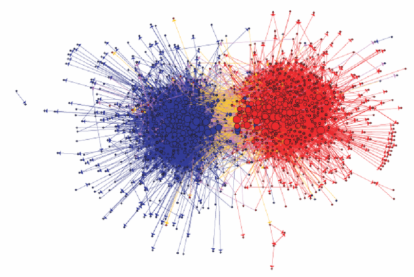

# Basics of ggraph

The `ggraph` package is an extension of `ggplot2` designed specifically for visualizing network data. The package extends the
grammar of graphics to handle network data, treating nodes and edges as separate geometric layers 
that can be styled independently. `ggraph` provides a framework for building network visualizations layer by 
layer. First, a layout is calculated that assigns coordinates to nodes, then edge and node geoms are drawn that define how connections are drawn, and nodes appear. This compositional approach makes it straightforward to create 
appealing visualizations while maintaining the flexibility and consistency that makes `ggplot2` so 
powerful. 

## Packages Needed for this Chapter
```{r}
#| label: libraries
#| message: false
library(igraph)
library(ggraph)
library(graphlayouts)
library(networkdata)
```

## Data Preparation

As a running example in this chapter, we use the network of character interactions in the first season of Game of Thrones (GoT). This dataset is included in the `networkdata` package. We also define a custom color palette, compute a clustering for node colors and compute degree as node size.

```{r}
#| label: data
data("got")

gotS1 <- got[[1]]

got_palette <- c(
  "#1A5878",
  "#C44237",
  "#AD8941",
  "#E99093",
  "#50594B",
  "#8968CD",
  "#9ACD32"
)

## compute a clustering for node colors
V(gotS1)$clu <- as.character(membership(cluster_louvain(gotS1)))

## compute degree as node size
V(gotS1)$size <- degree(gotS1)
```

## Grammar of graphics

To master `ggraph` you need to understand the basics of, or at least develop a feeling for, the **grammar of graphics**. 
The grammar is implemented in R through `ggplot2` and provides a systematic framework for constructing visualizations by combining independent components. Rather than thinking of plots as pre-defined chart types, the grammar decomposes graphics into fundamental elements: data, aesthetic mappings, geometric objects, scales, and coordinate systems. This approach allows one to build complex visualizations layer by layer, making it easier to customize and extend plots. For networks, `ggraph` extends this grammar to handle the unique structure of graph data, treating nodes and edges as separate geometric layers that can be styled and composed independently.

@fig-got-plot shows a standard network plot created with `ggraph`. We will go through the code step-by-step in the following sections to understand how to use each component effectively.

```{r}
#| label: fig-got-plot
#| fig-cap: "Game of Thrones season 1 character network."
#| fig-width: 10
#| fig-height: 6

ggraph(gotS1, layout = "stress") +
  geom_edge_link0(aes(edge_linewidth = weight), edge_colour = "grey66") +
  geom_node_point(aes(fill = clu, size = size), shape = 21) +
  geom_node_text(aes(filter = size >= 26, label = name), family = "serif") +
  scale_fill_manual(values = got_palette) +
  scale_edge_width(range = c(0.2, 3)) +
  scale_size(range = c(1, 6)) +
  theme_graph() +
  theme(legend.position = "none")
```


## Layout

```r
ggraph(gotS1, layout = "stress")
```

The first layer includes the calculation of a layout. Unlike traditional data visualization where variables naturally map to x and y coordinates, networks usually lack inherent spatial positions. This makes choosing a layout algorithm the most fundamental decision in network visualization. Layout algorithms assign coordinates to 
nodes based on the network's structure, aiming to reveal patterns and relationships that support your analytical goals. 

The package `graphlayouts` provides a wide range of layout algorithms that can be used with `ggraph`. The "stress" layout for example is always a safe choice since it is deterministic and produces *nice* layouts for most standard networks. Beyond this fairly general layout, there are many more specialized algorithms which may be better suited for specific types of networks or analytical goals. These algorithms will be discussed later. The `igraph` package also provides a variety of standard layout algorithms that can be used with `ggraph`.

```r
c(
  "layout_with_dh", "layout_with_drl", "layout_with_fr",
  "layout_with_gem", "layout_with_graphopt", "layout_with_kk",
  "layout_with_lgl", "layout_with_mds", "layout_with_sugiyama",
  "layout_as_bipartite", "layout_as_star", "layout_as_tree"
)
```

To use any of these, you just need to plugin the name of the underlying algorithm.
```r
ggraph(gotS1, layout = "dh") +
  ...
```

```{r}
#| label: fig-got-plot-layouts
#| fig-cap: "Game of Thrones network rendered with four different layout algorithms."
#| fig-width: 10
#| fig-height: 10
#| echo: false

library(patchwork)

p1 <- ggraph(gotS1, layout = "dh") +
  geom_edge_link0(aes(edge_linewidth = weight), edge_colour = "grey66") +
  geom_node_point(aes(fill = clu, size = size), shape = 21) +
  geom_node_text(aes(filter = size >= 26, label = name), family = "serif") +
  scale_fill_manual(values = got_palette) +
  scale_edge_width(range = c(0.2, 3)) +
  scale_size(range = c(1, 6)) +
  theme_graph() +
  theme(legend.position = "none")+
  labs(title = "layout = 'dh'")

p2 <- ggraph(gotS1, layout = "kk") +
  geom_edge_link0(aes(edge_linewidth = weight), edge_colour = "grey66") +
  geom_node_point(aes(fill = clu, size = size), shape = 21) +
  geom_node_text(aes(filter = size >= 26, label = name), family = "serif") +
  scale_fill_manual(values = got_palette) +
  scale_edge_width(range = c(0.2, 3)) +
  scale_size(range = c(1, 6)) +
  theme_graph() +
  theme(legend.position = "none")+
  labs(title = "layout = 'kk'")

p3 <- ggraph(gotS1, layout = "fr") +
  geom_edge_link0(aes(edge_linewidth = weight), edge_colour = "grey66") +
  geom_node_point(aes(fill = clu, size = size), shape = 21) +
  geom_node_text(aes(filter = size >= 26, label = name), family = "serif") +
  scale_fill_manual(values = got_palette) +
  scale_edge_width(range = c(0.2, 3)) +
  scale_size(range = c(1, 6)) +
  theme_graph() +
  theme(legend.position = "none")+
  labs(title = "layout = 'fr'")

p4 <- ggraph(gotS1, layout = "mds") +
  geom_edge_link0(aes(edge_linewidth = weight), edge_colour = "grey66") +
  geom_node_point(aes(fill = clu, size = size), shape = 21) +
  geom_node_text(aes(filter = size >= 26, label = name), family = "serif") +
  scale_fill_manual(values = got_palette) +
  scale_edge_width(range = c(0.2, 3)) +
  scale_size(range = c(1, 6)) +
  theme_graph() +
  theme(legend.position = "none")+
  labs(title = "layout = 'mds'")


p1 + p2 + p3 + p4 + plot_layout(ncol = 2)
```


@fig-got-plot-layouts illustrates how the choice of layout algorithm affects the appearance of the network. Note that there technically is no right or wrong choice. All layout algorithms are in a sense arbitrary since 
we can choose x and y coordinates freely as compared to ordinary data visualization where the "layout" is guided by existing "coordinates". For networks, it is mostly, but not exclusively, about aesthetics.

You can also precompute the layout with the `create_layout()` function. This makes sense in cases where the calculation
of the layout takes very long and you want to play around with other visual aspects. 

```r
gotS1_layout <- create_layout(gotS1, "stress")

ggraph(gotS1_layout) +
  ...
```

## Edges

```r
geom_edge_link0(aes(edge_linewidth = weight), edge_colour = "grey66")
```

The second layer specifies how edges are drawn. To do so, we use one of the many edge geoms available in `ggraph`.
```r
c(
  "geom_edge_arc", "geom_edge_arc0", "geom_edge_arc2",
  "geom_edge_bundle_force", "geom_edge_bundle_path", "geom_edge_density",
  "geom_edge_diagonal", "geom_edge_diagonal0", "geom_edge_diagonal2",
  "geom_edge_elbow", "geom_edge_elbow0", "geom_edge_elbow2", "geom_edge_fan",
  "geom_edge_fan0", "geom_edge_fan2", "geom_edge_hive", "geom_edge_hive0",
  "geom_edge_hive2", "geom_edge_link", "geom_edge_link0", "geom_edge_link2",
  "geom_edge_loop", "geom_edge_loop0", "geom_edge_parallel"
)
```
You can do a lot of fancy things with these geoms but for a standard network plot, you should almost always stick with `geom_edge_link0` since it simply draws a straight line between the endpoints. Some tools draw curved edges by default. While this may add some artistic value, it also reduces readability. It is best to always go with straight lines. If a network has multiple edges between two nodes, one can switch to `geom_edge_parallel()` (see @fig-parallel).

```{r}
#| label: fig-parallel
#| fig-cap: "Multi-edge network drawn with `geom_edge_parallel()`."
#| fig-width: 10
#| fig-height: 6

g <- make_graph(c(1, 2, 1, 2, 1, 2))

ggraph(g, layout = "stress") +
  geom_edge_parallel(edge_colour = "grey66", edge_linewidth = 0.5) +
  geom_node_point(size = 5) +
  theme_graph()
```

The curved equivalent of `geom_edge_parallel()` is `geom_edge_fan()`. @fig-fan shows the difference between the two.

```{r}
#| label: fig-fan
#| fig-cap: "Multi-edge network drawn with `geom_edge_fan()`."
#| fig-width: 10
#| fig-height: 6

ggraph(g, layout = "stress") +
  geom_edge_fan(edge_colour = "grey66", edge_linewidth = 0.5) +
  geom_node_point(size = 5) +
  theme_graph()
```

Most edge geoms come in three flavors. The standard `geom_edge_link()` draws 100 dots on each edge compared to only two dots (the endpoints) in `geom_edge_link0()`. This is done to allow gradients along the edge as shown in @fig-got-plot-grad. 

```{r}
#| label: fig-got-plot-grad
#| fig-cap: "Edge gradient showing directionality using `geom_edge_link()`."
#| fig-width: 10
#| fig-height: 6
ggraph(gotS1, layout = "stress") +
  geom_edge_link(aes(alpha = after_stat(index)), edge_colour = "black") +
  geom_node_point(aes(fill = clu, size = size), shape = 21) +
  scale_fill_manual(values = got_palette) +
  scale_edge_width_continuous(range = c(0.2, 3)) +
  scale_size_continuous(range = c(1, 6)) +
  theme_graph() +
  theme(legend.position = "none")
```

The drawback of using `geom_edge_link()` is that the time to render the plot increases and so 
does the size of the file if you export the plot. Typically, you do not need gradients along an edge. Hence, `geom_edge_link0()` should be the default choice to draw edges.

Within `geom_edge_link0`, you can specify the appearance of the edge, either by mapping edge attributes to aesthetics
or setting them globally for the graph. Mapping attributes to aesthetics is done within `aes()`.
In the example, we map the edge width to the edge attribute "weight". `ggraph` then automatically scales the
edge width according to the attribute. The colour of all edges is globally set to "grey66".

The following aesthetics can be used within `geom_edge_link0` either within `aes()` or globally:

- edge_colour (colour of the edge)
- edge_linewidth  (width of the edge)
- edge_linetype (linetype of the edge, defaults to "solid")
- edge_alpha (opacity; a value between 0 and 1)

`ggraph` does not automatically draw arrows if your graph is directed. You need to do this manually using 
the arrow parameter.
```r
geom_edge_link0(aes(...), ...,
  arrow = arrow(
    angle = 30, length = unit(0.15, "inches"),
    ends = "last", type = "closed"
  )
)
```

The default arrowhead type is "open", yet "closed" usually has a nicer appearance (see @fig-arrow).

```{r}
#| label: fig-arrow
#| fig-cap: "Directed network with closed arrowheads."
#| fig-width: 10
#| fig-height: 6

g <- make_graph(c(1, 2, 2, 3), directed = TRUE)

ggraph(g, layout = "stress") +
  geom_edge_link0(
    edge_colour = "grey66", edge_linewidth = 0.5,
    arrow = arrow(
      angle = 30, length = unit(0.15, "inches"),
      ends = "last", type = "closed"
    )
  ) +
  geom_node_point(size = 5) +
  theme_graph()
```


## Nodes

```r
geom_node_point(aes(fill = clu, size = size), shape = 21) +
  geom_node_text(aes(filter = size >= 26, label = name), family = "serif")
```

On top of the edge layer, the node layer is drawn. Always draw the node layer above 
the edge layer. Otherwise, edges will be visible on top of nodes which leads to a messy and less readable plot.
There are slightly less geoms available for nodes.

```r
c(
  "geom_node_arc_bar", "geom_node_circle", "geom_node_label",
  "geom_node_point", "geom_node_text", "geom_node_tile", "geom_node_treemap"
)
```

The most important ones here are `geom_node_point()` to draw nodes as simple geometric objects (circles, squares,...)
and `geom_node_text()` to add node labels. You can also use `geom_node_label()`, which draws labels within a box.

The mapping of node attributes to aesthetics is similar to edge attributes. In the example code, we map the fill attribute of the node shape to the "clu" attribute, which holds the result of a clustering, and the size of the nodes to the attribute "size". The shape of the node is globally set to 21.

@fig-points-symbols shows all possible shapes that can be used for the nodes.

{#fig-points-symbols}

For networks, "21" is a solid choice since it draws a border around the nodes. If other
shapes are used, say "19", several things need to be considered. To change the color of shapes 1-20, the colour parameter needs to be set. For shapes 21-25 the fill parameter. The colour parameter only controls the border for these cases. 

The following aesthetics can be used within `geom_node_point()` either within `aes()` or globally:

- alpha  (opacity; a value between 0 and 1)
- colour (colour of shapes 0-20 and border colour for 21-25)
- fill  (fill colour for shape 21-25)
- shape (node shape; a value between 0 and 25)
- size (size of node)
- stroke (size of node border)

For `geom_node_text()`, there are a lot more options available, but the most important ones are:

- label (attribute to be displayed as node label)
- colour (text colour)
- family (font to be used)
- size (font size)

Note that we also used a filter within `aes()` of `geom_node_text()`. The filter
parameter allows one to specify a rule for when to apply the aesthetic mappings.
The most frequent use case is for node labels (but can also be used for edges or nodes).
In the example, the node label is only displayed if the size attribute is larger than 26.

Because `ggraph` stores the node layout in a data frame accessible to every layer, geoms from other packages that operate on standard `x`/`y` aesthetics (e.g. `geom_mark_hull()` from `ggforce`, `geom_shadowtext()` from `shadowtext`) can be layered on top of a network plot. We will make use of this in later chapters.

## Scales

```r
scale_fill_manual(values = got_palette) +
scale_edge_width_continuous(range = c(0.2, 3)) +
scale_size_continuous(range = c(1, 6))
```

The `scale_*` functions are used to control aesthetics that are mapped within `aes()`.
Setting those are optional, since `ggraph` can take care of it automatically as shown in @fig-no-scales.
```{r}
#| label: fig-no-scales
#| fig-cap: "GoT network without explicit scale adjustments."
#| fig-width: 10
#| fig-height: 6

ggraph(gotS1, layout = "stress") +
  geom_edge_link0(aes(edge_linewidth = weight), edge_colour = "grey66") +
  geom_node_point(aes(fill = clu, size = size), shape = 21) +
  geom_node_text(aes(filter = size >= 26, label = name), family = "serif") +
  theme_graph() +
  theme(legend.position = "none")
```

While the node fill and size seem reasonable, the edges are, however, a little too thick.
In general, it is always a good idea to add a `scale_*` for each aesthetic mapping within `aes()`.

What kind of `scale_*` function is needed depends on the aesthetic and on the type of attribute.
Generally, scale functions are structured as  
`scale_<aes>_<variable type>()`.  

The "aes" part is easy. It is just the type specified within `aes()`. For edges, however, `edge_` needs to be prepended to the aesthetic name.
The "variable type" depends on which scale the attribute is on. The following table gives an overview of which aesthetics can be used for which variable type and some notes on when to use which aesthetic.

| aesthetic | variable type | notes |
|--------|----------|--------------|
| node size | continuous | |
| edge width| continuous| |
| node colour/fill | categorical/continuous | use a gradient for continuous variables|
| edge colour | continuous | categorical only if there are different types of edges |
| node shape | categorical| only if there are a few categories (1-5). Colour should be the preferred choice|
| edge linetype| categorical | only if there are a few categories (1-5). Colour should be the preferred choice|
| node/edge alpha| continuous | |

The easiest to use scales are those for continuous variables mapped to edge width and node size (also the alpha value, which is not used here). While there are several parameters within `scale_edge_width_continuous()` and `scale_size_continuous()`, the
most important one is "range" which fixes the minimum and maximum width and size respectively. In most cases it suffices to only adjust this parameter.

For continuous variables which are mapped to node/edge colour, one can use `scale_colour_gradient()`
`scale_colour_gradient2()` or `scale_colour_gradientn()` (add edge_ before colour for edge colours).
The difference between these functions is in how the gradient is constructed. `gradient` creates a two
colour gradient (low-high). So just two colours need to be specified (e.g. `low = "blue"`, `high = "red"`).
`gradient2` creates a diverging colour gradient (low-mid-high) (e.g. `low = "blue"`, `mid = "white"`, `high = "red"`) 
and `gradientn` a gradient consisting of more than three colours (specified with the colours parameter).

For categorical variables that are mapped to node colours (or fill in our example), one can
use `scale_fill_manual()` to choose a color for each category manually. 
To do so, simply create a vector of colors (like the `got_palette`) and pass it to the function with the parameter values.

`ggraph` then assigns the colors in the order of the unique values of the categorical variable. This 
are either the factor levels (if the variable is a factor) or the result of sorting the unique values (if the variable is a character).
```{r}
#| label: order-color
sort(unique(V(gotS1)$clu))
```
To avoid automatic assignment of colors, one can pass the vector of colours as a named vector. The difference between unnamed and named palettes is shown in @fig-got-plot-pal2.
```{r}
#| label: named_palette
got_palette2 <- c(
    "5" = "#1A5878", "3" = "#C44237", "2" = "#AD8941",
    "1" = "#E99093", "4" = "#50594B", "7" = "#8968CD", "6" = "#9ACD32"
)
```

```{r}
#| label: fig-got-plot-pal2
#| fig-cap: "Comparison of unnamed and named colour palettes."
#| fig-width: 13
#| fig-height: 5
#| echo: false

library(patchwork)

ggraph(gotS1, layout = "stress") +
  geom_edge_link0(aes(edge_linewidth = weight), edge_colour = "grey66") +
  geom_node_point(aes(fill = clu, size = size), shape = 21) +
  geom_node_text(aes(filter = size >= 26, label = name), family = "serif") +
  scale_fill_manual(values = got_palette2) +
  scale_edge_width_continuous(range = c(0.2, 3)) +
  scale_size_continuous(range = c(1, 6)) +
  theme_graph() +
  labs(title = "named palette") +
  theme(legend.position = "none") -> p2

ggraph(gotS1, layout = "stress") +
  geom_edge_link0(aes(edge_linewidth = weight), edge_colour = "grey66") +
  geom_node_point(aes(fill = clu, size = size), shape = 21) +
  geom_node_text(aes(filter = size >= 26, label = name), family = "serif") +
  scale_fill_manual(values = got_palette) +
  scale_edge_width_continuous(range = c(0.2, 3)) +
  scale_size_continuous(range = c(1, 6)) +
  theme_graph() +
  labs(title = "unnamed palette") +
  theme(legend.position = "none") -> p1

p1 + p2
```

Using a manual colour palette gives the network a unique touch but `scale_fill_brewer()` and `scale_colour_brewer()` can also be used to apply predefined color palettes.

The function offers all palettes available at [colorbrewer2.org](http://colorbrewer2.org/). An example is shown in @fig-got-plot-brewer. 

```{r}
#| label: fig-got-plot-brewer
#| fig-cap: "GoT network coloured with a ColorBrewer palette."
#| fig-width: 10
#| fig-height: 6
ggraph(gotS1, layout = "stress") +
  geom_edge_link0(aes(edge_linewidth = weight), edge_colour = "grey66") +
  geom_node_point(aes(fill = clu, size = size), shape = 21) +
  geom_node_text(aes(filter = size >= 26, label = name), family = "serif") +
  scale_fill_brewer(palette = "Dark2") +
  scale_edge_width_continuous(range = c(0.2, 3)) +
  scale_size_continuous(range = c(1, 6)) +
  theme_graph() +
  theme(legend.position = "none")
```

## Themes

```r
theme_graph() +
  theme(legend.position = "none")
```

Themes control the overall look of the plot. There are a lot of options within the `theme()`
function of `ggplot2`. However, there is really no need to use any of those. `theme_graph()` is used
to erase all of the default ggplot theme (e.g. axis, background, grids, etc.) since they are irrelevant for networks. 
The only option worthwhile in `theme()` is `legend.position`, which we set to `"none"`, i.e. do not show the legend.

@fig-got-plot-legend gives an example for a plot with a legend.
```{r}
#| label: fig-got-plot-legend
#| fig-cap: "GoT network with legend displayed at the bottom."
#| fig-width: 10
#| fig-height: 6
ggraph(gotS1, layout = "stress") +
  geom_edge_link0(aes(edge_linewidth = weight), edge_colour = "grey66") +
  geom_node_point(aes(fill = clu, size = size), shape = 21) +
  geom_node_text(aes(filter = size >= 26, label = name), family = "serif") +
  scale_fill_manual(values = got_palette) +
  scale_edge_width_continuous(range = c(0.2, 3)) +
  scale_size_continuous(range = c(1, 6)) +
  theme_graph() +
  theme(legend.position = "bottom")
```

This covers all the necessary steps to produce a standard network plot with `ggraph`. More advanced techniques will be covered in the next sections. We will conclude the introductory part by recreating a famous network visualization using `ggraph` to see how the different components work together in practice.

## Use case: Political Blogs

In this section, we recreate the figure shown below.

{#fig-polblogs-orig}
The network shows the linking between political blogs during the 2004 election in the US. Red nodes are conservative leaning blogs and blue ones liberal.

The dataset is included in the `networkdata` package.
```{r}
#| label:  data-polblogs
data("polblogs")

## add a vertex attribute for the indegree
V(polblogs)$deg <- degree(polblogs, mode = "in")
```

We start with a simple plot without any styling as shown in @fig-polblogs1.
```{r}
#| label: fig-polblogs1
#| fig-cap: "Initial plot of the political blogs network without styling."
#| fig-width: 10
#| fig-height: 8
lay <- create_layout(polblogs, "stress")

ggraph(lay) +
    geom_edge_link0(
        edge_linewidth = 0.2, edge_colour = "grey66",
        arrow = arrow(
            angle = 15, length = unit(0.15, "inches"),
            ends = "last", type = "closed"
        )
    ) +
    geom_node_point()
```

As a first cleanup step, we delete all isolates nodes and the small disconnected component (see @fig-polblogs2).

```{r}
#| label: fig-polblogs2
#| fig-cap: "Political blogs network after removing isolates and a small disconnected component."
#| fig-width: 10
#| fig-height: 8
polblogs <- delete_vertices(polblogs, which(degree(polblogs) == 0))

comps <- components(polblogs)
polblogs <- delete_vertices(polblogs, which(comps$membership == which.min(comps$csize)))


lay <- create_layout(polblogs, "stress")

ggraph(lay) +
    geom_edge_link0(
        edge_linewidth = 0.2, edge_colour = "grey66",
        arrow = arrow(
            angle = 15, length = unit(0.1, "inches"),
            ends = "last", type = "closed"
        )
    ) +
    geom_node_point()
```


@fig-polblogs3 shows the network with styling applied to the nodes. Political orientation is mapped to node colour and indegree to node size. The colors are manually set to match the original visualization and the size range is adjusted to make the differences in node size more visible.

```{r}
#| label: fig-polblogs3
#| fig-cap: "Political blogs network with node colour mapped to political orientation."
#| fig-width: 10
#| fig-height: 8
ggraph(lay) +
    geom_edge_link0(
        edge_linewidth = 0.2, edge_colour = "grey66",
        arrow = arrow(
            angle = 15, length = unit(0.15, "inches"),
            ends = "last", type = "closed"
        )
    ) +
    geom_node_point(shape = 21, aes(fill = pol, size = deg), show.legend = FALSE) +
    scale_fill_manual(values = c("left" = "#104E8B", "right" = "firebrick3")) +
    scale_size(range = c(0.5, 7))
```

Now we move on to the edges. This is a bit more complicated since we have to 
create an edge variable first which indicates if an edge is within or between political orientations.
This new variable is mapped to the edge color (@fig-polblogs4).

```{r}
#| label: fig-polblogs4
#| fig-cap: "Political blogs network with edge colour mapped to within/between political orientation."
#| fig-width: 10
#| fig-height: 8
pol_from <- V(polblogs)$pol[tail_of(polblogs, E(polblogs))]
pol_to <- V(polblogs)$pol[head_of(polblogs, E(polblogs))]
E(polblogs)$col <- ifelse(pol_from == pol_to, pol_from, "mixed")


lay <- create_layout(polblogs, "stress")
ggraph(lay) +
    geom_edge_link0(
        edge_linewidth = 0.2, aes(edge_colour = col),
        arrow = arrow(
            angle = 10, length = unit(0.1, "inches"),
            ends = "last", type = "closed"
        )
    ) +
    geom_node_point(shape = 21, aes(fill = pol, size = deg), show.legend = FALSE) +
    scale_fill_manual(values = c("left" = "#104E8B", "right" = "firebrick3")) +
    scale_edge_colour_manual(values = c("left" = "#104E8B", "mixed" = "goldenrod", "right" = "firebrick3")) +
    scale_size(range = c(0.5, 7))
```

Almost finished but it seems there are a lot of yellow edges which run over blue edges. It looks as
if these should run below according to the original viz. To achieve this, there are different options, but we use a filter trick here.
We add two `geom_edge_link0()` layers: First, for the mixed edges and then for the remaining edges.
In that way, the mixed edges are plotted first and thus below the intra group edges as seen in @fig-polblogs5.

```{r}
#| label: fig-polblogs5
#| fig-cap: "Political blogs network with mixed edges drawn below same-orientation edges."
#| fig-width: 10
#| fig-height: 8
ggraph(lay) +
    geom_edge_link0(
        edge_linewidth = 0.2, aes(filter = (col == "mixed"), edge_colour = col),
        arrow = arrow(
            angle = 10, length = unit(0.1, "inches"),
            ends = "last", type = "closed"
        ), show.legend = FALSE
    ) +
    geom_edge_link0(
        edge_linewidth = 0.2, aes(filter = (col != "mixed"), edge_colour = col),
        arrow = arrow(
            angle = 10, length = unit(0.1, "inches"),
            ends = "last", type = "closed"
        ), show.legend = FALSE
    ) +
    geom_node_point(shape = 21, aes(fill = pol, size = deg), show.legend = FALSE) +
    scale_fill_manual(values = c("left" = "#104E8B", "right" = "firebrick3")) +
    scale_edge_colour_manual(values = c("left" = "#104E8B", "mixed" = "goldenrod", "right" = "firebrick3")) +
    scale_size(range = c(0.5, 7))
```

Finally, we add the `theme_graph()` in @fig-polblogs6 to  finalize the plot.
```{r}
#| label: fig-polblogs6
#| fig-cap: "Final political blogs network visualization with `theme_graph()`."
#| fig-width: 10
#| fig-height: 8
ggraph(lay) +
    geom_edge_link0(
        edge_linewidth = 0.2, aes(filter = (col == "mixed"), edge_colour = col),
        arrow = arrow(
            angle = 10, length = unit(0.1, "inches"),
            ends = "last", type = "closed"
        ), show.legend = FALSE
    ) +
    geom_edge_link0(
        edge_linewidth = 0.2, aes(filter = (col != "mixed"), edge_colour = col),
        arrow = arrow(
            angle = 10, length = unit(0.1, "inches"),
            ends = "last", type = "closed"
        ), show.legend = FALSE
    ) +
    geom_node_point(shape = 21, aes(fill = pol, size = deg), show.legend = FALSE) +
    scale_fill_manual(values = c("left" = "#104E8B", "right" = "firebrick3")) +
    scale_edge_colour_manual(values = c("left" = "#104E8B", "mixed" = "goldenrod", "right" = "firebrick3")) +
    scale_size(range = c(0.5, 7)) +
    theme_graph()
```

